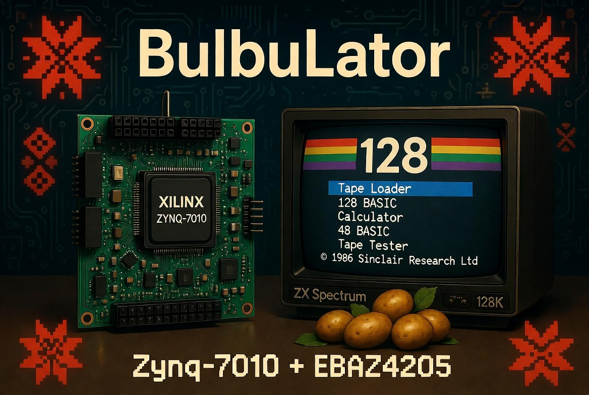
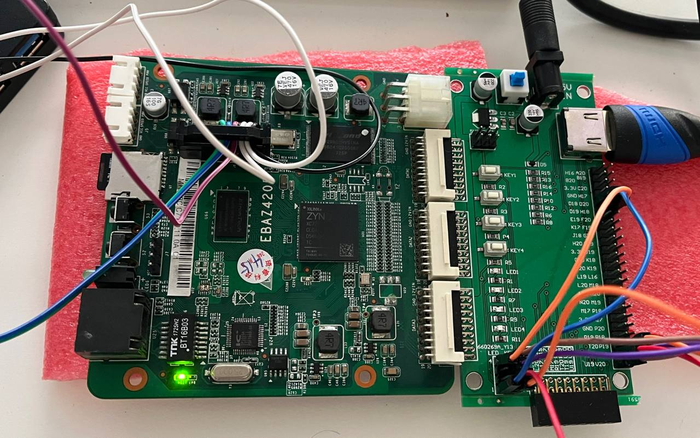

# ZX BulbuLator

Languages: **English** · [Русский](README.ru.md)

Developed by: Alexander Lavrinovich 
GitHub: https://github.com/Alex-Electron 
Email: lavrinovich.alex@gmail.com 
Co-author: AI 
Russian translation: DeepL 
Telegram: https://t.me/zx_bulbulator

A hardware ZX Spectrum emulator on a Xilinx Zynq SoC: bring up an open ZX Spectrum
core on the cheap, easy-to-find EBAZ4205 board, reworking it for the Xilinx
architecture along the way. The published build runs on the open **Atlas `zx`**
core; the MiST / MiSTer cores stay as a fallback for the machines Atlas doesn't cover.

*The EBAZ4205 (Zynq-7010) next to the HDMI / audio + buttons shield, powered up
and running.*

*And here it is working — the genuine © 1986 Sinclair ZX Spectrum 128 boot menu
(Tape Loader / 128 BASIC / Calculator / 48 BASIC / Tape Tester) on the EBAZ4205 over
HDMI. The full build is [Step 6](research/06-zx-spectrum-128/).*

The biggest change from the original cores is memory. MiST drives an external
SDRAM controller; here the Spectrum RAM sits in on-chip BRAM and is reached over
AXI, which takes a lot of timing and routing pain off the table on this board.

This repo is a working notebook and an idea record. It fills up as things get
checked on real hardware.

## Target board

The board is the EBAZ4205 with the Zynq-7010 (`XC7Z010`), the most common version
of this board on the second-hand market. Everything here is built and tested
against it. There are also boards with a custom-soldered `XC7Z020` (more logic,
but pricier) — see [`docs/HARDWARE.md`](docs/HARDWARE.md) for details.

| | EBAZ4205 |
|---|---|
| SoC | Xilinx Zynq-7000 `XC7Z010` (`clg400`, built for the -1 speed grade) |
| Processor (PS) | dual-core ARM Cortex-A9, 666 MHz |
| FPGA fabric (PL) | Artix-7 class — 28K logic cells, 17,600 LUTs, 35,200 flip-flops, 80 DSP slices |
| Block RAM | 60 × 36 Kb = 2.1 Mb (~270 KB) on-chip |
| DDR3 (on the PS) | 256 MB |
| NAND flash | 128 MB |
| Ethernet | 10/100, IP101GA PHY |
| microSD | on-board slot — this project boots from it |
| Clocks | 33.33 MHz PS reference, 25 MHz for the Ethernet PHY; the PL runs at a 100 MHz fabric clock here |
| Power | 5–12 V |
| Factory boot | NAND; we strap it to boot from SD instead |

The memory layout is the interesting part on this board. The Spectrum's RAM lives
in the on-chip Block RAM, which the current build fills (60/60), while the 256 MB
DDR3 holds the triple-buffered framebuffer the ARM and the video path share. The
7020 boards roughly triple the fabric (53,200 LUTs, 140 BRAM blocks, 220 DSP) —
room for bigger machines, though the build still targets the 7010 everyone has.

## What it should do

The cores: ZX Spectrum 48K, 128K, and Pentagon 128 with accurate INT timing
(320 lines per frame).

For input there is a PS/2 keyboard on two FPGA pins, Kempston and Sinclair
joysticks, and Dendy / Sega gamepads.

Sound covers the AY-3-8912 / YM2149F, Turbo Sound (two AY chips), General Sound,
and the beeper, with output over I²S and HDMI audio.

Storage is where it gets fun. Virtual `.trd` / `.scl` disks through a WD1793
TR-DOS, DivMMC / ESXDOS, and the part I most want to build: routing the WD1793
signals out to GPIO through a 3.3V→5V level shifter so a real floppy drive can
hang off the board.

Video is VGA and HDMI with CRT-style scanlines; the expansion shield for that is
already built and working. And since the EBAZ4205 has on-board Ethernet, the ARM
side can run an FTP server so games drop in over the network instead of going
back and forth on an SD card.

The longer list, including the ideas pulled from MiST / MiSTer / TSConf (OSD
menu, save states, tape emulation, ROM switcher, soft-USB, fast-forward), is in
[`docs/CONCEPT.md`](docs/CONCEPT.md).

## Status

Where things stand right now:

The **ZX Spectrum 128 now runs on the board** ([Step 6](research/06-zx-spectrum-128/)):
the original 128 boot menu over 720p50 HDMI with sound, the four shield buttons
driving the menu, tape loading through an audio pin, and standalone SD boot — the
display checks out against ZEsarUX. It's built on the open-source Atlas `zx` core;
the dense bitstream loads over PCAP, since plain JTAG configuration trips a
`BAD_PACKET` bug on this setup. [Step 7](research/07-arm-control-plane/) then wakes up the
idle ARM with an AXI control plane — it can now **halt the Z80 and read/write the Spectrum's
memory live** (the ARM paints the screen while the CPU is frozen), the foundation for loading
games from SD. [Step 8](research/08-ddr-framebuffer/) then makes the video **tear-free** by
buffering the ZX frame in PS DDR — triple-buffered, swapped on the HDMI vblank — the first real
use of that AXI-HP path to DDR. [Step 9](research/09-ps2-keyboard/) adds a real PS/2 keyboard with
a normalised control-key map (reset / NMI, plus an Extended-mode key). [Step 10](research/10-osd-keyboard-gate/)
gives the ARM an **on-screen display over the live picture** and a **keyboard gate** — press `F1` for a
help menu while the Spectrum keeps running, `F12`/`Esc` to close. It's built machine-agnostic on purpose
(a scancode FIFO the ARM drains, a `MACHINE_ID` register), the MiSTer split where the fabric is the
machine and the ARM is the operator. [Step 11](research/11-file-browser/) builds that OSD menu out into
an SD file browser, an options menu that saves to the card, and an OSD panel you can move and fade.
[Step 12](research/12-snapshot-loader/) closes that loop: pick a `.z80` or `.sna` and the ARM cold-resets
the machine, streams the RAM in over the AXI back door, injects the whole Z80 register set, and lets the
core run from the snapshot's PC — the browser is now a real loader. Next: bigger machines and a
flag-/timing-exact 48K core for the test suites.

## Learning the board

I'm figuring this board out as I go — Zynq, the EBAZ4205, and FPGA work in
general are new ground for me — so this repo doubles as a lab notebook. Instead
of dropping a finished emulator, the plan is to bring the board up one small,
verified experiment at a time and write down what actually happened, dead ends
included. When something only works after three tries, that's the part worth
recording.

Each step is self-contained: sources, a ready-to-flash bitstream, and notes on
what it proves and what tripped me up. They live in [`research/`](research/).

So far:

- **[Step 0 — Setup & wiring](research/00-setup/).** Starting from a bare board:
  power, the SD boot-mode strap, hooking up a JTAG programmer (a normal cable or
  a Raspberry Pi Pico), installing Vivado, and flashing a bitstream — enough for
  someone with no FPGA background to get to a blinking LED.
- **[Step 1 — LED blink](research/01-board-bringup-blink/).** The smallest "is
  this board even alive" test: a counter on the chip's internal oscillator
  blinking two LEDs in anti-phase. It proved that power, JTAG, and PL
  configuration all work. Along the way I learned that dense bitstreams only
  flash cleanly with the patched ("soft edges") Pico firmware, and that a design
  clocked from the PS stays dark until FCLK0 is brought up over JTAG — which is
  exactly why the blink runs off the internal oscillator instead.
- **[Step 2 — Buttons drive the LEDs](research/02-buttons-and-leds/).** Adds
  input: the four shield buttons freeze the blink, force the LEDs on or off, or
  speed them up. Small lessons in active-low inputs, two-flop synchronizers, and
  gating a counter.
- **[Step 3 — Primitive HDMI: colour bars](research/03-hdmi-bars/).** First
  picture on the screen — eight 720p colour bars. The first design that needs the
  PS for a clean pixel clock, and the one where I learned FCLK0 only reaches the
  fabric after `ps7_post_config` enables the PS→PL level shifters.
- **[Step 4 — HDMI with button-switched patterns](research/04-hdmi-buttons/).** A
  bouncing square plus colour bars, gradient, and checkerboard, switched live with
  the four shield buttons.
- **[Step 5 — HDMI audio: the square beeps](research/05-hdmi-beep/).** First sound:
  the bouncing square plays a beep over HDMI audio every time it hits a wall,
  using the open-source hdl-util/hdmi core for the TMDS and audio packets.
- **[Step 6 — A ZX Spectrum 128](research/06-zx-spectrum-128/).** It all comes
  together: a real ZX Spectrum 128 on the board, built on the open-source Atlas
  `zx` core — 720p50 HDMI video and sound, the four shield buttons drive the boot
  menu, it loads games from tape through a pin, and it boots from SD on its own.
  The hard-won lessons are in the notes: an inverted keyboard `make` bit that made
  the menu run in circles, floating buttons that needed pull-ups, the original
  128 ROM (with Tape Tester) vs the +2 one, and a dense bitstream that only
  configures over PCAP, not plain JTAG.
- **[Step 7 — Waking up the ARM](research/07-arm-control-plane/).** The other half of
  the chip — the ARM — sat idle through Step 6. This adds an AXI register interface so the
  PS can **halt the Z80 and read/write the Spectrum's memory live**. Two milestones on
  hardware: the bare-metal AXI handshake (built and proven *first*, before integrating), then
  the ARM freezing the Z80 and painting its screen straight over the bus. It's the
  [speccy2010](https://github.com/mborik/speccy2010) blueprint on Zynq, and the foundation for
  loading games from SD. The bitstream is a clean superset of Step 6 — nothing regressed.
- **[Step 8 — Tear-free video](research/08-ddr-framebuffer/).** The single on-chip framebuffer
  tore on border-effect demos — the Spectrum's ~50.02 Hz and HDMI's 50.000 Hz aren't locked, so
  the read pointer drifts through the write pointer. This buffers the whole 51 KB ZX frame in PS
  DDR — a MiSTer-style triple buffer — and swaps the scanout only on the HDMI vblank, so the
  picture is tear-free everywhere, including bank-5/bank-7 shadow-screen flips. It's the first
  real use of the Step-7 AXI-HP path to PS DDR, and on-chip BRAM stays 60/60.
- **[Step 9 — A real PS/2 keyboard](research/09-ps2-keyboard/).** A PS/2 keyboard on two pins,
  muxed with the four buttons — the Atlas core already had the receiver and the matrix decoder,
  the buttons just faked the key-taps. Plus a normalised control-key map: `F11` = hard/cold reset
  (wipes RAM), `Ctrl+Alt+Del` = soft reset, `Ctrl+Alt+Ins` = NMI, plus Alt as a one-key Extended-mode shortcut.
  The lesson worth keeping: a
  reset must not reset the DDR video pipeline — an AXI-HP master reset mid-burst hangs and freezes
  the picture. The on-screen menu landed in Step 10, the file browser in Step 11, and the SD snapshot loader in Step 12.
- **[Step 10 — On-screen display + the keyboard gate](research/10-osd-keyboard-gate/).** The ARM
  finally has a voice: it draws a 1-bpp OSD panel over the live picture — a combinational mux on the
  pixel path, so the Z80 never stops — and takes the keyboard the moment the menu opens (`F1` for
  help, `F12`/`Esc` to close). The clever part is what's *not* there: the fabric decodes no function
  key. Every scancode is tapped into a clock-crossing FIFO the ARM drains, and a `MACHINE_ID`
  register tells it which core is loaded, so the same OSD and keyboard gate are meant to sit in front
  of a future NES or C64 core unchanged. A fabric deadman timer hands the keyboard back if the ARM
  ever stalls. This is the MiSTer division of labour: the fabric is the machine, the ARM is the operator.

- **[Step 11 — A file browser and a settings menu](research/11-file-browser/).** The ARM gets the SD
  card and somewhere to keep its settings. **F5** opens a file browser that reads the FAT card and walks
  its folders (sort, a scrollbar, long names that scroll); **F9** opens an options menu whose changes
  apply live and save to a `bulbulator.ini` on the card — the first time the project writes to the card
  at all. The OSD panel learned to **move and fade** from that menu, and under the hood the framebuffer
  moved off a BRAM copy to a per-line DDR reader, freeing about a dozen BRAM tiles for the colour panel
  to come. The honest gaps: the browser navigates but didn't yet load the file you pick (Step 12 closes that),
  and the ARM app now needs the SD stack (FatFs/xsdps), so it ships prebuilt while the clean-clone build
  catches up.

- **[Step 12 — Loading a snapshot](research/12-snapshot-loader/).** The browser becomes a loader. Press
  **Enter** on a `.z80` or `.sna` and the ARM parses it, cold-resets and wipes the machine, streams the
  RAM image into the core's memory over the Step-7 AXI back door, injects the whole Z80 register file into
  the T80 in one shot (a 212-bit DIRSet vector), and releases it to run from the snapshot's PC. Two things
  made it more than "write the bytes and go": every load resets+wipes first — through the same FSM as the
  F11 hard reset — so nothing leaks from the last program (no stale pages, no carried-over AY squeal), and
  the SD path is hardened to never trust the card, since the EBAZ has no card-detect line (one strike and
  it drops the volume, an **EJECT** in F9, trimmed `xsdps` timeouts). It handles `.z80` v1/v2/v3 and
  `.sna`, 48K and 128K; the format and loader detail is its own document,
  [`docs/LOADER_SPEC.md`](docs/LOADER_SPEC.md). The honest gaps: AY/TurboSound state isn't restored yet,
  only the standard 48K/128K bank maps, and the ARM app still ships prebuilt while the SD stack gets
  vendored. (`VERSION 0xB01B0009`.)

More steps get added as I get them working.

## Changelog

- **2026-06-27 — Step 12: loading a snapshot.** The file browser becomes a loader: press **Enter** on a
  `.z80` or `.sna` and the ARM parses it, cold-resets and wipes the machine, streams the RAM in over the
  Step-7 AXI back door, injects the whole Z80 register file into the T80 in one shot (a 212-bit DIRSet
  vector), and runs from the snapshot's PC. Every load resets+wipes first — the same FSM as the F11 hard
  reset, on a new `CONTROL` bit 2 / `STATUS` bit 2 — so nothing leaks from the last program, and the SD
  path is hardened for a board with no card-detect (one-strike unmount, an **EJECT** in F9, trimmed
  `xsdps` timeouts). Handles `.z80` v1/v2/v3 and `.sna`, 48K and 128K; format reference in
  [`docs/LOADER_SPEC.md`](docs/LOADER_SPEC.md). Verified on hardware on the Atlas `zx` core (control-plane
  VERSION `0xB01B0009`). Not yet: AY state restore, non-standard bank maps, cycle-exact resume.
- **2026-06-25 — Step 11: a file browser and a settings menu.** The ARM gets the SD card: **F5**
  browses the FAT card (navigate, sort, scrollbar, long-name scroll), **F9** opens a data-driven options
  menu that applies live and saves to `bulbulator.ini` — the project's first write to the card. The OSD
  panel can now be moved and faded from that menu (new `OSD_POS` / `OSD_OP` registers, VERSION
  `0xB01B0008`), and the framebuffer moved to a per-line DDR reader, freeing about a dozen BRAM tiles.
  Verified on hardware on the Atlas `zx` core. The browser doesn't yet load the file you pick — that's Step 12.
- **2026-06-22 — Step 10: on-screen display + the keyboard gate.** The ARM draws a 1-bpp OSD over
  the live 720p picture without halting the Z80 (overlay, not halt), and a keyboard gate diverts the
  PS/2 keys to the ARM while the menu is open — `F1` opens a help / key-map page, `F12`/`Esc` close it.
  Built machine-agnostic on purpose: an always-tap scancode FIFO, the OSD compositor and a
  `MACHINE_ID` register, so the same control plane fits a future NES/C64 core; a fabric deadman frees
  the keyboard if the ARM stalls. Verified on hardware (control-plane VERSION `0xB01B0006`). Next: the
  navigable OSD file browser (Step 11) and the SD snapshot loader (Step 12).
- **2026-06-18 — Step 9: a real PS/2 keyboard.** A PS/2 keyboard on two pins, muxed with the four
  buttons (the Atlas core already shipped `ps2.v` + `keyboard.v`); a normalised key map — `F11`
  hard/cold reset with a RAM wipe, `Ctrl+Alt+Del` soft, `Ctrl+Alt+Ins` NMI, plus Alt for the Spectrum's Extended mode — and an SD-bootable
  image. The OSD menu (Step 10), file browser (Step 11) and SD snapshot loader (Step 12) are the next chapters.
- **2026-06-17 — Step 8: tear-free DDR framebuffer.** The ZX frame is triple-buffered in PS DDR
  over AXI-HP and swapped only on the HDMI vblank — no more tear seam on border demos or
  shadow-screen flips. Verified with the `ula128` timing test and the *Mescaline* / `esh2`
  border demos; on-chip BRAM unchanged at 60/60.
- **2026-06-16 — Step 7: waking up the ARM.** An AXI PS↔PL control plane — the ARM can now
  halt the Z80 and write the Spectrum's memory, proven live on HDMI (the ARM paints the
  screen while the CPU is frozen). The bare-metal handshake first, then halt + screen-poke.
  Zero edits to the Atlas core; the foundation for SD game loading.
- **2026-06-16 — Step 6: a ZX Spectrum 128.** The first real machine on the board —
  128 boot menu, 720p50 HDMI video + sound, the buttons driving the menu, tape
  loading through a pin, and standalone SD boot, on the Atlas `zx` core.
- **2026-06-15 — Steps 0–5: board bring-up.** Setup & wiring, LED blink, buttons,
  HDMI colour bars, button-switched patterns, and HDMI audio — the runway the
  Spectrum sits on.
- **2026-06-15 — Project start.** Idea recorded; targeting the EBAZ4205 (Zynq-7010).

## License

[MIT](LICENSE) © Alexander Lavrinovich

The MIT licence covers this project's own work (the board-top, scripts, and notes).
The cores it builds on keep their own licences — see each step's credits and the
upstream projects ([Atlas `zx`](https://github.com/AtlasFPGA/zx),
[hdl-util/hdmi](https://github.com/hdl-util/hdmi)).

The tape input uses the *Tape Load Reader* front-end circuit from the
[Murmulator](https://murmulator.ru/) project
([schematics](https://github.com/AlexEkb4ever/MURMULATOR_classical_scheme), GPL-3.0) — an
external hardware add-on wired to the board, credited and linked here, not redistributed.
