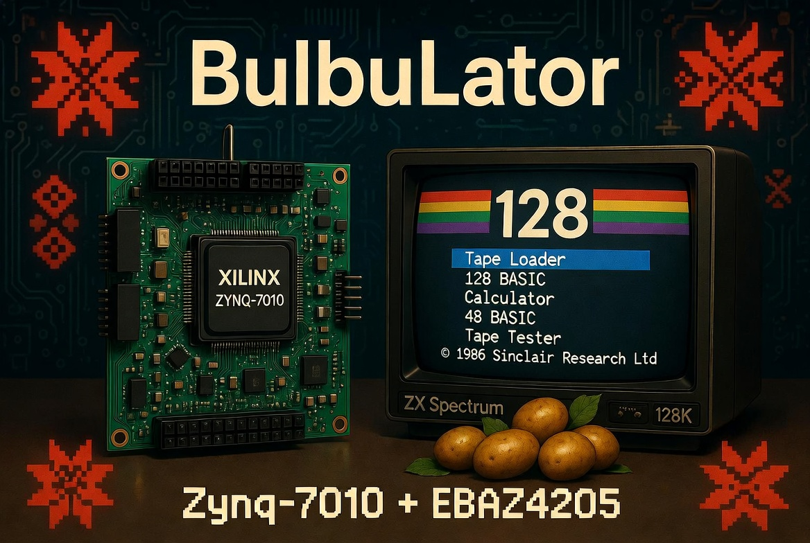
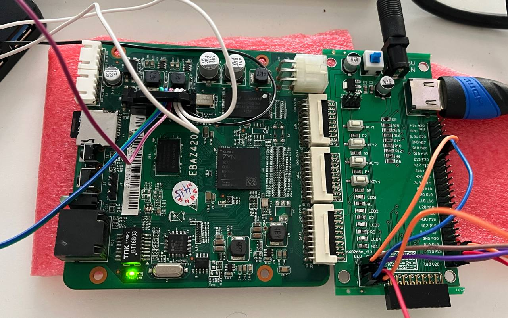
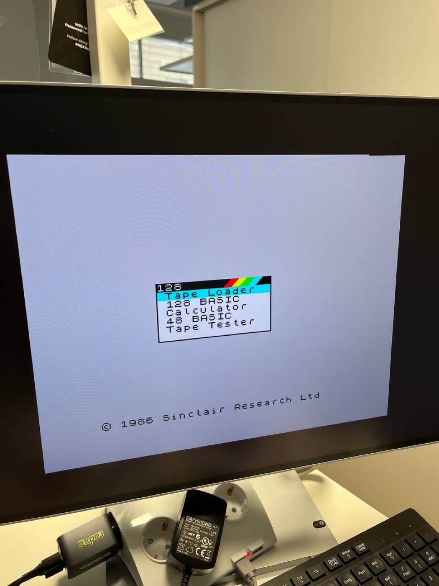

# ZX BulbuLator

Languages: [English](README.md) · **Русский**

Разработчик: Александр Лавринович  GitHub: https://github.com/Alex-Electron  Электронная почта: lavrinovich.alex@gmail.com  Соавтор: ИИ  Русский перевод: DeepL  Telegram: https://t.me/zx_bulbulator

Если проект вам понравился, будет очень приятно, если вы угостите меня чашечкой кофе:

 

Аппаратный эмулятор ZX Spectrum на SoC Xilinx Zynq: запусти открытое ядро ZX Spectrum на недорогой и легко доступной плате EBAZ4205, при этом адаптировав его под архитектуру Xilinx. Опубликованная сборка работает на открытом ядре **Atlas `zx`**; ядра MiST / MiSTer остаются в качестве запасного варианта для машин, которые не поддерживает Atlas.

*Плата EBAZ4205 (Zynq-7010) рядом с расширением HDMI / аудио + кнопки, включена и работает.*

*А вот и оно в действии — подлинное меню загрузки © 1986 Sinclair ZX Spectrum 128 (Tape Loader / 128 BASIC / Калькулятор / 48 BASIC / Тестер кассет) на EBAZ4205 через HDMI. Полная инструкция по сборке — в [Шаге 6](research/06-zx-spectrum-128/).*

Самое большое отличие от оригинальных ядер — это память. MiST управляет внешним контроллером SDRAM; здесь оперативная память Spectrum размещена в встроенной BRAM и доступна через AXI, что значительно упрощает синхронизацию и трассировку на этой плате.

Этот репозиторий — рабочий блокнот и сборник идей. Он пополняется по мере проверки всего на реальном оборудовании.

## Целевая плата

Это плата EBAZ4205 с Zynq-7010 (`XC7Z010`) — самая распространённая версия этой платы на рынке подержанного оборудования. Всё, что здесь описано, собрано и протестировано именно на ней. Есть также платы с самостоятельно впаянным `XC7Z020` (больше логики, но дороже) — подробности смотри в [`docs/HARDWARE.md`](docs/HARDWARE.md).

| | EBAZ4205 |
|---|---|
| SoC | Xilinx Zynq-7000 `XC7Z010` (`clg400`, изготовлен для класса скорости -1) |
| Процессор (PS) | двухъядерный ARM Cortex-A9, 666 МГц |
| Структура ПЛИС (PL) | класс Artix-7 — 28K логических ячеек, 17 600 LUT, 35 200 триггеров, 80 DSP-блоков |
| Блочная ОЗУ | 60 × 36 Kb = 2,1 Mb (~270 KB) на кристалле |
| DDR3 (на PS) | 256 МБ |
| NAND-флеш | 128 МБ |
| Ethernet | 10/100, PHY IP101GA |
| microSD | встроенный слот — этот проект загружается именно оттуда |
| Тактовые частоты | Опорная частота PS — 33,33 МГц, 25 МГц для Ethernet PHY; PL здесь работает на тактовой частоте фабрики 100 МГц |
| Питание | 5–12 В |
| Загрузка по умолчанию | NAND; мы перенастраиваем её, чтобы загружаться с SD |

Самое интересное в этой плате — расположение памяти. ОЗУ Spectrum находится в встроенной Block RAM, которую текущая сборка заполняет полностью (60/60), а 256 МБ DDR3 хранит фреймбуфер с тройным буфером, которым совместно пользуются ARM и видеоканал. На платах 7020 объём фабрики примерно втрое больше (53 200 LUT, 140 блоков BRAM, 220 DSP) — это даёт возможность создавать более мощные машины, хотя сборка по-прежнему ориентирована на модель 7010, которая есть у всех.

## Что она должна уметь

Ядра: ZX Spectrum 48K, 128K и Пентагон 1024 работают уже сейчас, и каждая машина сверена с настоящей по приборам (Шаг 15); NES/Денди идёт второй платформой. C64 и другие машины — в планах.

Для ввода предусмотрены: клавиатура PS/2 через два контакта FPGA, джойстики Kempston и Sinclair, а также геймпады Dendy / Sega.

Звук поддерживает AY-3-8912 / YM2149F, Turbo Sound (два чипа AY), General Sound и звуковой сигнализатор, с выходом через I²S и аудио HDMI.

А вот с хранением данных начинается самое интересное. Виртуальные диски `.trd` / `.scl` через WD1793 TR-DOS, DivMMC / ESXDOS, и то, что я больше всего хочу реализовать: вывод сигналов WD1793 на GPIO через преобразователь уровней 3,3 В → 5 В, чтобы к плате можно было подключить настоящий дисковод.

Видео — VGA и HDMI со сканирующими линиями в стиле CRT; расширение для этого уже собрано и работает. А поскольку у EBAZ4205 есть встроенный Ethernet, на стороне ARM можно запустить FTP-сервер, чтобы игры загружались по сети, а не переносились туда-сюда на SD-карте.

Более полный список, включая идеи, позаимствованные из MiST / MiSTer / TSConf (меню OSD, сохранение состояний, эмуляция кассет, переключатель ROM, программный USB, быстрая перемотка), находится в [`docs/CONCEPT.md`](docs/CONCEPT.md).

## Состояние дел

Вот как обстоят дела на данный момент:

**ZX Spectrum 128 теперь работает на плате** ([Шаг 6](research/06-zx-spectrum-128/)): оригинальное меню загрузки 128 через HDMI 720p50 со звуком, четыре кнопки на шилде для управления меню, загрузка с кассеты через аудиоконтакт и автономная загрузка с SD-карты — отображение на экране соответствует ZEsarUX. Проект построен на ядре `zx` с открытым исходным кодом из Atlas; плотный битстрим загружается через PCAP, так как при обычной настройке JTAG в этой конфигурации срабатывает ошибка `BAD_PACKET`. [Шаг 7](research/07-arm-control-plane/) пробуждает находящийся в режиме ожидания ARM с помощью контрольной плоскости AXI — теперь он может **останавливать Z80 и читать/записывать в память Spectrum в режиме реального времени** (ARM обновляет экран, пока процессор заморожен), что является основой для загрузки игр с SD-карты. [Шаг 8](research/08-ddr-framebuffer/) устраняет **рвущиеся изображения**, буферизуя кадр ZX в PS DDR — с тройной буферизацией и переключением во время HDMI vblank — это первое реальное использование того AXI-HP-канала для DDR. [Шаг 9](research/09-ps2-keyboard/) добавляет настоящую клавиатуру PS/2 с нормализованной раскладкой клавиш управления (сброс / NMI, плюс клавиша «Расширенный режим»). [Шаг 10](research/10-osd-keyboard-gate/) даёт ARM возможность **отображать экранное меню поверх живого изображения** и **управлять клавиатурой** — нажми `F1`, чтобы открыть меню помощи, пока Spectrum продолжает работать, `F12`/`Esc` — чтобы закрыть. Он специально разработан так, чтобы не зависеть от конкретной машины (FIFO сканирующих кодов, который очищает ARM, регистр `MACHINE_ID`), — это разделение по принципу MiSTer, где «фабрика» — это машина, а ARM — оператор. [Шаг 11](research/11-file-browser/) превращает это OSD-меню в файловый браузер SD-карты, меню настроек, которое сохраняется на карту, и OSD-панель, которую можно перемещать и затухать. [Шаг 12](research/12-snapshot-loader/) замыкает этот цикл: выбери файл `.z80` или `.sna`, и ARM выполнит холодный сброс машины, передаст содержимое ОЗУ через «заднюю дверь» AXI, вводит весь набор регистров Z80 и запускает ядро с адреса PC, указанного в снэпшоте — теперь браузер стал настоящим загрузчиком. [Шаг 13](research/13-music-player/) добавляет независимый от машины музыкальный плеер, а [Шаг 14](research/14-color-osd/) превращает OSD в полноцветный файловый менеджер в стиле DOS Navigator.

[**Шаг 15**](research/15-pentagon/) — это момент, когда платформа стала *семейством*: одно ядро несёт **ZX Spectrum 48K, 128K и Пентагон 1024**, и каждая машина сверена с настоящей не на глаз, а измерением. Наборы тестов таймингов проходят целиком на 48K (включая тесты портов) и на 128K; процессор проходит `z80full`, `z80ccf` и `z80memptr`; контеншен, момент записи в бордюр и положение прерывания совпали с железом. Подросли накопители — TR-DOS читает *и пишет*, NEMO-IDE читает `.hdf` байт в байт, работает DivMMC / esxDOS, — а General Sound играет музыку. Готовые ядра лежат в [`research/15-pentagon/bitstreams/`](research/15-pentagon/bitstreams/), наборы ПЗУ с полным описанием происхождения — в [`research/15-pentagon/roms/`](research/15-pentagon/roms/).

Дальше — сеть. **Шаг 16** выводит на плату веб-пульт: живой экран, клавиатура и файловый менеджер карты прямо в браузере. Сторона прошивки уже написана; препятствие физическое — Ethernet этой платы висит на выводах ПЛИС, а не процессора, поэтому нужен битстрим, выводящий контроллер на ноги микросхемы PHY.

## Изучение платы

Я разбираюсь с этой платой по ходу дела — Zynq, EBAZ4205 и работа с ПЛИС в целом для меня в новинку — так что этот репозиторий одновременно служит лабораторным дневником. Вместо того чтобы выкладывать готовый эмулятор, я планирую постепенно запускать плату, проводя по одному небольшому проверенному эксперименту за раз, и записывать, что на самом деле произошло, включая тупики. Когда что-то срабатывает только с третьей попытки, именно это и стоит зафиксировать.

Каждый шаг — это самостоятельная часть: исходники, готовый к записи битстрим и заметки о том, что он доказывает и что меня затруднило. Всё это находится в [`research/`](research/).

Пока что:

- **[Шаг 0 — Настройка и подключение](research/00-setup/).** Начинаем с «голой» платы:
  питание, перемычка для загрузки с SD-карты, подключение JTAG-программатора (обычный кабель или
  Raspberry Pi Pico), установка Vivado и запись битстрима — этого достаточно, чтобы
  человек без опыта работы с ПЛИС смог заставить светодиод мигать.
- **[Шаг 1 — Мигание светодиода](research/01-board-bringup-blink/).** Самый простой тест на то, «
  работает ли эта плата вообще»: счетчик на внутреннем генераторе микросхемы,
  заставляющий два светодиода мигать в противофазе. Это доказало, что питание, JTAG и
  конфигурация PL работают. По ходу дела я узнал, что плотные битстримы
  корректно мигают только с исправленной («мягкие фронты») прошивкой Pico, и что проект,
  тактованный от PS, остаётся тёмным, пока FCLK0 не запустится через JTAG — именно
  поэтому мигание вместо этого работает от внутреннего генератора.
- **[Шаг 2 — Кнопки управляют светодиодами](research/02-buttons-and-leds/).** Добавляем
  вход: четыре кнопки на шилде приостанавливают мигание, принудительно включают или выключают светодиоды, либо
  ускоряют их мигание. Небольшой урок по входам с активным низким уровнем, синхронизаторам с двумя триггерами и
  управлению счетчиком.
- **[Шаг 3 — Примитивный HDMI: цветовые полосы](research/03-hdmi-bars/).** Первое
  изображение на экране — восемь цветовых полос в разрешении 720p. Первая схема, которой нужен
  PS для чистого тактового сигнала пикселей, и та, где я узнал, что FCLK0 попадает в
  фабрику только после того, как `ps7_post_config` включает преобразователи уровня PS→PL.
- **[Шаг 4 — HDMI с узорами, переключаемыми кнопками](research/04-hdmi-buttons/).**
  Прыгающий квадрат плюс цветовые полосы, градиент и шахматная доска, переключаемые в режиме реального времени с помощью
  четырёх кнопок на экране.
- **[Шаг 5 — Аудио по HDMI: квадрат издаёт звуковой сигнал](research/05-hdmi-beep/).** Первый звук:
  прыгающий квадрат издаёт звуковой сигнал через аудио HDMI каждый раз, когда ударяется о стенку,
  используя ядро hdl-util/hdmi с открытым исходным кодом для передачи пакетов TMDS и аудио.
- **[Шаг 6 — ZX Spectrum 128](research/06-zx-spectrum-128/).** Всё
  собирается воедино: настоящий ZX Spectrum 128 на плате, построенный на ядре Atlas
  `zx` с открытым исходным кодом — видео и звук по HDMI в формате 720p50, четыре кнопки на шилде управляют меню загрузки,
  он загружает игры с кассеты через разъём и самостоятельно загружается с SD-карты.
  Уроки, извлечённые с большим трудом, описаны в примечаниях: инвертированный бит `make` клавиатуры, из-за которого
  меню зацикливалось, «плавающие» кнопки, которым потребовались подтяжки, оригинальная
  ПЗУ 128 (с Tape Tester) по сравнению с версией для +2, а также плотный битстрим, который
  настраивается через PCAP, а не по простому JTAG.
- **[Шаг 7 — Пробуждение ARM](research/07-arm-control-plane/).** Другая половина
  чипа — ARM — простаивала на протяжении всего Шага 6. Здесь добавляется интерфейс регистров AXI, чтобы
  PS мог **останавливать Z80 и читать/записывать в память Spectrum в режиме реального времени**. Два важных этапа в
  разработке аппаратного обеспечения: установка связи AXI «с нуля» (созданная и протестированная *в первую очередь*, ещё до интеграции), а затем
  остановка Z80 процессором ARM и рисование его экрана напрямую через шину. Это
  проект [speccy2010](https://github.com/mborik/speccy2010) на Zynq и основа для
  загрузки игр с SD-карты. Битстрим — это чистый надмножество шага 6 — никаких регрессий.
- **[Шаг 8 — Видео без разрывов](research/08-ddr-framebuffer/).** Единственный встроенный фреймбуфер
  давал разрывы в демо-роликах с эффектом бордюров — частоты Spectrum (~50,02 Гц) и HDMI (50,000 Гц) не синхронизированы, поэтому
  указатель чтения опережает указатель записи. Здесь весь кадр ZX объёмом 51 КБ буферизуется в PS
  DDR — это тройной буфер в стиле MiSTer — и развертка происходит только во время вертикальной развертки HDMI, поэтому
  изображение везде без разрывов, включая переключение теневого экрана между банками 5 и 7. Это первый
  реальное использование канала Step-7 AXI-HP для PS DDR, а встроенная BRAM остаётся в режиме 60/60.
- **[Шаг 9 — Настоящая клавиатура PS/2](research/09-ps2-keyboard/).** Клавиатура PS/2 на двух контактах,
  мультиплексированная с четырьмя кнопками — в ядре Atlas уже были приёмник и декодер матрицы,
  а кнопки просто имитировали нажатия клавиш. Плюс нормализованная раскладка клавиш управления: `F11` = жёсткий/холодный сброс
  (очищает ОЗУ), `Ctrl+Alt+Del` = мягкий сброс, `Ctrl+Alt+Ins` = NMI, плюс Alt как одноклавишное сочетание для перехода в расширенный режим.
  Урок, который стоит запомнить:
  сброс не должен сбрасывать видеоконвейер DDR — мастер-сброс AXI-HP посреди пакета данных приводит к зависанию и
  замораживанию изображения. Экранное меню появилось в шаге 10, файловый браузер — в шаге 11, а загрузчик снэпшотов с SD-карты — в шаге 12.
- **[Шаг 10 — Экранное меню + шлюз клавиатуры](research/10-osd-keyboard-gate/).** ARM
  наконец-то заговорил: он накладывает панель OSD с разрешением 1 бит на пиксель поверх живого изображения — это комбинационный мультиплексор на
  тракте пикселей, так что Z80 никогда не останавливается — и перехватывает управление клавиатурой в тот момент, когда открывается меню (`F1` для
  помощь, `F12`/`Esc` — для закрытия). Самое умное здесь — то, чего *нет*: фабрика не декодирует ни одну функциональную
  клавишу. Каждый сканкод поступает в FIFO с пересечением тактов, из которого ARM извлекает данные, а регистр `MACHINE_ID`
  указывает, какое ядро загружено, так что те же OSD и шлюз клавиатуры должны без изменений работать
  с будущими ядрами NES или C64. Таймер «дедмена» фабрики возвращает управление клавиатурой, если ARM
  когда-нибудь зависнет. Вот в чём заключается разделение обязанностей в MiSTer: фабрика — это машина, а ARM — оператор.

- **[Шаг 11 — Файловый браузер и меню настроек](research/11-file-browser/).** ARM получает SD-карту
  и место для хранения настроек. **F5** открывает файловый браузер, который считывает карту в формате FAT и просматривает
  её папки (сортировка, полоса прокрутки, длинные имена, которые прокручиваются); **F9** открывает меню настроек, изменения в котором
  применяются в реальном времени и сохраняются в файл `bulbulator.ini` на карте — это первый раз, когда проект вообще записывает что-либо
  на карту. Панель OSD научилась **перемещаться и плавно появляться/исчезать** из этого меню, а «под капотом» фреймбуфер
  переключился с копирования из BRAM на чтение из DDR построчно, освободив около дюжины ячеек BRAM для будущей
  цветной панели. Честные недоработки: браузер перемещается по страницам, но пока не загрузил выбранный тобой файл (это исправляется в шаге 12),
  а приложению ARM теперь нужен стек SD (FatFs/xsdps), поэтому оно поставляется в готовом виде, пока сборка с чистым клоном
  не доработается.

- **[Шаг 12 — Загрузка снэпшота](research/12-snapshot-loader/).** Браузер превращается в загрузчик. Нажми
  **Enter** на файле `.z80` или `.sna`, и ARM анализирует его, выполняет холодный сброс и очищает машину, передаёт
  образ ОЗУ в память ядра через «заднюю дверь» Step-7 AXI, загружает весь регистровый файл Z80 в
  T80 за один раз (212-битный вектор DIRSet) и запускает его с адреса PC, указанного в снэпшоте. Две вещи
  сделали этот процесс чем-то большим, чем просто «записал байты и готово»: каждая загрузка сначала выполняет сброс и очистку — через тот же FSM, что и
  жесткий сброс F11, — так что ничего не просачивается из предыдущей программы (ни устаревших страниц, ни перенесённого визга AY), и
  путь к SD-карте защищён так, чтобы никогда не доверять карте, поскольку у EBAZ нет линии обнаружения карты (один сбой — и
  он отключает звук, выдает **EJECT** в F9, сокращённые таймауты `xsdps`). Он поддерживает `.z80` v1/v2/v3 и
  `.sna`, 48K и 128K; подробности о формате и загрузчике описаны в отдельном документе,
  [`docs/LOADER_SPEC.ru.md`](docs/LOADER_SPEC.ru.md). Честные пробелы: состояние AY/TurboSound пока не восстанавливается,
  только стандартные карты банков 48K/128K, а приложение ARM по-прежнему поставляется в готовом виде, пока стек SD
  находится в стадии поставки. (`VERSION 0xB01B0009`.)
- **[Шаг 13 — Плеер: Универсальный ARM-синтез музыки через HDMI](research/13-music-player/).** Машино-независимый 
  плеер ретро-музыки, встроенный в ARM. Нажмите **Enter** на файле `.psg` в браузере (F5), чтобы воспроизвести 
  его через HDMI, пока ядро ZX Spectrum работает в фоне. Использует библиотеку программного синтеза AYUMI. 
  Требует D-Cache (включен через кастомный `lscript.ld` для Cortex-A9) для воспроизведения в реальном 
  времени на 47996 Гц без прерываний. Звук передается по шине AXI в новый аппаратный FIFO внутри ПЛИС.
- **[Шаг 14 — Цветной OSD и ZX-BulboNavigator](research/14-color-osd/).** 1-битная полоска превращается
  в полноцветный текстовый файловый менеджер 80×25 в стиле DOS Navigator — на простаивающем ARM, поверх
  живого ядра: браузер с сортировкой и выбором по маске, полноценный диалог Copy/Move, независимая от
  платформы кассетная станция (`.tap`/`.tzx`/`.wav`/`.mp3`, с моделью физической магнитной головки),
  встроенный музыкальный плеер (PSG/MP3/WAV, режимы, неблокирующая пауза) и data-driven меню, чьи
  настройки сохраняются в `bulbulator.ini`.

- **[Шаг 15 — семейство машин Спектрума: точность по приборам](research/15-pentagon/).** Одно ядро
  несёт ZX Spectrum 48K, 128K и Пентагон 1024; NES/Денди идёт отдельным ядром. Смысл этого шага в том,
  что приёмка идёт числами: наборы тестов таймингов проходят целиком на 48K и 128K, процессор проходит
  `z80full` / `z80ccf` / `z80memptr`, захваченный кадр — 384 настоящих точки с бордюрами 64/64, а
  бордюр Пентагона идёт шагом 2 точки, как у настоящей машины. Накопители (TR-DOS на чтение **и
  запись**, NEMO-IDE, DivMMC/esxDOS, Z-Controller), шесть источников звука, включая играющий General
  Sound, и кассетная станция, которая больше не обманывает собственный детектор 48K/128K у демок.
  Поставляется с готовыми ядрами и описанными наборами ПЗУ.
- **Шаг 16 — сеть (в планах).** Веб-пульт к плате: живой экран, клавиатура и файловый менеджер карты в
  браузере. Сторона прошивки написана; не хватает битстрима, выводящего контроллер Ethernet на ноги
  микросхемы PHY этой платы, потому что сеть здесь разведена на ПЛИС, а не на процессор.

Буду добавлять новые шаги по мере того, как они начнут работать.

## Журнал изменений

- **18.09.2026 — Шаг 15: семейство машин Спектрума, сверенное с настоящими.** Одно ядро на
  ZX Spectrum 48K / 128K / Пентагон 1024. Наборы тестов таймингов проходят целиком на 48K (с тестами
  портов) и на 128K; `z80full` 152/152, `z80ccf` 152/152, `z80full 1.2a` 160/160, `z80memptr` —
  все пройдены. Родная геометрия захвата (384 настоящих точки, бордюры 64/64) на 48K и 128K, своё
  положение прерывания у каждой машины, шаг бордюра Пентагона 2 точки и метка кадра, закрывшая дефект
  верхней кромки. Разрешение проигрывать ленту отделено от разрешения ускорять процессор. Накопители:
  TR-DOS на чтение, запись и `FORMAT`, побайтно точный `.hdf` у NEMO-IDE, DivMMC/esxDOS, Z-Controller.
  Звук: SAA1099 (который оказался заглушкой в битстриме) на честных 8 МГц, TurboSound, SpecDrum и
  играющий General Sound. Оболочка получила каркас окон, разведённые кроп и панораму и дерево настроек,
  описанное данными. Поставляются готовые ядра (`research/15-pentagon/bitstreams/`) и наборы ПЗУ с
  полным описанием происхождения (`research/15-pentagon/roms/`). Ядро `0xB01B0196`, прошивка v0.15.440.

- **08.07.2026 — Шаг 14: цветной OSD и ZX-BulboNavigator.** 1-битную полоску сменил полноцветный OSD 640×400 ARGB8888 в DDR (`osd_ddr_rd` по AXI-HP1 + попиксельный альфа-композитор), несущий полноценный файловый менеджер в стиле DOS Navigator на простаивающем ARM: браузер с сортировкой `Ctrl+F3-6`, выбором по маске, диалогом Copy/Move 78×15 (шесть режимов конфликта), rename / mkdir / рекурсивное удаление; data-driven меню-бар с сохранением настроек в `bulbulator.ini`; независимая от платформы кассетная станция (`.tap`/`.tzx`/`.wav`/`.mp3`, модель физической магнитной головки, MP3/WAV-как-кассета, Tape Sound, Mute-machine-on-load); встроенный музыкальный плеер (PSG/MP3/WAV, режимы, неблокирующая пауза, предзагрузка MP3); маска паузы, boot-nav и прозрачный знак PAUSE. Чистый клон воспроизводит битстрим — патч watchdog PS/2 вендорен в `third_party/atlas-zx-ps2-watchdog/` и накладывается при сборке. (`VERSION 0xB01B0017`, прошивка v0.14.92).

- **30.06.2026 — Шаг 13: универсальный музыкальный ARM-плеер.** Независимый от платформы музыкальный плеер, встроенный в управляющую плоскость ARM. Нажми **Enter** на файле `.psg` в браузере F5 — он играет через HDMI, пока ядро ZX Spectrum работает в фоне. Использует библиотеку программного синтеза AYUMI. Требует D-Cache (включён через кастомный `lscript.ld` для Cortex-A9) для воспроизведения 47996 Гц в реальном времени без прерываний звука. Звук идёт по AXI в новый аппаратный FIFO в ПЛИС, замещая звук фабрики, когда активен. (`VERSION 0xB01B000B`).

- **27.06.2026 — Шаг 12: загрузка снэпшота.** Обзор файлов превращается в загрузчик: нажми **Enter** на файле
  `.z80` или `.sna`, и ARM анализирует его, выполняет холодный сброс и очищает машину, передаёт ОЗУ через
  задний порт AXI Step-7, за один раз вводит весь регистровый файл Z80 в T80 (212-битный вектор DIRSet
  ), и запускается с адреса PC снэпшота. При каждой загрузке сначала происходит сброс и очистка — тот же FSM, что и при жёстком
  сбросе F11, с новыми значениями бита 2 `CONTROL` и бита 2 `STATUS` — так что ничего не просачивается из предыдущей программы, а путь SD
  защищён для платы без функции обнаружения карты (однократное отключение, команда **EJECT** в F9, сокращённые
  таймауты `xsdps`). Поддерживает `.z80` v1/v2/v3 и `.sna`, 48K и 128K; описание форматов в
  [`docs/LOADER_SPEC.ru.md`](docs/LOADER_SPEC.ru.md). Проверено на аппаратном обеспечении с ядром Atlas `zx` (версия
  управляющей плоскости `0xB01B0009`). Пока не реализовано: восстановление состояния AY, нестандартные карты банков, возобновление с точностью до цикла.
- **25.06.2026 — Шаг 11: файловый браузер и меню настроек.** ARM получает доступ к SD-карте: **F5**
  просматривает карту в формате FAT (навигация, сортировка, полоса прокрутки, прокрутка длинных имен), **F9** открывает меню настроек на основе данных
  , которые применяются в реальном времени и сохраняются в `bulbulator.ini` — это первая запись проекта на карту. Панель OSD
  теперь можно перемещать и затухать из этого меню (новые регистры `OSD_POS` / `OSD_OP`, VERSION
  `0xB01B0008`), а фреймбуфер переведён на построчный считыватель DDR, что освободило около дюжины ячеек BRAM.
  Проверено на аппаратном обеспечении ядра Atlas `zx`. Браузер пока не загружает выбранный файл — это шаг 12.
- **22.06.2026 — Шаг 10: экранное меню + шлюз клавиатуры.** ARM рисует OSD с разрешением 1 бит на пиксель поверх
  активного изображения 720p, не останавливая Z80 (наложение, а не остановка), а шлюз клавиатуры перенаправляет
  клавиши PS/2 на ARM, пока меню открыто — `F1` открывает страницу справки / раскладки клавиш, `F12`/`Esc` — закрывает её.
  Сделано специально независимым от конкретной машины: FIFO сканокодов с постоянным обновлением, композитор OSD и
  регистр `MACHINE_ID`, чтобы та же управляющая плоскость подходила для будущего ядра NES/C64; механизм «дедмен» освобождает
  клавиатуру, если ARM зависает. Проверено на аппаратном обеспечении (версия плана управления `0xB01B0006`). Далее:
  браузер файлов OSD с возможностью навигации (Шаг 11) и загрузчик снэпшотов с SD-карты (шаг 12).
- **18.06.2026 — Шаг 9: настоящая клавиатура PS/2.** Клавиатура PS/2 на двух контактах, с мультиплексированными четырьмя
  кнопками (ядро Atlas уже поставляется с файлами `ps2.v` + `keyboard.v`); нормализованная раскладка клавиш — `F11`
  — жёсткий/холодный сброс с очисткой ОЗУ, `Ctrl+Alt+Del` — мягкий, `Ctrl+Alt+Ins` — NMI, плюс Alt для расширенного режима Spectrum — и образ, загружаемый с SD-карты
 . Меню OSD (Шаг 10), файловый браузер (Шаг 11) и загрузчик снэпшотов с SD-карты (Шаг 12) — об этом в следующих главах.
- **17.06.2026 — Шаг 8: фреймбуфер DDR без разрывов.** Кадр ZX хранится в тройном буфере в PS DDR
  через AXI-HP и обновляется только во время HDMI vblank — больше никаких разрывов в демо-роликах с бордюрами или
  при переворотах теневого экрана. Проверено с помощью теста синхронизации `ula128` и демо *Mescaline* / `esh2*
  с бордюрами; встроенная BRAM осталась без изменений — 60/60.
- **16.06.2026 — Шаг 7: пробуждение ARM.** Управляющая плоскость AXI PS↔PL — теперь ARM может
  останавливать Z80 и записывать в память Spectrum, что подтвердилось в режиме реального времени по HDMI (ARM рисует
  экран, пока процессор заморожен). Сначала установка связи на уровне «голого железа», затем остановка + запись в память экрана.
  Никаких изменений в ядре Atlas; основа для загрузки игр с SD-карты.
- **16.06.2026 — Шаг 6: ZX Spectrum 128.** Первая настоящая машина на плате —
  загрузочное меню 128, видео и звук по HDMI 720p50, кнопки для управления меню,
  загрузка с кассеты через разъём и автономная загрузка с SD-карты на ядре Atlas `zx`.
- **15.06.2026 — Шаги 0–5: запуск платы.** Настройка и подключение, мигание светодиода, кнопки,
  цветные полосы по HDMI, узоры, переключаемые кнопками, и звук по HDMI — стартовая площадка, на которой
  стоит Spectrum.
- **15.06.2026 — Начало проекта.** Идея зафиксирована; цель — EBAZ4205 (Zynq-7010).

## Лицензия

[GPL-2.0-or-later](LICENSE) © 2026 Александр Лавринович

BulbuLator — свободное ПО под лицензией GNU General Public License версии 2 или (по вашему выбору) любой более поздней. Его можно использовать, изучать, собирать, прошивать, изменять и распространять; если вы распространяете изменённую версию или устройство на его основе — держите исходники открытыми под GPL и указывайте авторов. Для обычного использования и правок «для себя» не ограничивается ничего.

Лицензия GPL — потому что проект построен на GPL-ядрах FPGA: многоплатформенное ZX-ядро 48K/128K (theexperimentgroup / UnAmigaReloaded, [Atlas `zx`](https://github.com/AtlasFPGA/zx)), в состав которого входит звуковое ядро JT49 Хосе Техады (GPL-3.0-or-later); из-за JT49 любой распространяемый битстрим фактически идёт под GPL-3.0-or-later. Остальные компоненты сохраняют свои пермиссивные лицензии — [hdl-util/hdmi](https://github.com/hdl-util/hdmi) (Apache-2.0/MIT), AYUMI (MIT), minimp3 (CC0), speexdsp (BSD). Полная покомпонентная атрибуция — в [THIRD_PARTY.md](THIRD_PARTY.md); закреплённые исходники, которые тянет `get_deps.sh`, — это corresponding source для любых готовых бинарников.

Для ввода с ленты используется входная схема *Tape Load Reader* из проекта [Murmulator](https://murmulator.ru/) ([схемы](https://github.com/AlexEkb4ever/MURMULATOR_classical_scheme), GPL-3.0) — это внешнее аппаратное дополнение, подключённое к плате; ссылка на него и указание авторства приведены здесь, но само устройство не распространяется.
