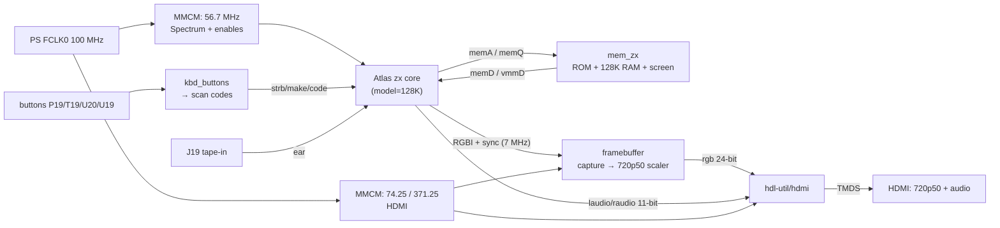
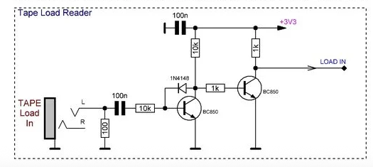

# Step 6 — A ZX Spectrum 128 on the EBAZ4205

Languages: **English** · [Русский](README.ru.md)

This is the big one. Steps 0–5 were the runway: power, JTAG, blink, buttons, HDMI
video, HDMI audio. Here it all comes together into a **real, timing-accurate ZX
Spectrum 128** running on a ~$10 board — HDMI video and sound, the four shield
buttons drive the boot menu, and it **loads games from tape** through an audio pin.
Put the SD card in and it boots the Spectrum on its own.

The display has been checked side by side against **ZEsarUX** (a reference emulator)
and matches — including the ULA quirks the timing test programs poke at.

## What it does

- **The original 128 boot menu** (the "toastrack" © 1986 Sinclair ROM): Tape Loader,
  128 BASIC, Calculator, 48 BASIC, **Tape Tester**.
- **HDMI video, 720p50**, the Spectrum picture in a 4:3 pillarbox with the **border**
  (so border effects survive).
- **HDMI audio**: AY/YM (128 sound chip) + beeper + tape-load sound, in the HDMI stream.
- **Menu navigation from the shield buttons**: P19 = down, T19 = up, U20 = Enter,
  U19 = Break.
- **Tape loading from an audio source**: feed a TAP/WAV player into pin **J19** and
  `LOAD ""` / the Tape Loader picks it up.
- **Boots from SD** (FSBL configures the PL from `BOOT.BIN`), or over JTAG.

## Proof it works — and the timing holds


*The ULA128 timing test — a program written to expose ULA/contention inaccuracies.
It renders cleanly here and matches ZEsarUX, so the core's timing holds up.*


*Ringo loading from tape through the J19 input — the multicolour loading border
(itself timing-critical) comes through correctly.*


*…and Ringo in-game.*

The tapes behind the timing shot ship in [`tests/`](tests/) so you can reproduce them on
your own board — load them through the J19 tape input (see **Run it**):

- **`ula128.tap`** — the ULA 128 timing test (azesmbog). If its border stripes and the
  paper/border boundary render cleanly and match ZEsarUX, the core's 128 ULA timing is right.
- **`AYtest_v0.2.tap`** — an AY-3-8910 / YM PSG sound test, to check the 128's chip audio
  in the HDMI stream.

Each ships as the original `.tap` (load from tape) and as a 128K `.z80` snapshot.

## Not reinventing the wheel

The Spectrum itself is the open-source **Atlas `zx`** core (T80 Z80, the ULA, AY via
JT49, 48K/128K, contention/timing inside the core). We didn't rewrite any of that — we
**forked it** and added a one-line build fix, then wrote only the *board* around it:

| Piece | Where it comes from |
|---|---|
| ZX Spectrum core | [AtlasFPGA/zx](https://github.com/AtlasFPGA/zx) → our fork [**Alex-Electron/zx** `ebaz4205-vivado`](https://github.com/Alex-Electron/zx/tree/ebaz4205-vivado) |
| Z80 | T80 (Daniel Wallner), inside the Atlas core |
| AY-3-8910 / YM2149 | JT49 (Jose Tejada / jotego), inside the Atlas core |
| HDMI encode + audio | [hdl-util/hdmi](https://github.com/hdl-util/hdmi) (MIT/Apache), same as Steps 3–5 |
| The board-top | this repo (`sources/`) |

The one fix in the fork: Vivado's VHDL is stricter than the ISE the core targeted, and
rejected a 4-bit literal AND-ed with a 9-bit signal in T80's ALU. Widening it to a
9-bit literal is the whole change — see the fork's `ebaz4205-vivado` branch.

## How it's wired



Our board modules (all in `sources/`):

- **`clock_zx.v`** — FCLK0 → an MMCM at ~56.7 MHz (the 128K master), plus the
  `pe7M0/ne7M0/pe3M5/ne3M5` clock enables the core needs.
- **`mem_zx.v`** — the memory the core's external bus expects, in Block RAM: the 32 KB
  +2-style ROM pair (here the toastrack 128 ROM), the 128 KB RAM, and a small screen
  buffer for the video fetch.
- **`framebuffer.v`** — captures the core's actual rendered **RGBI output pixel by
  pixel** (so the border and any border effects are kept, not re-drawn from screen RAM),
  and reads it back at 720p50 with a ×2 / pillarbox scale and the ZX palette.
- **`kbd_buttons.v`** — debounces the four buttons and turns each press into a single
  PS/2 scan-code *tap* the core's keyboard accepts.
- **`bulbulator_zx_top.v`** — ties it together with the proven HDMI stack from Step 5
  and the bare PS7 (for FCLK0). `hdmi_wrap.sv` is the thin stereo wrapper around hdl-util.

It fills the 7010 almost exactly: **60 of 60 Block RAM tiles**, ~20% of the LUTs.

## The things that bit us

The honest part. None of these were in the plan.

- **The keyboard ran in circles.** Two presses and the menu cursor would spin forever.
  The cause was one inverted bit: the Atlas core's `make` signal is **0 = pressed,
  1 = released** (its PS/2 layer sets `make` on the `F0` *release* prefix). We'd sent it
  the other way, so every "release" actually *held* the key down and the ROM auto-repeated.
  One line, a whole evening.
- **The buttons floated.** They're active-low and need an internal **pull-up** in the
  XDC; without it the released pin drifts and the debounce sees phantom presses.
- **The bitstream wouldn't flash over JTAG.** Steps 0–5 flashed fine, but this one
  always failed with `BAD_PACKET_ERROR` (`CONFIG_STATUS` bit 29), even compressed. It's
  not the size — it's that a **dense, BRAM-heavy** config stream trips a bug in the
  XVC-over-Pico path on this setup, while sparse demo bitstreams sail through. The fix is
  to skip JTAG configuration entirely and load over **PCAP**: DMA the bitstream into DDR
  (with read-back verification), then have the PS configure the PL from there. See
  `bulb_pcap_run.sh`. This is the "armoured train" route.
- **The first ROM had no Tape Tester.** The ROM the Atlas core ships is the grey +2
  (Amstrad) one; its menu is different. The original 128 *toastrack* ROM is the one with
  "Tape Tester" — fetched and converted by `sources/get_rom.sh`.
- **`bootgen` for the SD image segfaulted** on the build host (a botched tool move). The
  working `bootgen` was on a different machine — so `BOOT.BIN` (FSBL + bitstream + a tiny
  idle app) was built there. The FSBL sets FCLK0 = 100 MHz and configures the PL via PCAP
  at power-on — which is also why SD-boot dodges the JTAG `BAD_PACKET` problem for free.

## Build it yourself

You need the full Vivado 2023.1 (part `xc7z010clg400-1`). Fetch the shared cores
once from the repo root, then build:

```bash
../../get_deps.sh        # Atlas + HDMI cores, pinned to exact commits (once for the whole repo)
./build.sh               # → sources/build/bulbulator_zx_z010.bit
```

`build.sh` runs `sources/assemble.sh`, which links in the fetched cores, fetches
and converts the ROM (`get_rom.sh` → `rom128.hex`), and gathers this step's glue
into `sources/build/`; Vivado then builds in there. A prebuilt
**`bulbulator_zx_z010.bit`** is included if you just want to flash.

## Flash it — two ways

**SD card (standalone, recommended).** Take the [`flash/BOOT.BIN`](flash/) file from this
step and copy it to the **top level (root) of the SD card** — it must be named `BOOT.BIN`
and sit in the root, **not** inside any folder. (The `flash/` above is just where the file
lives in this repo; you do **not** create a `flash` folder on the card.) The card needs a
single **FAT32** partition — most micro-SD cards are already FAT32, so usually you just
drop the file on; otherwise format it FAT32 first. Then set the board to SD boot (see
[Step 0](../00-setup/)), insert the card, and power on — the Spectrum comes up by itself.
`BOOT.BIN` = Zynq FSBL + our bitstream + a do-nothing app; the FSBL brings up the
clocks/DDR and configures the PL. The Zynq BootROM only reads `BOOT.BIN` from the root of
the first FAT partition, so nothing else on the card matters.

**JTAG / PCAP (no SD).** Because the dense bitstream won't take plain JTAG config, use the
PCAP loader (load to DDR with verification, then PS configures the PL):

```bash
bash bulb_pcap_run.sh bulbulator_zx_z010.bit.bin   # .bit.bin via: bootgen -process_bitstream bin
```

`PCFG_DONE=1` means the PL is up. (`flash/ps7_init_fclk.tcl` + `flash/pcap_load.tcl` are
the PS-side helpers.)

## Run it

- **Menu:** T19/P19 move the cursor, U20 selects, U19 is Break.
- **Load a game from tape.** J19 is a 3.3 V *digital* input, so the analogue tape audio
  has to be squared into a clean logic level first. We used the **Tape Load Reader**
  front-end from the [Murmulator](https://murmulator.ru/) project — a small two-transistor
  squarer (AC-coupled audio in, a clean `LOAD IN` out). Wire its `LOAD IN` to **J19**
  (= `DATA2-09`) and share a ground with your player; on the Spectrum pick *Tape Loader*
  (or `LOAD ""`), start the TAP/WAV audio, and the loading stripes appear.

  
- **LEDs:** H18 blinks (alive); D18 (lock) stays off — cosmetic, the shield LED is
  active-low against a steady "locked" level.

Note on the framebuffer: at this step it's a single buffer. The Spectrum frame rate
(~50 Hz) and 720p50 are nearly identical, so the read/write seam parks off-screen, and on
the menu and in ordinary games the picture is stable and correct (matches ZEsarUX). The
catch, which showed up later, is that the two rates aren't *exactly* locked (~50.02 vs
50.000 Hz), so on border-effect demos the seam slowly crawls down the screen. That's what
[Step 8](../08-ddr-framebuffer/) fixes, by moving the frame into a triple-buffered PS DDR
framebuffer. The original research is in
[`DDR_FRAMEBUFFER_PLAN.md`](DDR_FRAMEBUFFER_PLAN.md); Step 8 is the realized version.

## Files

```
sources/   our board-top (clock_zx, mem_zx, framebuffer, kbd_buttons, top, hdmi_wrap),
           the XDC, the portable build script, and get_rom.sh
flash/     BOOT.BIN (SD), ps7_init_fclk.tcl + pcap_load.tcl (PCAP)
tests/     ula128.tap + AYtest_v0.2.tap (+ .z80 snapshots) — load-from-tape timing & sound checks
bulbulator_zx_z010.bit   prebuilt bitstream
bulb_pcap_run.sh         PCAP ("armoured train") loader
DDR_FRAMEBUFFER_PLAN.md  the original DDR framebuffer plan (realized in Step 8)
```

## Credits & licences

- **Atlas `zx` core** — [AtlasFPGA/zx](https://github.com/AtlasFPGA/zx); our build fork
  [Alex-Electron/zx](https://github.com/Alex-Electron/zx). Contains **T80** (Daniel
  Wallner) and **JT49** (Jose Tejada). Please see the upstream project for its terms;
  we redistribute only our board-top + a forked, attributed copy of the core.
- **HDMI**: [hdl-util/hdmi](https://github.com/hdl-util/hdmi) by Sameer Puri & contributors
  (MIT / Apache-2.0); we build from our fork [Alex-Electron/hdmi](https://github.com/Alex-Electron/hdmi).
- **128 ROM**: the © 1986 Sinclair/Amstrad ZX Spectrum 128 ROM, distributed under
  Amstrad's permission for emulation; fetched (not shipped) by `get_rom.sh` from the
  [fbzx](https://github.com/rastersoft/fbzx) project, via our fork
  [Alex-Electron/fbzx](https://github.com/Alex-Electron/fbzx).
- **Tape input front-end**: the *Tape Load Reader* squarer circuit is from the
  [Murmulator](https://murmulator.ru/) project — schematics at
  [AlexEkb4ever/MURMULATOR_classical_scheme](https://github.com/AlexEkb4ever/MURMULATOR_classical_scheme)
  (GPL-3.0). It's an external hardware front-end wired to J19; we credit and link it, and don't
  redistribute its files.
- **Test tapes** in `tests/` (`ula128`, `AYtest`) are third-party ZX scene test programs,
  included unmodified so you can verify timing and sound on real hardware; all rights remain
  with their original authors.
- Our board-top and scripts are this project's own work.

We keep our own forks of every upstream project we build on, so the build stays
reproducible even if upstream moves — always crediting and tracking the originals.
