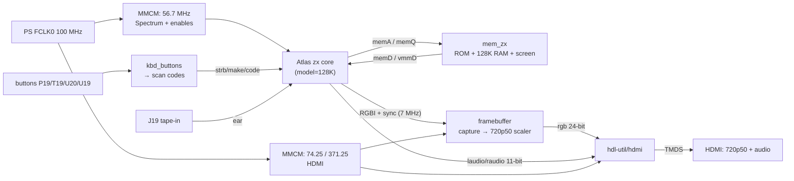

# Шаг 6 — ZX Spectrum 128 на EBAZ4205

Languages: [English](README.md) · **Русский**

Вот и главный этап. Шаги 0–5 были как разгоновой полосой: питание, JTAG, мигание, кнопки, видео по HDMI, звук по HDMI. Здесь всё это объединяется в **настоящий ZX Spectrum 128 с точным синхронизацией**, работающий на плате стоимостью около 10 долларов — видео и звук по HDMI, четыре кнопки на шилде управляют меню загрузки, а **игры загружаются с кассеты** через аудиоконтакт. Вставь SD-карту — и Spectrum загрузится сам по себе.

Отображение было проверено в параллельном режиме с **ZEsarUX** (эталонным эмулятором) и совпадает — включая особенности ULA, на которые указывают программы для тестирования синхронизации.

## Что он умеет

- **Оригинальное меню загрузки 128** (ROM «toastrack» © 1986 Sinclair): Tape Loader,
  128 BASIC, Calculator, 48 BASIC, **Tape Tester**.
- **Видео по HDMI, 720p50**: изображение Spectrum в формате 4:3 с бордюрами по бокам и **бордюрами**
  (так что эффекты бордюров сохраняются).
- **Звук по HDMI**: AY/YM (звуковой чип 128) + звуковой сигнал + звук загрузки с кассеты — всё в потоке HDMI.
- **Навигация по меню с помощью кнопок на расширении**: P19 = вниз, T19 = вверх, U20 = Enter,
  U19 = Break.
- **Загрузка кассеты из аудиоисточника**: подключи TAP/WAV-плеер к разъёму **J19** и
  `LOAD ""` — загрузчик кассеты распознает его.
- **Загрузка с SD** (FSBL настраивает PL из `BOOT.BIN`) или через JTAG.

## Доказательство, что всё работает — и синхронизация в норме


*Тест синхронизации ULA128 — программа, написанная для выявления неточностей в работе ULA и конфликтов доступа. Здесь она отображается корректно и совпадает с результатами ZEsarUX, значит, синхронизация ядра в норме.*


*Ringo загружается с кассеты через вход J19 — разноцветный бордюр загрузки (сама по себе критичная с точки зрения синхронизации) отображается правильно.*


*…и Ringo в игре.*

Кассеты, использованные в тестах синхронизации, находятся в папке [`tests/`](tests/), так что ты можешь воспроизвести их на своей плате — загрузи их через вход J19 для кассет (см. раздел **Запуск**):

- **`ula128.tap`** — тест синхронизации ULA 128 (azesmbog). Если бордюры рамки и
  граница между бумагой и рамкой отображаются чётко и совпадают с ZEsarUX, значит, синхронизация 128 ULA ядра в порядке.
- **`AYtest_v0.2.tap`** — тест звука AY-3-8910 / YM PSG для проверки встроенного звука 128
  в потоке HDMI.

Каждый поставляется в виде оригинального файла `.tap` (загрузка с ленты) и в виде 128K-снэпшота `.z80`.

## Не изобретаем велосипед

Сам Spectrum — это ядро с открытым исходным кодом **Atlas `zx`** (T80 Z80, ULA, AY через JT49, 48K/128K, управление конфликтами и синхронизация внутри ядра). Мы ничего из этого не переписывали — мы **создали форк** и добавили однострочное исправление для сборки, а потом написали только *плату* вокруг него:

| Элемент | Откуда взято |
|---|---|
| Ядро ZX Spectrum | [AtlasFPGA/zx](https://github.com/AtlasFPGA/zx) → наш форк [**Alex-Electron/zx** `ebaz4205-vivado`](https://github.com/Alex-Electron/zx/tree/ebaz4205-vivado) |
| Z80 | T80 (Дэниел Уоллнер), внутри ядра Atlas |
| AY-3-8910 / YM2149 | JT49 (Хосе Техада / jotego), внутри ядра Atlas |
| Кодирование HDMI + аудио | [hdl-util/hdmi](https://github.com/hdl-util/hdmi) (MIT/Apache), то же, что и в шагах 3–5 |
| Верхняя часть платы | этот репозиторий (`sources/`) |

Единственное исправление в форке: VHDL в Vivado более строгий, чем в ISE, на который было ориентировано ядро, и отклонял 4-битовый литерал, объединенный оператором AND с 9-битным сигналом в ALU T80. Расширение его до 9-битового литерала — и это всё изменение — смотри ветку `ebaz4205-vivado` в форке.

## Как это подключено



Наши модули платы (все находятся в папке `sources/`):

- **`clock_zx.v`** — FCLK0 → MMCM с частотой ~56,7 МГц (мастер 128K), плюс
  `pe7M0/ne7M0/pe3M5/ne3M5` — тактовые сигналы, необходимые для работы ядра.
- **`mem_zx.v`** — память, которую ожидает внешняя шина ядра, в виде Block RAM: пара ПЗУ объёмом 32 КБ
  +2-типа (здесь — ROM «toastrack 128»), 128 КБ ОЗУ и небольшой буфер экрана
  для вывода видео.
- **`framebuffer.v`** — фиксирует фактически отрисованный ядром **RGBI-вывод пиксель за
  пиксель** (так что бордюры и любые эффекты по краям сохраняются, а не перерисовываются из экранной ОЗУ),
  и считывает его обратно в формате 720p50 с масштабированием ×2 / pillarbox и палитрой ZX.
- **`kbd_buttons.v`** — устраняет дребезг четырёх кнопок и преобразует каждое нажатие в один
  *импульс* сканирующего кода PS/2, который принимает клавиатура ядра.
- **`bulbulator_zx_top.v`** — объединяет всё это с проверенным стеком HDMI из шага 5
  и «голым» PS7 (для FCLK0). `hdmi_wrap.sv` — это лёгкая стерео-обёртка вокруг hdl-util.

Он почти полностью заполняет 7010: **60 из 60 блоков Block RAM**, ~20% LUT.

## Что нас подвело

Буду честен. Ничего из этого не было в планах.

- **Клавиатура зациклилась.** Два нажатия — и курсор меню начинал крутиться бесконечно.
  Причина была в одном инвертированном бите: сигнал `make` ядра Atlas — **0 = нажато,
  1 = отпущено** (его PS/2-уровень устанавливает `make` при префиксе *отпускания* `F0`). Мы послали сигнал
  в обратном направлении, поэтому каждое «отпускание» на самом деле *удерживало* клавишу нажатой, а ПЗУ включало автоповтор.
  Одна строчка — целый вечер.
- **Кнопки «плавали».** У них активный низкий уровень, и им нужен внутренний **подтягивающий резистор** в
  XDC; без него вывод «отпустил» дрейфует, и фильтр отскока фиксирует фантомные нажатия.
- **Битовый поток не прошивался через JTAG.** Шаги 0–5 прошивались нормально, но этот
  всегда заканчивался сбоем с ошибкой `BAD_PACKET_ERROR` (бит 29 в `CONFIG_STATUS`), даже в сжатом виде. Дело
  не в размере — просто **плотный, насыщенный BRAM** конфигурационный поток запускает баг в
  тракте XVC-over-Pico в этой конфигурации, в то время как разреженные демонстрационные битовые потоки проходят без проблем. Решение —
  полностью обойти конфигурацию через JTAG и загрузить через **PCAP**: загрузить битовый поток в DDR с помощью DMA
  (с проверкой обратного считывания), а затем заставить PS настроить PL оттуда. См.
  `bulb_pcap_run.sh`. Это маршрут «бронированного поезда».
- **В первом ПЗУ не было Tape Tester.** ПЗУ, которое поставляется с ядром Atlas, — это серое +2
  (Amstrad); у него другое меню. Оригинальный ROM 128 *toastrack* — это тот, в котором есть
  «Tape Tester» — его загружает и конвертирует `sources/get_rom.sh`.
- **`bootgen` для образа SD давал ошибку segfault** на хосте сборки (неудачное перемещение инструмента).
  Рабочий `bootgen` находился на другой машине — поэтому `BOOT.BIN` (FSBL + битовый поток + небольшое
  приложение для ожидания) был скомпилирован там. FSBL устанавливает FCLK0 = 100 МГц и настраивает PL через PCAP
  при включении питания — именно поэтому загрузка с SD автоматически обходит проблему JTAG `BAD_PACKET`.

## Собери сам

Тебе понадобится Vivado 2023.1 (полная версия, для синтеза) и микросхема `xc7z010clg400-1`.

```bash
cd sources/
git clone -b ebaz4205-vivado https://github.com/Alex-Electron/zx        # the Atlas core, with the T80 fix
git clone https://github.com/Alex-Electron/hdmi                         # the HDMI core (our fork of hdl-util/hdmi)
bash get_rom.sh                                                         # downloads + builds rom128.hex
vivado -mode batch -source build_bulbulator_zx.tcl                      # → bulbulator_zx_z010.bit
```

Структура каталогов, которую ожидает сборка (форк Atlas в `sources/zx/`, hdl-util в `sources/hdmi/`), описана в начале файла `build_bulbulator_zx.tcl`. Если тебе просто нужно прошить устройство, в комплект входит готовый файл **`bulbulator_zx_z010.bit`**.

## Прошивка — два способа

**SD-карта (автономный режим, рекомендуется).** Возьми файл [`flash/BOOT.BIN`](flash/) из этого шага и скопируй его в **корневой каталог SD-карты** — он должен называться `BOOT.BIN` и находиться в корне, **а не** внутри какой-либо папки. (Указанный выше каталог `flash/` — это просто место, где файл находится в этом репозитории; тебе **не** нужно создавать папку `flash` на карте.) На карте должен быть только один раздел **FAT32** — большинство карт micro-SD уже отформатированы в FAT32, так что обычно достаточно просто скопировать туда файл; в противном случае сначала отформатируй карту в FAT32. Затем настрой плату на загрузку с SD-карты (см. [Шаг 0](../00-setup/)), вставь карту и включи питание — Spectrum загрузится сам. `BOOT.BIN` = FSBL Zynq + наш битовый поток + приложение, которое ничего не делает; FSBL запускает тактовые генераторы и DDR, а также настраивает PL. BootROM Zynq считывает только `BOOT.BIN` из корня первого раздела FAT, поэтому остальное содержимое карты не имеет значения.

**JTAG / PCAP (без SD).** Поскольку плотный битстрим не принимает обычную JTAG-конфигурацию, используй загрузчик PCAP (загрузка в DDR с верификацией, после чего PS настраивает PL):

```bash
bash bulb_pcap_run.sh bulbulator_zx_z010.bit.bin   # .bit.bin via: bootgen -process_bitstream bin
```

`PCFG_DONE=1` означает, что PL готов к работе. (`flash/ps7_init_fclk.tcl` + `flash/pcap_load.tcl` — это вспомогательные скрипты со стороны PS.)

## Запусти программу

- **Меню:** T19/P19 — перемещение курсора, U20 — выбор, U19 — остановка.
- **Загрузка игры с ленты.** J19 — это *цифровой* вход на 3,3 В, поэтому аналоговый аудиосигнал с ленты
  сначала нужно преобразовать в чистый логический уровень. Мы использовали **Tape Load Reader**
  — интерфейс из проекта [Murmulator](https://murmulator.ru/) — небольшой двухтранзисторный
  преобразователь (аудиовход с переменным током, чистый выход `LOAD IN`). Подключи его `LOAD IN` к **J19**
  (= `DATA2-09`) и соедини на землю с твоим проигрывателем; на Spectrum выбери *Tape Loader*
  (или `LOAD ""`), запусти аудио TAP/WAV, и на экране появятся полоски загрузки.

 - **Светодиоды:** H18 мигает (работает); D18 (блокировка) не горит — это чисто косметический эффект, светодиод экрана работает по схеме «активный низ» на фоне постоянного уровня «заблокировано».

Примечание про фреймбуфер: на этом шаге он одинарный. Частоты Spectrum (~50 Гц) и 720p50 почти совпадают, поэтому граница чтения/записи стоит за пределами экрана, и в меню и обычных играх картинка стабильна и корректна (совпадает с ZEsarUX). Загвоздка, которая вылезла позже: точного совпадения частот нет (~50,02 против 50,000 Гц), так что на демо с эффектами в бордюре эта граница медленно ползёт вниз по экрану — это и устраняет [Шаг 8](../08-ddr-framebuffer/), перенося кадр в фреймбуфер с тройной буферизацией в PS DDR. Исходное исследование лежит в [`DDR_FRAMEBUFFER_PLAN.md`](DDR_FRAMEBUFFER_PLAN.md); Шаг 8 — его реализация.

## Файлы

```
sources/   our board-top (clock_zx, mem_zx, framebuffer, kbd_buttons, top, hdmi_wrap),
           the XDC, the portable build script, and get_rom.sh
flash/     BOOT.BIN (SD), ps7_init_fclk.tcl + pcap_load.tcl (PCAP)
tests/     ula128.tap + AYtest_v0.2.tap (+ .z80 snapshots) — load-from-tape timing & sound checks
bulbulator_zx_z010.bit   prebuilt bitstream
bulb_pcap_run.sh         PCAP ("armoured train") loader
DDR_FRAMEBUFFER_PLAN.md  the original DDR framebuffer plan (realized in Step 8)
```

## Авторы и лицензии

- **Ядро Atlas `zx`** — [AtlasFPGA/zx](https://github.com/AtlasFPGA/zx); наш форк сборки
  [Alex-Electron/zx](https://github.com/Alex-Electron/zx). Содержит **T80** (Дэниел
  Уоллнер) и **JT49** (Хосе Техада). Условия использования смотри в исходном проекте;
  мы распространяем только нашу версию для конкретной платы + форк ядра с указанием авторства.
- **HDMI**: [hdl-util/hdmi](https://github.com/hdl-util/hdmi) от Sameer Puri и других авторов
  (MIT / Apache-2.0); мы собираем из нашего форка [Alex-Electron/hdmi](https://github.com/Alex-Electron/hdmi).
- **128 ROM**: ROM для Sinclair/Amstrad ZX Spectrum 128 © 1986, распространяемый по
  разрешению Amstrad для эмуляции; загружается (но не поставляется) скриптом `get_rom.sh` из
  проекта [fbzx](https://github.com/rastersoft/fbzx) через наш форк
  [Alex-Electron/fbzx](https://github.com/Alex-Electron/fbzx).
- **Интерфейс для ввода с кассеты**: схема усилителя *Tape Load Reader* взята из
  проекта [Murmulator](https://murmulator.ru/) — схемы на
  [AlexEkb4ever/MURMULATOR_classical_scheme](https://github.com/AlexEkb4ever/MURMULATOR_classical_scheme)
  (GPL-3.0). Это внешний аппаратный интерфейс, подключённый к разъёму J19; мы указываем авторство и даём ссылку на него, но не
  распространяем его файлы.
- **Тестовые ленты** в папке `tests/` (`ula128`, `AYtest`) — это сторонние тестовые программы из ZX-сообщества,
  включённые без изменений, чтобы ты мог проверить синхронизацию и звук на реальном оборудовании; все права остаются
  за их оригинальными авторами.
- Наши надстройки и скрипты — это собственная работа этого проекта.

Мы ведём собственные форки всех исходных проектов, на которых строимся, чтобы сборка оставалась воспроизводимой, даже если исходные проекты изменятся — всегда указывая авторство и отслеживая оригиналы.
