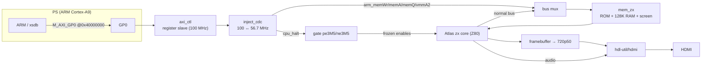

# Step 7 — Waking up the ARM: a PS↔PL control plane

Languages: **English** · [Русский](README.ru.md)

The EBAZ4205 has two halves: the FPGA fabric (PL) and a dual-core ARM Cortex-A9 (PS).
Steps 0–6 used only the fabric — the whole Spectrum lives there, and the ARM did nothing
but hand us a 100 MHz clock. That's half the chip idle.

This step wakes the ARM up. It adds a small **AXI register interface** between the PS and
the PL so the ARM can **halt the Z80** and **read/write the Spectrum's memory** — live, while
the machine is running. That's the foundation for the real prize (loading games from SD
without a tape), and this step proves the plumbing end to end on hardware.

It's the [speccy2010](https://github.com/mborik/speccy2010) idea — *FPGA is the bare
machine, the CPU on the side does OSD / file-loading / snapshots over a register bus* —
brought to Zynq, where that bus is **AXI**.

## What it does

The bitstream here is the **Step-6 Spectrum, unchanged in behaviour, plus a dormant control
plane**. Boot it from SD and you get exactly the Step-6 machine — same menu, video, sound,
buttons, tape loading (verified against ZEsarUX again, `ula128` and all). Nothing regressed.

What's new is what the ARM can now do over `M_AXI_GP0`:

- **Milestone 1 — the AXI handshake.** A tiny standalone bitstream (`m1-handshake-test/`,
  bare PS7 + the register slave, no Spectrum) where the ARM reads/writes registers over
  GP0: `VERSION` reads back `0xB01B0001`, a control bit drives an LED, a free-running counter
  proves the slave is alive. We built this **first**, on purpose — AXI deadlocks are subtle,
  and you do not want to discover one buried inside 2000 lines of integration.
- **Milestone 2 — halt + memory write.** In the full bitstream, the ARM sets `CONTROL.HALT`,
  the Z80 freezes (and says so via `STATUS.HALT_ACK`), and the ARM streams bytes straight
  into the Spectrum's screen RAM. **You watch the picture change on HDMI** while the Z80 is
  stopped.

## Proof it works


*The ARM froze the Z80 on the 128 boot menu and filled the screen's attribute area over AXI —
the whole display goes red while the CPU is held, the menu text still legible in black. Un-halt
and the Spectrum carries on from exactly where it stopped. This is the PS reaching into the PL's
memory, live.*

## Why this and not another demo

Of the directions open after Step 6 — polish/accuracy demos, scale up to bigger machines, or
put the ARM to work — this one ships a real capability *and* builds the exact PS↔PL plumbing
(AXI master, a C runtime on the ARM, later PS DDR) that any scale-up needs anyway. It
sidesteps the 100%-full Block RAM wall entirely: the ARM and its work live in PS DDR, not in
the fabric. The control plane is **Stage 1**; the **`.sna` snapshot loader** (the ARM reads a
game off the SD card and injects it) is the next step and reuses everything here.

## How it's wired



The register map (base = `M_AXI_GP0` `0x4000_0000`), AXI3, 32-bit:

| Offset | Name | R/W | Meaning |
|---|---|---|---|
| `0x00` | `VERSION`  | R   | `0xB01B0002` (the `m1-handshake-test` slave reads `0xB01B0001`) |
| `0x04` | `CONTROL`  | R/W | bit0 = **HALT** (1 ⇒ freeze the Z80; the ARM owns the memory bus) |
| `0x08` | `STATUS`   | R   | bit0 = **HALT_ACK** (CPU frozen, safe to write), bit1 = `RAM_BUSY` |
| `0x0C` | `COUNTER`  | R   | free-running clock counter (liveness) |
| `0x10` | `RAM_ADDR` | R/W | 17-bit Spectrum RAM byte address; **auto-increments** after each `RAM_DATA` write |
| `0x14` | `RAM_DATA` | W   | write a byte → `RAM[RAM_ADDR]`, then `RAM_ADDR++` (stream a page with repeated writes) |
| `0x18` | `SCRATCH`  | R/W | spare 32-bit register |

The new board modules (in `sources/`):

- **`axi_ctl.v`** — the AXI3 slave on GP0: the register file above, purely in the 100 MHz AXI
  clock domain. Designed clean and versioned from day one — we did **not** inherit
  speccy2010's ad-hoc bus, only its *idea*.
- **`inject_cdc.v`** — the clock-domain crossing into the ~56.7 MHz Spectrum domain: a 2-FF
  synchroniser for the HALT level, and a toggle-synchronised, multi-cycle handshake for each
  RAM write (so a write strobe lands as exactly one Spectrum-clock pulse with stable
  address/data). This is the part to get right; everything else is bookkeeping.
- **`bulbulator_zx_top.v`** — the Step-6 top, plus the PS7 `M_AXI_GP0` ports, `axi_ctl`,
  `inject_cdc`, the HALT gate, and the memory-bus mux. The HDMI video/audio path is untouched.

Two design choices worth calling out:

- **HALT touches the Atlas core zero times.** Instead of editing the core, the top simply
  ANDs `~cpu_halt` into the two 3.5 MHz CPU clock-enables (`pe3M5`/`ne3M5`) *at the core's
  input*. That freezes the Z80 and the MMU (so `memWr`/`memA`/`vmmA2` hold steady) while the
  video enables (`pe7M0`/`ne7M0`) and the HDMI audio keep running — the picture stays live
  and the sound chip keeps going. The minimal-fork discipline from Step 6 holds: the core is
  still upstream + a one-line build fix.
- **Writing RAM costs zero Block RAM.** The 7010's BRAM is 100% full (60/60). There's no room
  for a third memory port. So while the Z80 is halted the ARM is *muxed onto the core's own
  `memWr`/`memA`/`memQ`/`vmmA2` bus* — the same wires the CPU would have driven. A handful of
  LUTs, not a byte of BRAM.

It still fits: **60/60 Block RAM, ~21% LUTs**, timing closed (including the 100 ↔ 56.7 MHz
crossing).

## The things that bit us

- **The off-by-one that ate the top-left character.** First run, the screen filled red
  *except one cell, top-left, inside the active area*. The cause: `axi_ctl` bumped `RAM_ADDR`
  in the same clocked assignment that raised the write strobe, so by the time `inject_cdc`
  latched the address (one cycle later, when it saw the strobe) the address was **already
  incremented** — every byte landed at `base+1`, and `base` itself was never written. The fix
  is a dedicated `ctl_ram_waddr` register that captures the *pre-increment* address and is the
  one the CDC latches. Lesson: when streaming through a toggle-synchronised CDC, hand the
  destination the address *before* you advance the pointer.
- **The Z80 core can already accept a register dump — for free.** The T80 inside the Atlas
  core is the Sorgelig lineage (the same one speccy2010 uses), and it *already* exposes the
  `DIRSet`/`DIR` parallel register-load interface — `cpu.v` just ties it off. So the upcoming
  `.sna` loader (which has to set PC/SP/AF/the lot) needs **no CPU surgery**; we just connect
  pins that are already compiled in. Found this by reading the core instead of assuming.
- **`bootgen` for the SD image is glibc-picky.** On a bleeding-edge host (glibc 2.43) the full
  boot-image build (`FSBL + bitstream + idle.elf → BOOT.BIN`) segfaults during ELF parsing,
  even though every bundled library is present — the 2023.1 tool predates that glibc. The
  bitstream-only mode (`-process_bitstream bin`, used for the PCAP path) is unaffected. The fix
  is baked into each step's `flash/build_boot.sh`: hand bootgen pre-extracted `.bin` partitions
  (no ELF parsing, so no segfault), then patch the BootROM header's length and checksum fields.
  No extra tool — just the `bootgen` that ships with Vivado.

## Milestone 1 first — the bare-metal handshake (`m1-handshake-test/`)

Before integrating anything, build and flash the standalone test: a bare PS7 + the register
slave + two LEDs, nothing Spectrum. Then, over the Pico/XVC JTAG link:

```
mrd 0x40000000     → 0xB01B0001   # the read path works
mwr 0x40000004 1   → LED on        # the write path works
mrd 0x40000004     → 1             # the latch / read-back works
mrd 0x4000000C  (twice)            # COUNTER changes → the slave is clocked
```

`m1-handshake-test/axi_flash_test.sh` drives exactly this (Vivado Lab holds the XVC target,
`xsdb` programs the small bitstream and does the `mrd`/`mwr`). If that round-trips, the PS↔PL
AXI path is sound and you can integrate with confidence.

> On a Zynq-7010 the GP0 master is dead until `ps7_init` has run (FCLK0 — the AXI clock — is
> off on a bare PS7 until the clock registers are programmed). The scripts run `ps7_init`
> first; this is also the empirical confirmation that GP0 works at all.

## Build it yourself

Vivado 2023.1 (full), part `xc7z010clg400-1`. Same shape as Step 6 — fetch the
cores once from the repo root, then build:

```bash
../../get_deps.sh        # Atlas + HDMI cores, pinned (once for the whole repo)
./build.sh               # → sources/build/bulbulator_zx_z010.bit
```

This step reuses Step 6's glue unchanged and adds only its delta (`axi_ctl.v`,
`inject_cdc.v`, and the changed top + constraints); `sources/assemble.sh` pulls the
shared files from Step 6 and gathers everything into `sources/build/`. The standalone
Milestone-1 bitstream builds from `m1-handshake-test/build_axi_test.tcl` (no ROM, no
Atlas core needed). Prebuilt `bulbulator_zx_z010.bit` and `flash/BOOT.BIN` are
included if you just want to run it.

## Flash it

**SD card (standalone).** Copy [`flash/BOOT.BIN`](flash/) to the **root** of a FAT32 SD card
as `BOOT.BIN` (not inside any folder — the `flash/` path is just where it lives in the repo),
set the board to SD boot ([Step 0](../00-setup/)), insert, power on. The Spectrum comes up by
itself; the control plane sits dormant until something on the ARM (or `xsdb`) drives it.

**JTAG / PCAP (dev).** The bitstream is dense, so it won't take plain JTAG config (the Step-6
`BAD_PACKET` story) — load it over PCAP:

```bash
bash bulb_pcap_run.sh        # bootgen .bit.bin → DDR (verified) → PS configures the PL via PCAP
```

`PCFG_DONE=1` means the PL is up. (`flash/ps7_init_fclk.tcl` + `flash/pcap_load.tcl` are the
PS-side helpers, same as Step 6.)

## Run the demo — the ARM paints the screen

With the PL configured (PCAP or SD) and `xsdb` attached over the Pico:

```tcl
# (m2_poke.tcl does this end to end)
mwr 0x40000004 0x1                 ;# HALT the Z80
# spin until STATUS bit0 (HALT_ACK) = 1
mwr 0x40000010 0x00015800          ;# RAM_ADDR = bank-5 attributes (0x14000 + 0x1800)
for {set i 0} {$i < 768} {incr i} { mwr 0x40000014 0x10 }   ;# paper = red, INK = black
```

`0x15800` is where the displayed screen's attribute bytes live in the 128K RAM map (RAM region
`memA[18:17]=01`, bank 5 = `0x14000`, attribute offset `0x1800`); 768 bytes cover all
24 × 32 cells. `RAM_ADDR` auto-increments, so it's just a stream of `RAM_DATA` writes. The
whole screen turns red while the Z80 is frozen. Drop `CONTROL.HALT` and the Spectrum resumes.

`bulb_m2_run.sh` chains the whole thing: PCAP-configure → halt → paint.

## What's next

The register window + halt are the hard part; the payoff is close. **Stage 1 finishes with a
`.sna` loader**: wire the T80 `DIRSet`/`DIR` register injection and the 7FFD/FE port writes
into `axi_ctl`, then a small bare-metal ARM program reads a snapshot off the SD card and
streams its RAM pages, ports and Z80 registers over this exact bus — and a game loads and
runs, no tape. After that, the software floppy (TR-DOS) and an on-screen file browser are the
same pattern again.

## Files

```
sources/             integrated build: the Step-6 board + axi_ctl.v + inject_cdc.v, XDC, build script, get_rom.sh
m1-handshake-test/   standalone bare-PS7 AXI handshake bitstream + its flash/test script (built first)
flash/               how to get the design onto the board: BOOT.BIN (SD boot) + ps7_init_fclk.tcl + pcap_load.tcl (the JTAG/PCAP config helpers)
m2_poke.tcl              the demo run by the ARM: halt the Z80, paint the screen (invoked by bulb_m2_run.sh)
bulbulator_zx_z010.bit   prebuilt integrated bitstream
bulb_pcap_run.sh         PCAP loader (dev flashing)
bulb_m2_run.sh           PCAP-configure → halt → paint, end to end
```

## Credits & licences

Same upstream as Step 6 — the **Atlas `zx`** core ([AtlasFPGA/zx](https://github.com/AtlasFPGA/zx)
→ our fork [Alex-Electron/zx](https://github.com/Alex-Electron/zx), containing T80 by Daniel
Wallner and JT49 by Jose Tejada), **HDMI** from
[hdl-util/hdmi](https://github.com/hdl-util/hdmi) (→ [Alex-Electron/hdmi](https://github.com/Alex-Electron/hdmi)),
the 128 ROM fetched by `get_rom.sh`. The control-plane idea is from
[speccy2010](https://github.com/mborik/speccy2010) (→ our fork
[Alex-Electron/speccy2010](https://github.com/Alex-Electron/speccy2010)); we port the *concept*
to AXI, not its bus layout. `axi_ctl.v`, `inject_cdc.v`, the board-top and the scripts are this
project's own work.
