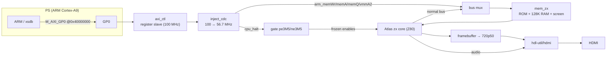

# Шаг 7 — Пробуждение ARM: плоскость управления PS↔PL

Languages: [English](README.md) · **Русский**

EBAZ4205 состоит из двух частей: матрицы FPGA (PL) и двухъядерного процессора ARM Cortex-A9 (PS). На шагах 0–6 использовалась только матрица — вся система Spectrum находится именно там, а ARM просто выдавал нам тактовую частоту 100 МГц. То есть половина чипа простаивает.

На этом этапе мы пробуждаем ARM. Добавляем небольшой **интерфейс регистров AXI** между PS и PL, чтобы ARM мог **останавливать Z80** и **читать/записывать в память Spectrum** — прямо на ходу, пока машина работает. Это основа для настоящего прорыва (загрузка игр с SD-карты без кассеты), и этот шаг доказывает, что вся «трубопроводка» на аппаратном уровне работает от начала до конца.

Это идея [speccy2010](https://github.com/mborik/speccy2010) — *FPGA — это «голая» машина, а процессор на боковой плате занимается OSD, загрузкой файлов и созданием снимков состояния через регистровую шину* — реализованная на Zynq, где эта шина — **AXI**.

## Как это работает

Битстрим здесь представляет собой **Spectrum из шага 6, с неизменным поведением, плюс неактивная плоскость управления**. Загрузи его с SD-карты, и ты получишь именно ту же машину, что и в шаге 6 — то же меню, видео, звук, кнопки, загрузка кассет (снова проверено по сравнению с ZEsarUX, включая `ula128` и всё остальное). Ничего не ухудшилось.

Новое заключается в том, что ARM теперь может делать через `M_AXI_GP0`:

- **Этап 1 — установка связи по AXI.** Крошечный автономный битстрим (`m1-handshake-test/`,
  только PS7 + ведомый регистр, без Spectrum), в котором ARM читает/записывает регистры через
  GP0: `VERSION` возвращает `0xB01B0001`, управляющий бит управляет светодиодом, а автономный счётчик
  подтверждает, что ведомое устройство работает. Мы специально создали это **первым** — тупиковые ситуации в AXI труднозаметны,
  и тебе не захочется обнаруживать их, зарытые в 2000 строк интеграционного кода.
- **Этап 2 — остановка + запись в память.** В полном битстриме ARM устанавливает `CONTROL.HALT`,
  Z80 зависает (и сообщает об этом через `STATUS.HALT_ACK`), а ARM передаёт байты напрямую
  в экранную ОЗУ Spectrum. **Ты видишь, как изображение меняется по HDMI**, пока Z80
  остановлен.

## Доказательство, что всё работает


*ARM заморозил Z80 в меню загрузки 128 и заполнил область атрибутов экрана через AXI — весь дисплей становится красным, пока процессор приостановлен, а текст меню по-прежнему читаем чёрным. Сними приостановку — и Spectrum продолжит работу именно с того места, где остановился. Это PS, обращающийся к памяти PL в режиме реального времени.*

## Почему именно это демо, а не какое-то другое

Из всех направлений, открывающихся после шага 6 — доработка/уточнение демо, масштабирование на более мощные машины или задействование ARM — именно это демо демонстрирует реальные возможности *и* создаёт именно ту инфраструктуру PS↔PL (AXI-мастер, среда выполнения C на ARM, позже PS DDR), которая в любом случае нужна для любого масштабирования. Она полностью обходит «барьер» 100%-ной загрузки Block RAM: ARM и его работа находятся в PS DDR, а не в фабрике. Управляющая плоскость — это **Этап 1**; **загрузчик снимков `.sna`** (ARM считывает игру с SD-карты и запускает её) — следующий шаг, который повторно использует всё, что здесь есть.

## Как всё подключено



Карта регистров (база = `M_AXI_GP0` `0x4000_0000`), AXI3, 32-битная:

| Смещение | Название | Ч/З | Значение |
|---|---|---|---|
| `0x00` | `VERSION`  | Ч/З   | `0xB01B0002` (ведомый `m1-handshake-test` считывает `0xB01B0001`) |
| `0x04` | `CONTROL`  | Ч/З | бит 0 = **HALT** (1 ⇒ заморозить Z80; ARM владеет шиной памяти) |
| `0x08` | `STATUS`   | R   | бит 0 = **HALT_ACK** (процессор приостановлен, можно записывать), бит 1 = `RAM_BUSY` |
| `0x0C` | `COUNTER`  | Ч   | счетчик свободно идущего тактового генератора (проверка работоспособности) |
| `0x10` | `RAM_ADDR` | Ч/З | 17-битовый байтовый адрес ОЗУ Spectrum; **автоматически увеличивается** после каждой записи в `RAM_DATA` |
| `0x14` | `RAM_DATA` | W   | запись байта → `RAM[RAM_ADDR]`, затем `RAM_ADDR++` (потоковая запись страницы с повторяющимися операциями записи) |
| `0x18` | `SCRATCH`  | Ч/З | запасной 32-битный регистр |

Новые модули платы (в `sources/`):

- **`axi_ctl.v`** — ведомый AXI3 на GP0: вышеупомянутый файл регистров, работающий исключительно в тактовой области AXI 100 МГц
  . Разработан с самого начала с учётом чистоты кода и версионирования — мы **не** унаследовали
  специально разработанную шину speccy2010, а только её *идею*.
- **`inject_cdc.v`** — переход между тактовыми доменами в домен Spectrum с частотой ~56,7 МГц: 2-FF
  для уровня HALT и синхронизированный по переключению многоцикловый обмен данными для каждой
  записи в ОЗУ (так что импульс записи приходится ровно на один такт Spectrum со стабильными
  адресом и данными). Вот эту часть нужно сделать правильно; всё остальное — просто формальности.
- **`bulbulator_zx_top.v`** — верхний уровень Step-6, плюс порты PS7 `M_AXI_GP0`, `axi_ctl`,
  `inject_cdc`, вентиль HALT и мультиплексор шины памяти. Видео- и аудиотракт HDMI остаётся без изменений.

Стоит отметить два важных решения при проектировании:

- **HALT ни разу не затрагивает ядро Atlas.** Вместо того чтобы изменять ядро, верхний уровень просто
  применяет операцию AND к `~cpu_halt` в двух сигналах разрешения тактовой частоты ЦП 3,5 МГц (`pe3M5`/`ne3M5`) *на входе ядра*.
  * Это приостанавливает работу Z80 и MMU (поэтому `memWr`/`memA`/`vmmA2` остаются неизменными), в то время как
  сигналы разрешения видео (`pe7M0`/`ne7M0`) и аудио по HDMI продолжают работать — изображение остаётся живым,
  а звуковой чип продолжает работать. Соблюдается принцип минимального количества форков из шага 6: ядро
  по-прежнему находится в верхнем течении + исправление на одну строку в сборке.
- **Запись в ОЗУ не требует использования Block RAM.** BRAM 7010 заполнена на 100% (60/60). Места
  для третьего порта памяти нет. Поэтому, пока Z80 остановлен, ARM *подключается к собственной шине ядра
  `memWr`/`memA`/`memQ`/`vmmA2` ядра* — те же самые линии, которыми управлял бы процессор. Всего несколько
  LUT, ни одного байта BRAM.

Всё по-прежнему укладывается: **60/60 блочной ОЗУ, ~21% LUT**, тайминги уложились (включая переход с 100 на 56,7 МГц).

## Что нас подвело

- **Ошибка «off-by-one», которая съела символ в левом верхнем углу.** При первом запуске экран заполнился красным
  *за исключением одной ячейки — верхней левой, внутри активной области*. Причина: `axi_ctl` изменил `RAM_ADDR`
  в том же тактовом присвоении, которое вызвало строб записи, так что к моменту, когда `inject_cdc`
  зафиксировал адрес (на один цикл позже, когда увидел импульс), адрес был **уже
  инкментирован** — каждый байт попадал в `base+1`, а само `base` так и не было записано. Исправление
  заключается в использовании специального регистра `ctl_ram_waddr`, который фиксирует адрес *до инкремента* и именно его
  фиксирует CDC. Урок: при потоковой передаче через CDC с синхронизацией по переключению передавай
  адрес в конечный регистр *до* того, как сдвинешь указатель.
- **Ядро Z80 уже может принимать дамп регистров — бесплатно.** T80 внутри ядра Atlas
  происходит из линейки Sorgelig (та же, что используется в speccy2010), и оно *уже* предоставляет
  параллельный интерфейс загрузки регистров `DIRSet`/`DIR` — файл `cpu.v` просто его отключает. Так что предстоящему
  загрузчику `.sna` (которому предстоит настроить PC/SP/AF и всё остальное) **не потребуется никаких изменений в CPU**; мы просто подключаем
  контакты, которые уже вкомпилированы. Обнаружил это, изучив ядро, а не делая предположений.
- **`bootgen` для образа SD очень привередлив к glibc.** На самом новом хосте (glibc 2.43) полная
  сборка загрузочного образа (`FSBL + bitstream + idle.elf → BOOT.BIN`) вылетает с ошибкой сегментации при разборе ELF,
  хотя все необходимые библиотеки присутствуют — инструмент версии 2023.1 выпущен до появления этой версии glibc. Режим
  только с битстримом (`-process_bitstream bin`, используется для пути PCAP) не затронут. Исправление
  встроено в скрипт `flash/build_boot.sh` каждого этапа: сначала вручную запускается `bootgen` с предварительно
  извлечёнными разделами `.bin` (без анализа ELF, поэтому нет ошибок сегментации), а затем в поля длины и
  контрольной суммы заголовка BootROM вносятся исправления. Никаких дополнительных инструментов — только
  `bootgen`, который идёт в комплекте с Vivado.

## Сначала этап 1 — установка связи с «голым железом» (`m1-handshake-test/`)

Прежде чем что-либо интегрировать, собери и запиши в ПЗУ автономный тест: «голый» PS7 + регистровый ведомый модуль + два светодиода, без Spectrum. Затем через JTAG-соединение Pico/XVC:

```
mrd 0x40000000     → 0xB01B0001   # the read path works
mwr 0x40000004 1   → LED on        # the write path works
mrd 0x40000004     → 1             # the latch / read-back works
mrd 0x4000000C  (twice)            # COUNTER changes → the slave is clocked
```

Скрипт `m1-handshake-test/axi_flash_test.sh` как раз и запускает этот процесс (Vivado Lab управляет целевым устройством XVC, а `xsdb` записывает небольшой битстрим и выполняет команды `mrd`/`mwr`). Если всё прошло успешно, путь AXI PS↔PL исправен, и ты можешь смело приступать к интеграции.

> На Zynq-7010 мастер GP0 не работает, пока не запустится `ps7_init` (FCLK0 — тактовая частота AXI —
> отключена на «голом» PS7, пока не запрограммированы тактовые регистры). Скрипты сначала запускают `ps7_init`
> в первую очередь; это также эмпирическое подтверждение того, что GP0 вообще работает.

## Собери сам

Vivado 2023.1 (полная версия), компонент `xc7z010clg400-1`. Делай так же, как в шаге 6 — сначала загрузи ядра из корня репозитория, а потом собери:

```bash
../../get_deps.sh        # Atlas + HDMI cores, pinned (once for the whole repo)
./build.sh               # → sources/build/bulbulator_zx_z010.bit
```

На этом этапе без изменений используется код из 6-го этапа, а добавляется только его дельта (`axi_ctl.v`, `inject_cdc.v` и измененные верхний уровень + ограничения); скрипт `sources/assemble.sh` извлекает общие файлы из 6-го этапа и собирает всё в папку `sources/build/`. Автономный битстрим Milestone-1 собирается из файла `m1-handshake-test/build_axi_test.tcl` (не требуется ни ПЗУ, ни ядро Atlas). Если ты просто хочешь запустить программу, в комплект входят готовые файлы `bulbulator_zx_z010.bit` и `flash/BOOT.BIN`.

## Запиши на SD-карту

**SD-карта (автономный режим).** Скопируй [`flash/BOOT.BIN`](flash/) в **корневую папку** SD-карты с файловой системой FAT32 как `BOOT.BIN` (не в папку — путь `flash/` просто указывает на его место в репозитории), настрой плату на загрузку с SD ([Шаг 0](../00-setup/)), вставь карту и включи питание. Spectrum загрузится сам по себе; управляющая часть будет находиться в режиме ожидания, пока что-нибудь на ARM (или `xsdb`) не запустит её.

**JTAG / PCAP (dev).** Поток данных плотный, поэтому обычная конфигурация по JTAG не подойдёт (история с `BAD_PACKET` в шаге 6) — загрузи его через PCAP:

```bash
bash bulb_pcap_run.sh        # bootgen .bit.bin → DDR (verified) → PS configures the PL via PCAP
```

`PCFG_DONE=1` означает, что PL готов к работе. (`flash/ps7_init_fclk.tcl` + `flash/pcap_load.tcl` — это вспомогательные скрипты со стороны PS, как и в шаге 6.)

## Запусти демонстрацию — ARM нарисует что-нибудь на экране

После настройки PL (PCAP или SD) и подключения `xsdb` через Pico:

```tcl
# (m2_poke.tcl does this end to end)
mwr 0x40000004 0x1                 ;# HALT the Z80
# spin until STATUS bit0 (HALT_ACK) = 1
mwr 0x40000010 0x00015800          ;# RAM_ADDR = bank-5 attributes (0x14000 + 0x1800)
for {set i 0} {$i < 768} {incr i} { mwr 0x40000014 0x10 }   ;# paper = red, INK = black
```

`0x15800` — это место в карте ОЗУ объемом 128 КБ, где хранятся байты атрибутов отображаемого экрана (область ОЗУ `memA[18:17]=01`, банк 5 = `0x14000`, смещение атрибутов `0x1800`); 768 байт охватывают все ячейки размером 24 × 32. `RAM_ADDR` автоматически увеличивается, так что это просто поток записей в `RAM_DATA`. Весь экран становится красным, пока Z80 замер. Отпусти `CONTROL.HALT` — и Spectrum возобновит работу.

`bulb_m2_run.sh` связывает всё это воедино: настройка PCAP → остановка → рисование.

## Что дальше

Окно регистров + остановка — самая сложная часть; результат уже близок. **Этап 1 заканчивается загрузчиком `.sna`**: подключи T80 `DIRSet`/`DIR`, а также запись в порты 7FFD/FE в `axi_ctl`, после чего небольшая «голая» программа для ARM считывает снимок с SD-карты и передаёт страницы ОЗУ, порты и регистры Z80 по этой самой шине — и игра загружается и запускается, без кассеты. После этого программная дискетка (TR-DOS) и экранный файловый браузер построены по той же схеме.

## Файлы

```
sources/             integrated build: the Step-6 board + axi_ctl.v + inject_cdc.v, XDC, build script, get_rom.sh
m1-handshake-test/   standalone bare-PS7 AXI handshake bitstream + its flash/test script (built first)
flash/               how to get the design onto the board: BOOT.BIN (SD boot) + ps7_init_fclk.tcl + pcap_load.tcl (the JTAG/PCAP config helpers)
m2_poke.tcl              the demo run by the ARM: halt the Z80, paint the screen (invoked by bulb_m2_run.sh)
bulbulator_zx_z010.bit   prebuilt integrated bitstream
bulb_pcap_run.sh         PCAP loader (dev flashing)
bulb_m2_run.sh           PCAP-configure → halt → paint, end to end
```

## Авторы и лицензии

Тот же исходный код, что и в шаге 6 — ядро **Atlas `zx`** ([AtlasFPGA/zx](https://github.com/AtlasFPGA/zx) → наш форк [Alex-Electron/zx](https://github.com/Alex-Electron/zx), включающий T80 от Даниэля Валлнера и JT49 от Хосе Техады), **HDMI** из [hdl-util/hdmi](https://github.com/hdl-util/hdmi) (→ [Alex-Electron/hdmi](https://github.com/Alex-Electron/hdmi)), а также 128 ROM, загруженный скриптом `get_rom.sh`. Идея управляющей плоскости взята из [speccy2010](https://github.com/mborik/speccy2010) (→ наш форк [Alex-Electron/speccy2010](https://github.com/Alex-Electron/speccy2010)); мы перенесли *концепцию* на AXI, а не схему шины. `axi_ctl.v`, `inject_cdc.v`, верхний уровень платы и скрипты — это наша собственная работа в рамках этого проекта.
