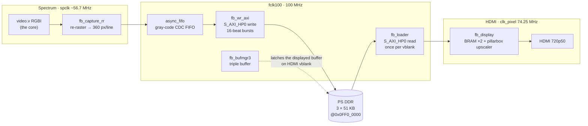
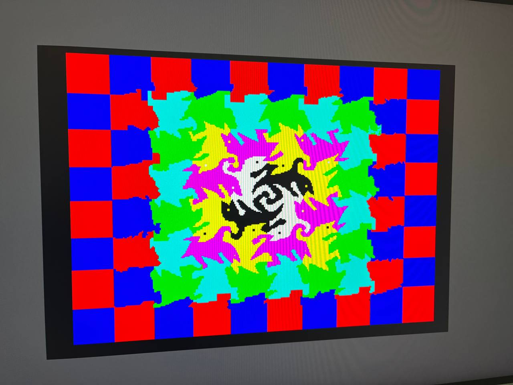

# Step 8 — Tear-free video: a DDR double-buffered framebuffer

Languages: **English** · [Русский](README.ru.md)

Steps 6 and 7 put a real, timing-accurate ZX Spectrum 128 on screen and woke the ARM up to
drive it. But the video had one honest flaw: a **single on-chip framebuffer**. The Spectrum
core renders into a BRAM at its own ~50.02 Hz, and the HDMI side scans it out at exactly
50.000 Hz. Those two rates are *not* locked, so the read pointer slowly drifts through the
write pointer. The moment the picture is moving (a border effect, a running demo, a
shadow-screen flip), you get a **horizontal tear seam crawling down the screen**.

On the menu and most games you never notice. On a border-effect demo like *Mescaline
Synesthesia* it is impossible to miss: a bright line marching top-to-bottom, over and over.

So this step does it properly. The 256×192 screen plus border is only **~51 KB** as a
4-bit-per-pixel source frame, which fits in PS DDR with room to spare. We **double/triple-buffer that
source frame in DDR** and only ever swap which buffer the scanout reads **on the HDMI vblank**.
The scanout always sees a *complete, stable* frame, so nothing tears: not the screen, not the
border, not even a bank-5 ↔ bank-7 shadow-screen switch. The on-chip BRAM upscaler (pillarbox, palette,
720p50) is reused unchanged, so on-chip memory usage stays exactly where it was: **60/60 BRAM**.

The result is verified on hardware: *Mescaline* and the `ula128` timing test run with **no tear
seam**, the shadow screen switches cleanly, and the frame-rate beat (50.02 vs 50.000 Hz) is
down to an imperceptible micro-stutter every ~50 s instead of a constant moving line.

## The pipeline

Everything that was a single BRAM `framebuffer` is now a chain across two clock domains and
PS DDR, glued together with the **AXI-HP** port whose latency we measured back in Step 7. The
two clock-domain crossings are the arrows that jump between the coloured boxes below: capture →
FIFO (spclk → fclk100), and loader → display (fclk100 → clk_pixel, inside the display BRAM):



- **`fb_capture_rr`** (Spectrum domain) re-rasters the core's video to exactly **360 pixels × 288
  lines = 6480 64-bit words per frame**, via a ping-pong line buffer. This matters: the core's
  vblank lines (`vCount 248..255`) carry *zero* non-blank pixels, so a naïve packer would push
  ~6300 words and the streamed frame would scroll diagonally. Padding every line to a fixed 360
  keeps the frame word-aligned (geometry identical to the Step-6 `framebuffer.v`).
- **`async_fifo`** is a classic dual-clock gray-code FIFO (distributed RAM, FWFT) — the safe CDC
  from the Spectrum clock to `fclk100`.
- **`fb_wr_axi`** drains the FIFO to PS DDR over **S_AXI_HP0 (write)** as 16-beat INCR bursts.
- **`fb_bufmgr3`** is a MiSTer-`ascal`-style **triple buffer**. Because a live capture can't be
  paused, the writer must always have a free buffer — three buffers guarantee that, so the
  writer never stalls and the reader always gets the latest complete frame. The displayed
  buffer is latched **only on the HDMI vblank**.
- **`fb_loader`** reads the displayed buffer back over **S_AXI_HP0 (read)** into the display BRAM
  once per frame (during vblank), and **`fb_display`** is the unchanged Step-6 upscaler.

Read and write share one HP0 port (independent AR/R and AW/W channels), so no interconnect.
Total DDR traffic is under **8 MB/s** against the ~800 MB/s the port sustains — a rounding error.

## Bugs worth writing down

This took a few hardware iterations. The non-obvious ones:

1. **The vblank lines scroll the picture.** Streaming to DDR needs *exactly* 6480 words/frame; the
   core's 8 vblank lines give 0 → the frame came up short and crawled diagonally. Fix: the
   re-raster line buffer (`fb_capture_rr`) pads every line to 360.
2. **Startup FIFO overflow.** The HP write path is only live after the FSBL/PCAP enables the PS↔PL
   level shifters; the capture started immediately and overran the FIFO before that, dropping
   words and desyncing the frame. Fix: gate the capture until the loader has read its first frame
   (proof the HP path is up), and start it on a frame boundary.
3. **The writer overwrote the displayed buffer.** `fb_wr_axi` re-latched the buffer base in the
   same cycle the manager advanced it → it used the *old* base → the writer painted the buffer the
   scanout was still showing, top-to-bottom (a seam crawling down, then a jump). Fix: wait a few
   cycles for the pointer to settle.
4. **The async FIFO needs registered `full`/`empty`.** A combinational `full` feeds the write
   pointer which feeds `full` — a combinational loop. The textbook Cummings design registers them.

## What you see, and the output window

The captured 360×288 contains the 256×192 screen, the ZX border, and (because the ULA scanline
wraps) the *left* border tucked onto the right. To fit the whole frame, `fb_capture_rr` starts 8
lines after vsync: it drops the dead black vblank lines (which we'd never show) and spends them
on the *bottom* border instead, so the full bottom border is captured rather than clipped. The
output window is then cropped in `fb_display` (display-side only, the 6480-word capture contract
untouched): a thin black strip at the right edge goes, and the screen plus a clean border on all
four sides stays — important, because the **border is real content** (the `ula128` test draws its
timing stripes there). The displayed window is 356×257 source → ×2 → 712×514, framed in a
dark-grey pillarbox inside 1280×720.

## A demo that exercises it



*`esh2` (an Escher-tessellation 128K demo) running through the DDR framebuffer. The red/blue
check pattern is painted **into the border** by cycle-exact ULA timing, which is exactly the
kind of effect the single buffer used to tear on. Here it sits still. That it comes out clean
also tells me the core's Sinclair-128 raster timing is right. The tape is in
[`demos/`](demos/) — `esh2_128.tap` (load it from cassette through the Step-6 J19 input) plus a
128K `.z80` snapshot for the Step-7 ARM injector.*

## A no-snow variant

The 128 has a real "snow" hardware bug: when the I register points into the screen page
(0x40–0x7F), the refresh cycle makes the ULA fetch the wrong byte and flickering specks crawl
over the picture. The Atlas core reproduces it faithfully — it shows up on timing tests like
*IR Contention 128*, and real hardware (and Retro Virtual Machine) snow there too. It is correct,
but it is also noise, and most software keeps the I register clear of that page precisely to
avoid it.

So there is a second build with the snow switched off, offered as an option. Everything else is
identical — contention timing, floating bus, the tear-free DDR path — only the snow artifact is
gone, because the video fetch always uses the raster address. Real games and demos look the same
either way; the difference only shows on snow-test programs.

- **Faithful (default):** `bulbulator_zx_ddr.bit` / `flash/BOOT.BIN` — snow on, like a real 128.
- **No-snow:** `bulbulator_zx_ddr_nosnow.bit` / `flash/BOOT_NOSNOW.BIN` — clean.

It is one guard in the Atlas core's `memory.v`, on the video-fetch address `vmmA1`:

```verilog
`ifdef NO_SNOW
assign vmmA1 = { vmmPage, va[12:7], va[6:0] };                            // raster address only
`else
assign vmmA1 = { vmmPage, va[12:7], !rfsh && addr01 ? a[6:0] : va[6:0] }; // faithful ULA snow
`endif
```

`sources/build_bulbulator_ddr_nosnow.tcl` synthesises with `-verilog_define NO_SNOW`, and
`ddr_inject_nosnow_run.sh` injects a `.z80` onto the no-snow bitstream over JTAG. (Once a
keyboard is wired this becomes a runtime key toggle, so one bitstream does both.)

## Build from source

Fetch the cores once from the repo root, then build:

```
../../get_deps.sh        # Atlas + HDMI cores, pinned (once for the whole repo)
./build.sh               # → sources/build/bulbulator_zx_ddr.bit  (faithful, ULA snow on)
./build.sh nosnow        # → sources/build/bulbulator_zx_ddr_nosnow.bit
```

This step swaps the single-BRAM framebuffer for the DDR triple-buffer, so `sources/`
holds the DDR chain (`fb_capture_rr`, `async_fifo`, `fb_wr_axi`, `fb_bufmgr3`,
`fb_loader`, `fb_display`), the changed `axi_ctl`/`inject_cdc`, the new top and
constraints — the base glue (`clock_zx`, `mem_zx`, `kbd_buttons`, `hdmi_wrap`) is
pulled from Step 6. `sources/assemble.sh` gathers it all into `sources/build/`, links
the forked Atlas + HDMI cores, and fetches `rom128.hex`; Vivado builds in there with
relative paths only (nothing to edit for your machine).

The DDR-framebuffer path was brought up in isolation first, in `standalone-tests/`: Phase 1a
(prove DDR→HDMI read), then Phase 2a (the full capture→FIFO→DDR→triple-buffer chain driven by a
synthetic raster on the real Spectrum clock). Same discipline as Step 7's `m1-handshake-test`.

## Run it

**Over JTAG (PCAP "armoured train"):** `ddr_full_run.sh` configures the dense bitstream via PCAP
(it's BAD_PACKET-immune, same as Steps 6–7). `ddr_inject_run.sh <snapshot.z80>` additionally
injects a `.z80` over the Step-7 control plane so you can watch a demo (e.g. Mescaline) come up
tear-free.

**From SD (no JTAG):** copy `flash/BOOT.BIN` to the FAT `boot` partition of the card (set the
board to SD boot — the R2577 strap, see Step 0), power on, and the 128 menu comes up on HDMI.
`flash/build_boot.sh` rebuilds that `BOOT.BIN` (FSBL + bitstream + idle) VM-free — see the script
header for the bootgen-on-modern-glibc workaround.

## Files

```
bulbulator_zx_ddr.bit         the bitstream (Atlas ZX-128 + Step-7 control plane + DDR framebuffer)
bulbulator_zx_ddr_nosnow.bit  the same, with the ULA snow effect disabled (clean variant)
ddr_full_run.sh               PCAP-configure the bitstream over JTAG
ddr_inject_run.sh             PCAP-configure + inject a .z80 demo over the control plane
ddr_inject_nosnow_run.sh      the same, onto the no-snow bitstream
sources/                      all RTL + build .tcl (incl. the _nosnow build) + .xdc + core deps list
flash/                        BOOT.BIN + BOOT_NOSNOW.BIN (SD images) + build_boot.sh + bifs + fsbl/idle
standalone-tests/             Phase 1a / Phase 2a bring-up harnesses for the DDR path
demos/                        verified tear-free demos (esh2_128: .tap + .z80 snapshot)
images/                       hardware photos
```
