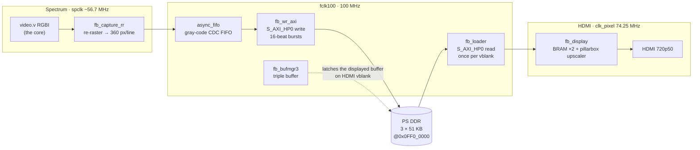

# Шаг 8 — Видео без рывков: фреймбуфер DDR с двойным буфером

Languages: [English](README.md) · **Русский**

Шаги 6 и 7 позволили вывести на экран настоящий ZX Spectrum 128 с точной синхронизацией и задействовали ARM, чтобы он им управлял. Но у видео был один существенный недостаток: **один встроенный фреймбуфер**. Ядро Spectrum выводит изображение в BRAM со своей частотой ~50,02 Гц, а сторона HDMI сканирует его с частотой ровно 50,000 Гц. Эти две частоты *не* синхронизированы, поэтому указатель чтения медленно отстаёт от указателя записи. Как только изображение начинает двигаться (эффект бордюров, запущенное демо, переключение теневого экрана), на экране появляется **горизонтальный разрыв, ползущий вниз**.

В меню и в большинстве игр этого никогда не заметишь. А в демо с эффектом бордюра, вроде *Mescaline Synesthesia*, это невозможно не заметить: яркая линия, бегущая сверху вниз, снова и снова.

Так что этот шаг решает проблему как надо. Экран 256×192 плюс бордюры занимает всего **~51 КБ** в виде исходного кадра с 4 битами на пиксель, что с запасом помещается в PS DDR. Мы **создаём двойной/тройной буфер этого исходного кадра в DDR** и меняем буфер, с которого сканирование считывает данные, только **во время vblank по HDMI**. Сканаут всегда видит *полный, стабильный* кадр, поэтому ничего не рвётся: ни экран, ни бордюры, ни даже переключение теневого экрана между банками 5 и 7. Встроенный в чип апскейлер BRAM (pillarbox, палитра, 720p50) используется без изменений, так что использование встроенной памяти остаётся точно таким же: **60/60 BRAM**.

Результат проверен на аппаратном уровне: *Mescaline* и тест синхронизации `ula128` проходят **без разрывов**, переключение теневого экрана происходит плавно, а разница в частоте кадров (50,02 против 50,000 Гц) сводится к незаметному микрозаминку примерно каждые ~50 с вместо постоянной движущейся линии.

## Конвейер

Всё, что раньше было одним BRAM-`framebuffer`, теперь представляет собой цепочку, проходящую через два тактовых домена и PS DDR, скреплённую портом **AXI-HP**, задержку которого мы измерили ещё на этапе 7. Два перехода между тактовыми доменами обозначены стрелками, перескакивающими между цветными блоками ниже: захват → FIFO (spclk → fclk100) и загрузчик → дисплей (fclk100 → clk_pixel, внутри BRAM дисплея):



- **`fb_capture_rr`** (в спектральной области) перерастирует видеосигнал ядра до размера ровно **360 пикселей × 288
  строк = 6480 64-битных слов на кадр** с помощью буфера строк типа «пинг-понг». Это важно: строки vblank ядра
  (`vCount 248..255`) содержат *ноль* непустых пикселей, поэтому простодушный упаковщик записал бы
  ~6300 слов, и потоковый кадр прокручивался бы по диагонали. Заполнение каждой строки до фиксированного размера 360
  обеспечивает выравнивание кадра по словам (геометрия идентична файлу `framebuffer.v` из шага 6).
- **`async_fifo`** — это классический FIFO с серым кодом и двумя тактовыми сигналами (распределенная ОЗУ, FWFT) — безопасный CDC
  от тактовой частоты Spectrum к `fclk100`.
- **`fb_wr_axi`** выгружает FIFO в PS DDR через **S_AXI_HP0 (запись)** в виде 16-тактных INCR-пакетов.
- **`fb_bufmgr3`** — это **тройной буфер** в стиле MiSTer-`ascal`. Поскольку захват в реальном времени нельзя
  приостановить, записывающему модулю всегда нужен свободный буфер — три буфера это гарантируют, поэтому
  запись никогда не задерживается, а считывающий модуль всегда получает последний полный кадр. Отображаемый
  буфер фиксируется **только во время HDMI vblank**.
- **`fb_loader`** считывает буфер отображения обратно через **S_AXI_HP0 (чтение)** в BRAM дисплея
  один раз за кадр (во время vblank), а **`fb_display`** — это неизменённый апскейлер Step-6.

Чтение и запись используют один порт HP0 (независимые каналы AR/R и AW/W), так что никаких межсоединений не требуется. Общий трафик DDR составляет менее **8 МБ/с** по сравнению с ~800 МБ/с, которые поддерживает порт — это просто погрешность округления.

## Ошибки, о которых стоит упомянуть

На это ушло несколько итераций аппаратного кода. Вот самые неочевидные из них:

1. **Строки vblank смещают изображение.** Поток в DDR должен составлять *ровно* 6480 слов на кадр;
   8 строк vblank ядра дают 0 → кадр оказался неполным и сместился по диагонали. Исправление:
   буфер строк повторной растризации (`fb_capture_rr`) дополняет каждую строку до 360.
2. **Переполнение FIFO при запуске.** Тракт записи HP активен только после того, как FSBL/PCAP включает сдвигатели уровней PS↔PL
   ; захват начался сразу и переполнил FIFO ещё до этого, в результате чего
   слова были утеряны, а кадр рассинхронизировался. Исправление: заблокируй захват, пока загрузчик не прочитает свой первый кадр
   (что подтвердит работоспособность канала HP), и запускай его на границе кадра.
3. **Записывающий модуль перезаписал отображаемый буфер.** `fb_wr_axi` повторно зафиксировал базовый адрес буфера в
   том же цикле, когда менеджер сдвинул его → он использовал *старый* базовый адрес → записывающий модуль закрасил буфер, который
   всё ещё отображался на выходе, сверху вниз (сначала сдвиг вниз, потом скачок). Исправление: подожди несколько
   циклов, пока указатель не стабилизируется.
4. **Асинхронному FIFO нужны регистрированные сигналы `full`/`empty`.** Комбинационный сигнал `full` подаётся на указатель записи,
   который, в свою очередь, подаёт сигнал `full` — получается комбинационный цикл. В классической схеме Каммингса они регистрируются.

## Что ты видишь и окно вывода

Захваченное изображение 360×288 содержит экран 256×192, бордюр ZX и (поскольку строка развертки ULA переносится) *левый* бордюр, задвинутый направо. Чтобы уместить весь кадр, `fb_capture_rr` запускается через 8 строк после vsync: он отбрасывает мёртвые чёрные строки vblank (которые мы бы всё равно не показывали) и вместо этого тратит их на *нижний* бордюр, так что нижний бордюр захватывается целиком, а не обрезается. Затем в `fb_display` окно вывода обрезается (только со стороны дисплея, договор о захвате на 6480 слов остаётся нетронутым): убирается тонкая чёрная полоска по правому краю, а остаётся экран плюс чистый бордюр со всех четырёх сторон — это важно, потому что **бордюр — это реальное содержимое** (тест `ula128` рисует там свои полосы синхронизации). Отображаемое окно имеет размер 356×257 (исходное) → ×2 → 712×514, обрамлённое тёмно-серым пилларбоксом внутри 1280×720.

## Демо, демонстрирующее это


*`esh2` (демо с тесселяцией Эшера, 128K) работает через фреймбуфер DDR. Красно-синий шахматный узор рисуется **в бордюре** благодаря точному по циклам синхронизации ULA — именно из-за такого эффекта раньше в одном буфере возникали разрывы. Здесь же всё остаётся на месте. То, что картинка получается чистой, также говорит о том, что растровое синхронизирование ядра Sinclair-128 настроено правильно. Кассета находится в папке [`demos/`](demos/) — `esh2_128.tap` (загружай её с кассеты через вход J19 Step-6) плюс 128K-снимок в формате `.z80` для инжектора ARM Step-7.*

## Вариант без «снега»

У 128 есть настоящий аппаратный баг «снега»: когда регистр I указывает на страницу экрана (0x40–0x7F), цикл обновления заставляет ULA извлекать не тот байт, и по картинке ползут мерцающие пятна. Ядро Atlas точно воспроизводит эту ошибку — она проявляется в тестах синхронизации, таких как *IR Contention 128*, и на реальном оборудовании (а также в Retro Virtual Machine) «снег» тоже присутствует. Это нормально, но при этом создаёт помехи, и большинство программ специально не заполняют регистр I данными из этой страницы, чтобы этого избежать.

Поэтому есть вторая сборка с отключенным «снегом», предлагаемая в качестве опции. Всё остальное остаётся таким же — время конфликтов, плавающая шина, путь DDR без разрывов — исчез только артефакт «снега», потому что при извлечении видео всегда используется растровый адрес. Настоящие игры и демо-версии выглядят одинаково в обоих случаях; разница заметна только в программах для тестирования «снега».

- **Faithful (по умолчанию):** `bulbulator_zx_ddr.bit` / `flash/BOOT.BIN` — «снег» включен, как на настоящем 128.
- **Без снега:** `bulbulator_zx_ddr_nosnow.bit` / `flash/BOOT_NOSNOW.BIN` — чисто.

Это один защитный механизм в файле `memory.v` ядра Atlas, по адресу видеозагрузки `vmmA1`:

```verilog
`ifdef NO_SNOW
assign vmmA1 = { vmmPage, va[12:7], va[6:0] };                            // raster address only
`else
assign vmmA1 = { vmmPage, va[12:7], !rfsh && addr01 ? a[6:0] : va[6:0] }; // faithful ULA snow
`endif
```

Файл `sources/build_bulbulator_ddr_nosnow.tcl` синтезируется с параметром `-verilog_define NO_SNOW`, а скрипт `ddr_inject_nosnow_run.sh` вставляет файл `.z80` в битовый поток без режима «snow» через JTAG. (Как только клавиатура подключена, это превращается в переключение клавиши во время работы, так что один битовый поток выполняет обе функции.)

## Сборка из исходников

В папке `sources/` есть весь набор файлов. Порядок действий (выполняй на хосте сборки, где установлен Vivado):

```
vivado -mode batch -source sources/build_bulbulator_ddr.tcl
```

В порядке: ядро hdl-util/HDMI + `hdmi_wrap.sv`; форк ядра Atlas ZX (T80 / JT49 / SAA + ядро на Verilog из `Alex-Electron/zx`); связующие модули EBAZ (`clock_zx`, `mem_zx`, `kbd_buttons`); управляющая плоскость Step-7 (`axi_ctl`, `inject_cdc`); цепочка фреймбуфера DDR (`fb_capture_rr`, `async_fifo`, `fb_wr_axi`, `fb_bufmgr3`, `fb_loader`, `fb_display`); и верхний модуль `bulbulator_zx_ddr_top.v`. Скрипт `get_rom.sh` загружает файл `rom128.hex` (ПЗУ Toastrack, см. шаг 6). Пути в верхней части файла `.tcl` указывают на макет хоста сборки — отредактируй их, чтобы они соответствовали твоему.

Путь к DDR-фреймбуферу сначала тестировался отдельно в папке `standalone-tests/`: фаза 1a (проверка чтения из DDR в HDMI), затем фаза 2a (полная цепочка «захват→FIFO→DDR→тройной буфер», управляемая синтетическим растром на реальном тактовом генераторе Spectrum). Тот же подход, что и в `m1-handshake-test` из шага 7.

## Запустить

**Через JTAG (PCAP «бронированный поезд»):** `ddr_full_run.sh` настраивает плотный битовый поток через PCAP (он устойчив к BAD_PACKET, как и в шагах 6–7). `ddr_inject_run.sh <snapshot.z80>` дополнительно вводит файл `.z80` через управляющую плоскость Step-7, чтобы ты мог посмотреть, как демо (например, Mescaline) запускается без сбоев.

**С SD-карты (без JTAG):** скопируй `flash/BOOT.BIN` в FAT-раздел `boot` на карте (установи плату на загрузку с SD — ремешок R2577, см. шаг 0), включи питание, и на HDMI появится меню 128. Скрипт `flash/build_boot.sh` пересобирает этот файл `BOOT.BIN` (FSBL + битовый поток + режим ожидания) без использования виртуальной машины — смотри заголовок скрипта, чтобы узнать об обходном решении для bootgen на современной glibc.

## Файлы

```
bulbulator_zx_ddr.bit         the bitstream (Atlas ZX-128 + Step-7 control plane + DDR framebuffer)
bulbulator_zx_ddr_nosnow.bit  the same, with the ULA snow effect disabled (clean variant)
ddr_full_run.sh               PCAP-configure the bitstream over JTAG
ddr_inject_run.sh             PCAP-configure + inject a .z80 demo over the control plane
ddr_inject_nosnow_run.sh      the same, onto the no-snow bitstream
sources/                      all RTL + build .tcl (incl. the _nosnow build) + .xdc + core deps list
flash/                        BOOT.BIN + BOOT_NOSNOW.BIN (SD images) + build_boot.sh + bifs + fsbl/idle
standalone-tests/             Phase 1a / Phase 2a bring-up harnesses for the DDR path
demos/                        verified tear-free demos (esh2_128: .tap + .z80 snapshot)
images/                       hardware photos
```
