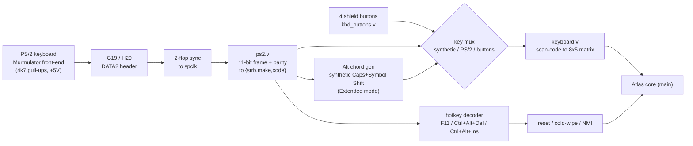

# Step 9 — A real PS/2 keyboard

Languages: **English** · [Русский](README.ru.md)


*`VSEM PRIVET OT BulbuLatora`, typed on the running 128 from a real PS/2 keyboard plugged into the board.*

Steps 6–8 drove the boot menu with the four shield buttons. That was enough to pick a menu
item, but you couldn't *type*. This step wires a real **PS/2 keyboard** to the board, so the
Spectrum behaves like a Spectrum. It also maps the control keys (reset, NMI) to the de-facto
Speccy-emulator layout, and folds the Spectrum's awkward Extended-mode chord onto one key: Alt.

## The keyboard was already half-built

The Atlas core already ships the whole keyboard path. `ps2.v` is a PS/2
receiver (it clocks in the 11-bit frame and checks parity), and `keyboard.v` maps PS/2 set-2
scan-codes onto the 8×5 ZX key matrix. Steps 6–8 just never used `ps2.v` — the four buttons
synthesised fake key-taps straight into `keyboard.v` instead. So a real keyboard was two pins
and a mux away.

## Wiring — what connects where

A PS/2 keyboard uses a 6-pin mini-DIN. The front-end is the **Murmulator** one — each line pulled
to 3.3 V through 4.7 kΩ, +5 V to power the keyboard. It's the same project whose tape-load circuit
Step 6 used. Schematic: [murmulator.ru/mm2-0](https://murmulator.ru/mm2-0).

| PS/2 mini-DIN pin | Line | Connects to |
|---|---|---|
| **5** | **CLK**  | 4.7 kΩ pull-up to 3.3 V → FPGA **G19** (header DATA2-07) |
| **1** | **DATA** | 4.7 kΩ pull-up to 3.3 V → FPGA **H20** (header DATA2-08) |
| **4** | VCC | **+5 V** |
| **3** | GND | GND |
| 2, 6 | mouse CLK / DATA | not used yet — reserved for a future PS/2 mouse (the Murmulator socket is keyboard **+** mouse) |


*The PS/2 front-end, from the [Murmulator](https://murmulator.ru/mm2-0) project. We use the
keyboard pair — CLK KBD (pin 5) → G19, DATA KBD (pin 1) → H20 — and leave the mouse pair free
for later.*

In short: PS/2 **clock → G19**, **data → H20** (both pulled up 4k7 to 3.3 V), with +5 V and ground
from the board. PS/2 clock is slow (~12 kHz), so neither line needs a clock-capable pin — the two
are run through a two-flop synchroniser into the Spectrum clock and handed to `ps2.v`, whose
`{strb, make, code}` output is muxed with the four shield buttons (PS/2 wins on a simultaneous
press) into the core. So the buttons keep working right alongside the keyboard.

## Bring it up in isolation first

Same discipline as the Step-7 handshake and the Step-8 DDR phases: before touching the full
1.1 MB design, a tiny standalone bitstream proved the keyboard reads. `standalone-tests/` is
`PS7 (FCLK0 + GP0)` + the core's `ps2.v` + a small read-only AXI slave that latches the last
scan-code and a byte counter into a register. Flash it, press keys, read the register over JTAG
with `xsdb`:

```
VERSION 0xB01B0009
PS2 scancode=0x29   <- Space
PS2 scancode=0x1C   <- A
PS2 scancode=0x5A   <- Enter
```

Space = `0x29`, A = `0x1C`, Enter = `0x5A` — exactly the set-2 codes `keyboard.v` expects. One
gotcha worth noting: `xsdb` blocks reads of the PL / GP0 address space by default, so you need
`configparams force-mem-accesses 1` (the same line the PCAP loader uses) before `mrd` will touch
`0x4000_0000`.

## The key map

Typing, cursor and the two shifts come straight from `keyboard.v`:

- letters, digits, **Enter**, **Space**, **Backspace** (= DELETE), **Esc** (= BREAK), and the
  cursor keys **↑ ↓ ← →**;
- **Shift** = Caps Shift (CS), **Ctrl** = Symbol Shift (SS) — so `Ctrl`+key gives the red
  symbols and BASIC tokens;
- **Alt** = a one-key shortcut into the Spectrum's Extended mode (the green and red keyword
  tokens) — see below.

The control keys follow the de-facto Speccy-emulator standard (Murmulator / ESPectrum / MiSTer):

| Key | Action |
|---|---|
| **`F11`** | hard / cold reset — wipes all 128 KB of RAM, then resets (a real power-on boot) |
| **`Ctrl`+`Alt`+`Del`** | soft reset — reboot to the menu, RAM kept |
| **`Ctrl`+`Alt`+`Ins`** | NMI |

Reserved for the OSD / loader steps, not wired yet: `F1` = help, `F5` = file loader,
`F12` = OSD menu, `Ctrl`/`Shift`+`F1…F10` = snapshot slots.

## Alt — the Extended-mode key

The green and red keyword tokens printed above and below each Spectrum key live in "Extended
mode". On real hardware you reach it with a two-shift chord: hold Caps Shift and Symbol Shift
together for the `E` cursor, let go, then press a key. Alt does the whole two-shift sequence for you:
hold it and tap a key for the red token below the key, or tap Alt on its own and then a key for
the green token above.

Alt doesn't remap anything. Press it and the fabric fires a short synthetic Caps+Symbol Shift
chord into the keyboard stream, which arms the ROM's `E` mode, then holds Symbol Shift for as long
as Alt stays down, so the next key lands as the red extended token. The chord lasts
about 60 ms, long enough for the ROM's 50 Hz keyboard scan to catch it. None of it touches the
Atlas core: the synthetic codes ride the same `{strb, make, code}` mux as the keys and the
buttons, so `Ctrl+Alt+Del` and the rest still decode exactly as they did before.

## The two reset levels

Two reset levels, and a few things worth writing down:

- **Soft (`Ctrl+Alt+Del`)** pulses the core reset → the 128 reboots to its menu, RAM untouched.
  **Hard (`F11`)** additionally sweeps all 128 KB of RAM to zero (a small fabric state-machine
  that freezes the Z80, writes 0 across the whole RAM and the screen shadow, then resets) — a
  genuine cold boot.
- On a 128 the thing that actually makes a reset "full" is clearing the `0x7FFD` paging latch
  including its lock bit, and `main.reset` already does that — so even the soft reset is a proper
  reset and you can't get stuck in 48K mode. The RAM wipe is the extra that makes the hard reset
  feel like flipping the power switch.
- **The gotcha that cost a rebuild:** a runtime reset must *not* reset the DDR video pipeline.
  The first attempt reset the whole capture → DDR → loader chain along with the core; the AXI-HP
  master got reset mid-burst, the PS DDR port hung waiting for the rest of the transfer, and the
  picture froze for good. The fix: keep the video pipeline on the power-on reset only and pulse
  *just the core* on a hotkey — the capture re-syncs to the core's video on its own, so the
  picture stays put. (Also: like any real Spectrum, a reset blanks the screen to black either
  way — soft and hard look identical; the difference is only in RAM.)

**NMI** (`Ctrl+Alt+Ins`) pulses the Z80's `/NMI`. On a bare 128 with the stock ROM (no Multiface
or Gluk freezer ROM) the NMI handler just drops to 48 BASIC — the authentic bare-machine
behaviour. The useful version (a freezer / instant snapshot) comes later, once the ARM is
catching the NMI or a Multiface-style ROM is paged in.

## What this step is *not*

This is the keyboard and the key map — nothing more. The on-screen menu (`F12`), the SD
file/snapshot loader (`F5` + the save/load slots) and save-states are the next chapter: the ARM
draws an OSD over the screen and loads games from the card, MiSTer-style. That architecture is
mapped out, but it's a separate step.

## How the keyboard reaches the matrix



## Build, flash, run

Three ways to use this, depending on how much you want to do yourself.

**Build the bitstream.** Same flow as Step 8 — this is the Step-8 design plus the keyboard. Fetch
the cores once from the repo root (`../../get_deps.sh`), then `./build.sh` (or `./build.sh nosnow`).
This step's only change is the top (`bulbulator_zx_ddr_top.v`) and its constraints; `sources/assemble.sh`
pulls the Step-8 DDR chain and the Step-6 base glue, gathers it into `sources/build/`, and Vivado
writes `bulbulator_zx_kbd.bit` there (the same name as the prebuilt one this step
flashes). The standalone read-test builds on its own from `standalone-tests/`.

**Flash over JTAG.** PCAP "armoured train", same as Steps 6–8: configure `bulbulator_zx_kbd.bit`
over PCAP (it's BAD_PACKET-immune, unlike plain JTAG on this board). The 128 menu comes up on HDMI
and the keyboard is live straight away.

**Flash from SD (no JTAG, no host).** Copy `flash/BOOT.BIN` onto the FAT `boot` partition of the
card, set the board to SD boot (the R2577 strap — see Step 0), power on, and the keyboard-128
boots on its own. To rebuild that image yourself, `flash/build_boot.sh` assembles it (FSBL +
the keyboard `bulbulator_zx_kbd.bit` + idle) VM-free — see the script header for the bootgen
workaround on modern glibc;
`fsbl.bin` / `idle.bin` are the ready boot partitions, reused unchanged from Step 8.

## Files

```
sources/bulbulator_zx_ddr_top.v   full top: Step-8 design + ps2 + key mux + hotkey decoder + Alt Extended-mode chord + reset logic
sources/bulbulator_ddr.xdc        the .xdc, now with PS2_CLK=G19 and PS2_DATA=H20
standalone-tests/                 the PS/2 read-test: ps2_test_top.v + ps2_axi.v + .xdc + build_ps2_test.tcl + ps2_test_run.sh (flash+read) / ps2_read_only.sh (re-read)
bulbulator_zx_kbd.bit             prebuilt bitstream (keyboard + the normalised key map) — flash over JTAG
flash/BOOT.BIN                    ready SD-card image (FSBL + this step's keyboard bitstream + idle) — copy to the card's FAT boot partition
flash/build_boot.sh + bulb_ddr_*.bif + fsbl.bin + idle.bin   rebuild BOOT.BIN yourself (the .bif packages bulbulator_zx_kbd.bit)
flash/pcap_load.tcl + ps7_init_fclk.tcl   PCAP loader + PS7/FCLK/level-shifter init (reused from Step 8; used by JTAG and SD boot)
images/                           the board typing on the live 128 + the PS/2 wiring (Murmulator)
```

The PS/2 receiver (`ps2.v`) and the matrix mapper (`keyboard.v`) come from the
[Atlas `zx`](https://github.com/AtlasFPGA/zx) core. The keyboard front-end circuit is from the
[Murmulator](https://murmulator.ru/mm2-0) project — an external hardware add-on, credited and
linked here, not redistributed.
