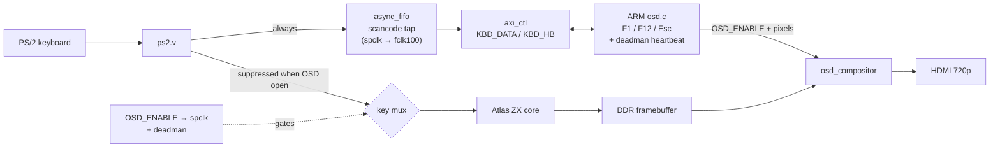

# Step 10 — An on-screen display, and a keyboard that knows who it's talking to

Languages: **English** · [Русский](README.ru.md)

By Step 9 the Spectrum had everything a Spectrum needs: video, sound, a real keyboard. What it
didn't have was a way for the ARM to *say* anything. The picture belonged entirely to the Z80; the
keyboard went straight into the key matrix. This step gives the ARM a voice and a hand on the
keyboard — an OSD it draws over the live picture, and a "gate" that hands it the keyboard the moment
the menu is open. Press **F1** and a help panel appears over the running machine; press **F12** or
**Esc** and it's gone. The Spectrum never stops while you do it.

This is the MiSTer division of labour, and it's where BulbuLator stops being "a Spectrum on an FPGA"
and starts being a platform: the fabric is the machine, the ARM is the operator. Everything here is
built to be machine-agnostic on purpose. The same OSD and the same keyboard gate are meant to sit in
front of a future NES or C64 core just as happily as the Spectrum, so almost nothing below decodes
anything Spectrum-specific.

## The overlay doesn't stop the machine

The OSD is a 256×64 one-bit-per-pixel panel that lives in distributed RAM (the chip is 60/60
BRAM-full, so a BRAM tile was never an option). The ARM fills it over the AXI control plane and a
tiny compositor lays it over the HDMI scanout — a set pixel becomes cream ink, a clear pixel inside
the panel barely dims the video underneath, and everything outside the panel is the live picture
untouched. It's a combinational mux on the pixel path, so the picture timing doesn't change and the
Z80 keeps running at full speed behind it. The panel sits in the grey field above the Spectrum's
screen, so it doesn't cover the picture at all.

That "barely dims" is deliberate: the panel is a faint haze, not a dark box. You can see straight
through it to whatever the machine is doing.

## The keyboard gate

The interesting part is the keyboard. The trick is to give the ARM the keys *only* when it needs
them, without the fabric having to understand any of them.

Two pieces do this, and both are machine-agnostic:

- An **always-tap FIFO**. Every PS/2 scancode the receiver decodes is written into a small
  clock-crossing FIFO (`async_fifo`, written in the Spectrum clock, read in the ARM clock) — *always*,
  whether the menu is open or not. The ARM drains it continuously. So the ARM sees every key the
  instant it's pressed, which is what lets **F1 or F12 open the menu even while it's closed**. The
  FIFO never depends on the menu state.
- A **gate**. When the ARM turns the OSD on (`OSD_ENABLE`), that bit is synchronised into the
  Spectrum clock and used for one thing only: to **stop the real PS/2 keys from reaching the Z80's
  matrix** while the menu is up. The four shield buttons and the synthetic Alt chord still go
  through. Close the menu and the keys flow back to the Z80 exactly as before.

The fabric decodes no function key. F1, F12, Esc — all of that is the ARM's business. That's the
whole point: drop a different core in behind this and the keyboard plumbing doesn't change, because
it never knew it was talking to a Spectrum.

A small safety net rides along: a **deadman timer** in the fabric. If the ARM ever stalls with the
menu open, after about 1.2 s the gate releases on its own and the keyboard goes back to the machine.
A crashed operator can't lock you out of your own Spectrum.

## What the ARM does with it

The ARM app is a few hundred bytes of bare-metal C in a forever loop: pet the deadman, pop one
scancode, act on it. It tracks make/break itself (the PS/2 `0xF0` and `0xE0` prefixes are passed
through untouched, so the ARM filters them, not the fabric). **F12 is edge-triggered** — it toggles
the menu on the press only, so a key held a beat too long, or a tired keyboard that bounces, can't
flip it twice and look like it "did nothing". **F1** brings up the help page from any state; **Esc**
and **F12** close it. On boot the app flushes whatever was typed before it came up, so the menu
always starts closed.

The help page is the key map, nothing more for now:

```
ZX BulbuLator
F1 - HELP
F12/ESC - CLOSE MENU
SHIFT - CAPS SHIFT
CTRL - SYMBOL SHIFT
ALT - CS+SS (EXTEND)
CTRL+ALT+DEL - SOFT RESET
CTRL+ALT+INS - NMI
```

There's deliberately no `F5 - LOAD` line. Loading a game from an F-key isn't a real cross-emulator
convention — MiSTer loads through the OSD's own file browser, not a shortcut — so that belongs in a
later step (a proper browser with long filenames and a load-screen preview, which wants a colour
DDR-backed surface, not this little one-bit text panel).

## The control-plane registers

The AXI register file (`axi_ctl.v`, on `M_AXI_GP0` at `0x4000_0000`) grew four entries for this step,
and the version bumped to `0xB01B0006`:

| Addr | Name | R/W | Meaning |
|---|---|---|---|
| `0x54` | `KBD_DATA` | R | scancode FIFO head: `[9]` = release flag, `[8]` = empty, `[7:0]` = code. A read **pops** the FIFO. |
| `0x58` | `KBD_STATUS` | R | bit0 = FIFO empty (a non-popping poll) |
| `0x5C` | `KBD_HB` | W | any write = deadman heartbeat |
| `0x60` | `MACHINE_ID` | R | which core is loaded — `0x00805A58` here (`'ZX'` + a 128K variant byte). The ARM reads it to pick the right key map; it's the seam future machines plug into. |

(`0x48`–`0x50` are the OSD overlay registers — enable, the auto-incrementing buffer pointer, and the
packed pixel data — introduced alongside the compositor.)

## How it fits together



## Build, flash, run

Same three ways as the earlier steps.

**Build the bitstream.** Fetch the cores once from the repo root (`../../get_deps.sh`), then
`./build.sh` (or `./build.sh nosnow`). This step's delta — the gate top, `axi_ctl` with the keyboard
registers, the new `osd_compositor`, a re-centred `fb_display`, and the constraints with the
keyboard-gate CDC false-paths — lives in `sources/`; `sources/assemble.sh` pulls the unchanged Step 6
glue and Step 8 DDR chain around it and Vivado writes `bulbulator_zx_osd.bit`.

**Flash over JTAG and run the OSD.** `./osd_run.sh` configures the bitstream over PCAP (the
"armoured train", as in Steps 6–9), builds the ARM app, loads it onto Cortex-A9 #0 and starts it.
The Spectrum 128 comes up on HDMI and the keyboard is live; F1/F12 work straight away.

**Flash from SD (no JTAG, no host).** Copy `flash/BOOT.BIN` onto the card's FAT `boot` partition, set
the board to SD boot (the R2577 strap — see Step 0) and power on. The FSBL brings up the bitstream
and starts the OSD app on its own. To rebuild that image: `make -C arm` to get `arm/osd.bin`, copy it
to `flash/`, then `flash/build_boot.sh` (FSBL + this step's bitstream + the OSD app, VM-free — see the
script header for the bootgen-on-modern-glibc workaround).

## Files

```
sources/bulbulator_zx_ddr_top.v   full top: Step 8/9 design + the keyboard gate + osd_compositor wiring
sources/axi_ctl.v                 control plane + OSD + keyboard-FIFO + MACHINE_ID registers (VERSION 0xB01B0006)
sources/osd_compositor.v          the 1-bpp OSD panel composited over the live HDMI scanout (NEW)
sources/fb_display.v              the Step 8 DDR upscaler, picture re-centred (equal left/right margins)
sources/bulbulator_ddr.xdc        constraints, now with the keyboard-gate CDC false-paths
sources/assemble.sh + build.tcl   gather the delta + the Step 6/8 sources into build/, then synth
arm/osd.c + start.S + osd.lds + Makefile   the bare-metal OSD app (drain the FIFO, draw the panel)
arm/osd_attach_run.sh + osd_run_arm.tcl    load + run osd.elf over JTAG without re-flashing the PL
build.sh                          build the bitstream
osd_run.sh                        PCAP-flash the bitstream + load/run the OSD app over JTAG
flash/BOOT.BIN                    ready SD image (FSBL + this step's bitstream + the OSD app)
flash/build_boot.sh + bif + fsbl.bin + osd.bin   rebuild BOOT.BIN yourself
flash/pcap_load.tcl + ps7_init_fclk.tcl          PCAP loader + PS7/FCLK/level-shifter init (reused since Step 8)
bulbulator_zx_osd.bit             prebuilt bitstream — flash over JTAG
```

The PS/2 receiver (`ps2.v`) and the key matrix (`keyboard.v`) come from the
[Atlas `zx`](https://github.com/AtlasFPGA/zx) core. The async FIFO, the DDR framebuffer chain and the
AXI control plane are the Step 7/8 work; this step adds the OSD compositor, the keyboard gate and the
ARM app on top of them.
