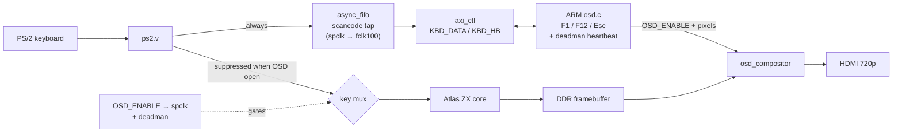

# Шаг 10 — Экранное меню и клавиатура, которая знает, с кем общается

Languages: [English](README.md) · **Русский**

К шагу 9 у Spectrum было всё, что нужно Spectrum: видео, звук, настоящая клавиатура. Чего не хватало, так это способа, чтобы ARM мог что-то *сказать*. Отображение изображения полностью принадлежало Z80; клавиатура подключалась напрямую к матрице клавиш. На этом шаге мы дадим ARM голос и доступ к клавиатуре — экранное меню, которое он накладывает на текущее изображение, и «шлюз», который передаёт ему управление клавиатурой, как только открывается меню. Нажми **F1** — и над работающей машиной появится панель справки; нажми **F12** или **Esc** — и она исчезнет. Spectrum при этом не останавливается.

Это и есть разделение труда по принципу MiSTer, и именно здесь BulbuLator перестаёт быть «Spectrum на FPGA» и становится платформой: фабрика (ПЛ) — это машина, а ARM — оператор. Здесь всё специально построено так, чтобы не зависеть от конкретной машины. Один и тот же OSD и один и тот же шлюз клавиатуры должны с таким же успехом работать с будущим ядром NES или C64, как и со Spectrum, поэтому почти ничто на нижнем уровне не декодирует что-либо, специфичное для Spectrum.

## Оверлей не останавливает работу машины

OSD — это панель размером 256×64 с одним битом на пиксель, которая находится в распределённой оперативной памяти (чип полностью заполнен BRAM 60/60, так что использование BRAM-плитки никогда не было вариантом). ARM заполняет её через контрольную плоскость AXI, а крошечный композитор накладывает изображение на выход HDMI — установленный пиксель становится кремовым, прозрачный пиксель внутри панели едва приглушает видео под ней, а всё за пределами панели — это нетронутое живое изображение. Это комбинационный мультиплексор на пути пикселей, поэтому синхронизация изображения не меняется, а Z80 продолжает работать на полной скорости за его спиной. Панель расположена в сером поле над экраном Spectrum, так что она вообще не закрывает изображение.

Это «едва затуманивает» сделано специально: панель представляет собой едва заметную дымку, а не тёмную коробку. Через неё можно прямо видеть всё, что делает компьютер.

## Шлюз клавиатуры

Самое интересное — это клавиатура. Хитрость в том, чтобы передавать ARM сигналы клавиш *только* тогда, когда они нужны, при этом матрице не нужно понимать их значение.

Эту задачу решают два компонента, и оба они независимы от конкретной машины:

- **FIFO с постоянным считыванием**. Каждый PS/2-сканкод, который декодирует приёмник, записывается в небольшой
  FIFO с пересечением тактов (async_fifo, запись происходит по такту Spectrum, чтение — по такту ARM) — *всегда*,
  независимо от того, открыто меню или нет. ARM постоянно считывает его содержимое. Таким образом, ARM видит каждую клавишу в
  тот же момент, когда её нажимают, и именно это позволяет **нажимать F1 или F12, чтобы открыть меню, даже когда оно закрыто**. Этот
  FIFO никогда не зависит от состояния меню.
- **Шлюз**. Когда ARM включает OSD (`OSD_ENABLE`), этот бит синхронизируется с
  тактовой частотой Spectrum и используется только для одной цели: **предотвратить поступление сигналов от реальных клавиш PS/2 в матрицу Z80**,
  пока меню открыто. Четыре кнопки на экранной панели и синтетический аккорд Alt по-прежнему
  проходят. Закрой меню — и сигналы клавиш снова поступают на Z80 точно так же, как и раньше.

Схема не декодирует функциональные клавиши. F1, F12, Esc — всё это дело ARM. В этом и суть: вставь за этим любое другое ядро, и схема клавиатуры останется прежней, потому что она и не подозревала, что общается со Spectrum.

Есть ещё небольшая страховка: **таймер «мертвеца»** в фабрике. Если ARM когда-нибудь зависнет с открытым меню, примерно через 1,2 с шлюз откроется сам по себе, и клавиатура вернётся к компьютеру. Даже сбой в работе оператора не сможет заблокировать тебе доступ к твоему собственному Spectrum.

## Что с этим делает ARM

Приложение для ARM — это несколько сотен байтов кода на C, написанного на «голом железе», в бесконечном цикле: проверяй таймер «мертвеца», считывай один сканкод, реагируй на него. Оно само отслеживает замыкание/размыкание (префиксы PS/2 `0xF0` и `0xE0` пропускаются без изменений, поэтому их фильтрует ARM, а не фабрика). **Клавиша F12 срабатывает по фронту** — меню включается только при нажатии, так что если клавишу удерживаешь чуть дольше, чем нужно, или у тебя усталая клавиатура, которая подскакивает, она не сможет нажать дважды и создать впечатление, что «ничего не произошло». **F1** открывает страницу справки из любого состояния; **Esc** и **F12** закрывают её. При запуске приложение очищает всё, что было набрано до его запуска, поэтому меню всегда открывается в закрытом состоянии.

Страница справки — это раскладка клавиш, пока ничего больше:

```
ZX BulbuLator
F1 - HELP
F12/ESC - CLOSE MENU
SHIFT - CAPS SHIFT
CTRL - SYMBOL SHIFT
ALT - CS+SS (EXTEND)
CTRL+ALT+DEL - SOFT RESET
CTRL+ALT+INS - NMI
```

Строка `F5 - LOAD` отсутствует специально. Загрузка игры с помощью клавиши F не является настоящим стандартом для всех эмуляторов — MiSTer загружает игры через собственный файловый браузер OSD, а не с помощью горячей клавиши — так что это место для более позднего этапа (настоящий браузер с длинными именами файлов и предварительным просмотром на экране загрузки, для которого нужна цветная поверхность на базе DDR, а не эта маленькая однобитовая текстовая панель).

## Регистры плоскости управления

Файл регистров AXI (`axi_ctl.v`, на `M_AXI_GP0` по адресу `0x4000_0000`) пополнился на четыре записи на этом этапе, а версия изменилась на `0xB01B0006`:

| Адрес | Название | Ч/З | Значение |
|---|---|---|---|
| `0x54` | `KBD_DATA` | Ч | голова FIFO сканкодов: `[9]` = флаг отпускания, `[8]` = пусто, `[7:0]` = код. Чтение **вытаскивает** элемент из FIFO. |
| `0x58` | `KBD_STATUS` | Ч | бит 0 = FIFO пуст (опрос без очистки) |
| `0x5C` | `KBD_HB` | З | любая запись = сигнал «deadman» |
| `0x60` | `MACHINE_ID` | Ч | какое ядро загружено — здесь `0x00805A58` (`'ZX'` + байт варианта 128K). ARM считывает его, чтобы выбрать правильную раскладку клавиш; это тот шов, к которому подключаются будущие машины. |

(`0x48`–`0x50` — это регистры наложения OSD — включение, автоматически инкрементирующийся указатель буфера и упакованные данные пикселей — введенные вместе с композитором.)

## Как всё это устроено



## Сборка, прошивка, запуск

Те же три шага, что и раньше.

**Собери битстрим.** Сначала загрузи ядра из корня репозитория (`../../get_deps.sh`), а потом запусти `./build.sh` (или `./build.sh nosnow`). Дельта этого шага — верхняя часть логического блока, `axi_ctl` с регистрами клавиатуры, новый `osd_compositor`, перецентрированный `fb_display` и ограничения с ложными путями CDC для клавиатурного блока — находится в `sources/`; `sources/assemble.sh` подтягивает вокруг этого неизменённый связующий код из шага 6 и цепочку DDR из шага 8, после чего Vivado записывает файл `bulbulator_zx_osd.bit`.

**Прошей через JTAG и запусти OSD.** `./osd_run.sh` настраивает битстрим через PCAP (это тот самый «бронепоезд», как в шагах 6–9), собирает приложение для ARM, загружает его на Cortex-A9 № 0 и запускает. Spectrum 128 появляется на HDMI, клавиатура работает; F1/F12 срабатывают сразу.

**Прошивка с SD-карты (без JTAG, без хоста).** Скопируй `flash/BOOT.BIN` в раздел `boot` файловой системы FAT на карте, переключи плату на загрузку с SD (перемычка R2577 — см. шаг 0) и включи питание. FSBL загрузит битстрим и самостоятельно запустит приложение OSD. Чтобы пересобрать этот образ: `make -C arm`, чтобы получить `arm/osd.bin`, скопируй его в `flash/`, затем запусти `flash/build_boot.sh` (FSBL + битстрим из этого шага + приложение OSD, без виртуальной машины — смотри заголовок скрипта для обходного решения bootgen-on-modern-glibc).

## Файлы

```
sources/bulbulator_zx_ddr_top.v   full top: Step 8/9 design + the keyboard gate + osd_compositor wiring
sources/axi_ctl.v                 control plane + OSD + keyboard-FIFO + MACHINE_ID registers (VERSION 0xB01B0006)
sources/osd_compositor.v          the 1-bpp OSD panel composited over the live HDMI scanout (NEW)
sources/fb_display.v              the Step 8 DDR upscaler, picture re-centred (equal left/right margins)
sources/bulbulator_ddr.xdc        constraints, now with the keyboard-gate CDC false-paths
sources/assemble.sh + build.tcl   gather the delta + the Step 6/8 sources into build/, then synth
arm/osd.c + start.S + osd.lds + Makefile   the bare-metal OSD app (drain the FIFO, draw the panel)
arm/osd_attach_run.sh + osd_run_arm.tcl    load + run osd.elf over JTAG without re-flashing the PL
build.sh                          build the bitstream
osd_run.sh                        PCAP-flash the bitstream + load/run the OSD app over JTAG
flash/BOOT.BIN                    ready SD image (FSBL + this step's bitstream + the OSD app)
flash/build_boot.sh + bif + fsbl.bin + osd.bin   rebuild BOOT.BIN yourself
flash/pcap_load.tcl + ps7_init_fclk.tcl          PCAP loader + PS7/FCLK/level-shifter init (reused since Step 8)
bulbulator_zx_osd.bit             prebuilt bitstream — flash over JTAG
```

PS/2-приёмник (`ps2.v`) и матрица клавиш (`keyboard.v`) взяты из ядра [Atlas `zx`](https://github.com/AtlasFPGA/zx). Асинхронный FIFO, цепочка фреймбуфера DDR и плоскость управления AXI — это результат работы на этапах 7 и 8; на этом этапе к ним добавляются композитор OSD, шлюз клавиатуры и приложение ARM.
