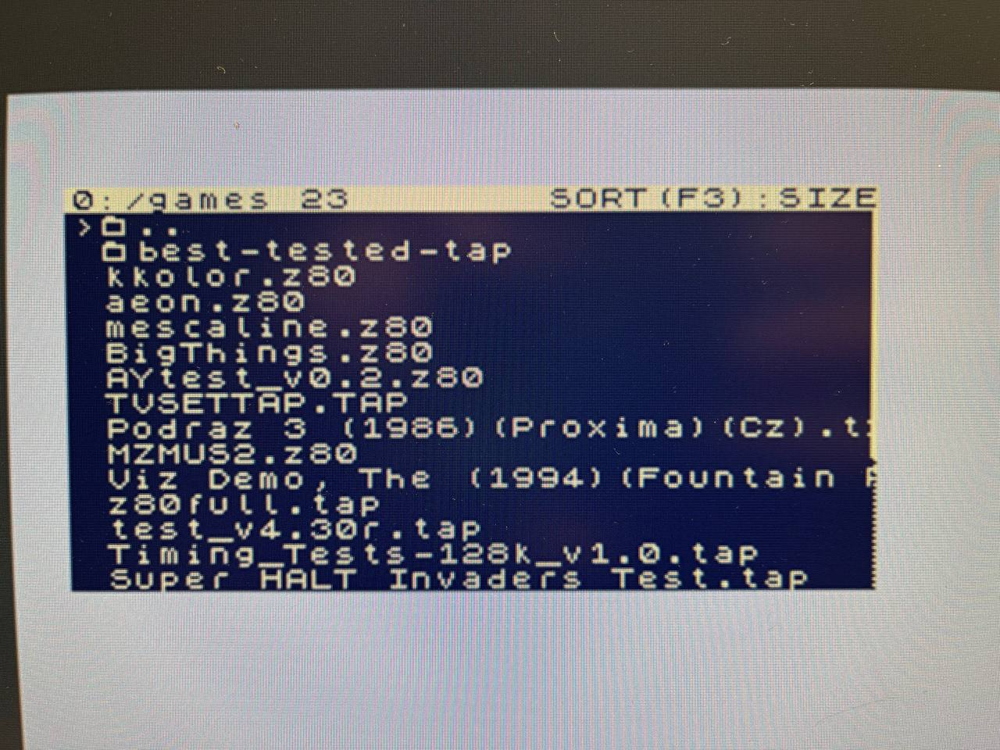
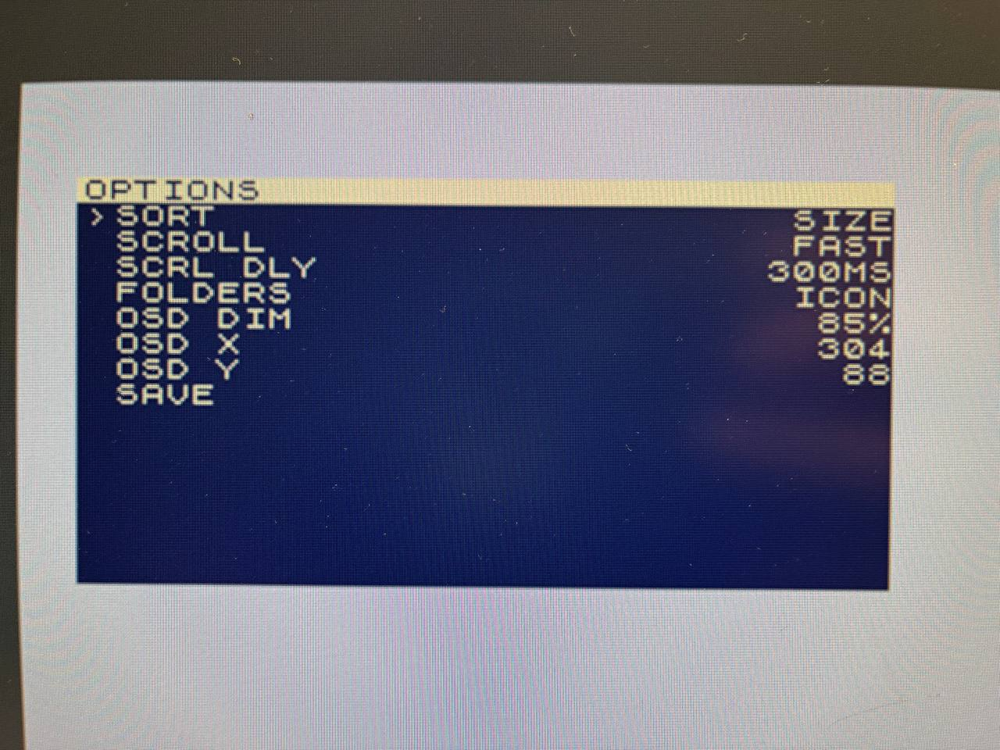
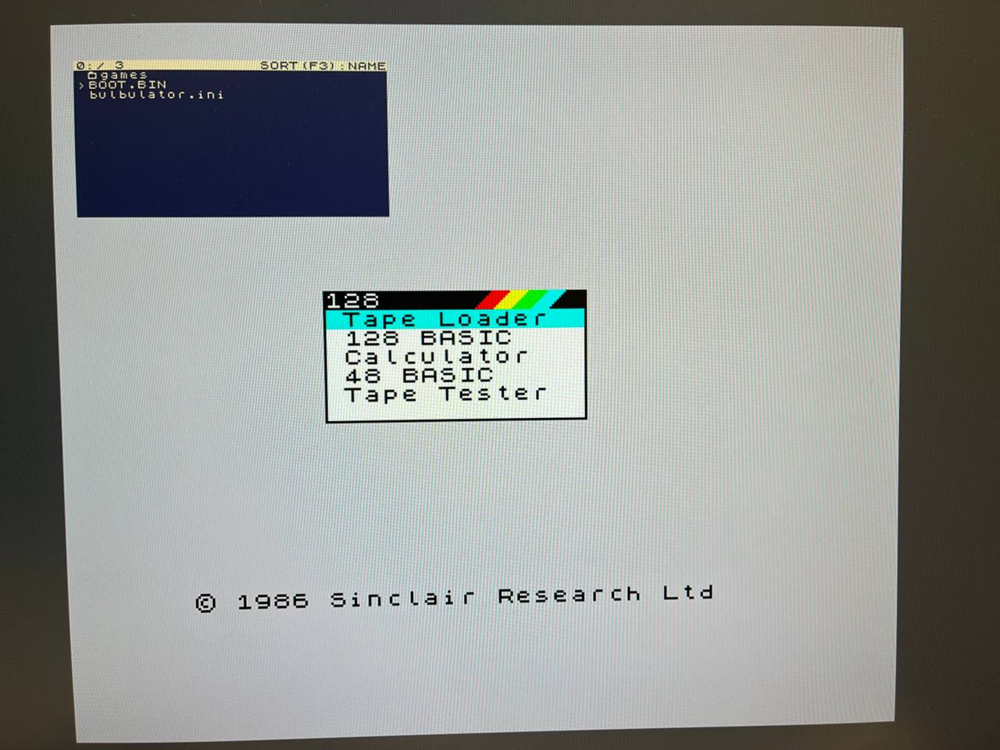
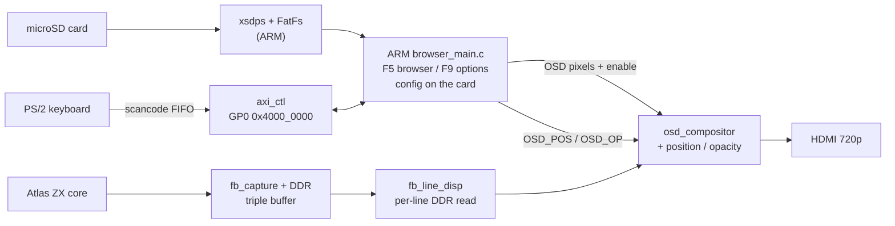

# Step 11 — Reading the SD card: a file browser

Languages: **English** · [Русский](README.ru.md)



*The F5 browser listing the SD card. Up/Down scroll, Enter opens a folder, `..` goes back; long names
scroll, folders are marked, and a bar on the right shows where you are in a long list.*

The goal of this step is the thing every loader needs first: mount a real filesystem off the SD card
and put its files on the screen. Step 10 gave the ARM a voice (an OSD over the live picture) and a hand
on the keyboard, but nothing to read. This step gives it the card: an **F5 file browser** that mounts
the FAT card and walks its folders, an **F9 options menu** whose changes apply live and save back to a
config file on the card, and an OSD panel you can now **move and fade** from that menu.

This is still the browser, not the loader. You can walk the card and read it; actually injecting the
file you land on (`.z80` / `.sna` over the AXI control plane) is the next step. The point of this one
is the plumbing underneath: the SD stack, the reusable menu, and a config file the project can grow
into.

## The file browser

Press **F5** and the OSD fills with the card's root. The ARM reads the FAT filesystem through ChaN's
FatFs on top of Xilinx's `xsdps` SD driver, and walks it with `f_opendir` / `f_readdir`:

- **Navigate.** Up/Down move the cursor, Enter opens a folder, `..` goes back up. (The "couldn't get
  back out of a folder" bug is fixed — climbing up used to leave a trailing slash on the path and the
  next read stuck on it.)
- **Sort** with **F3**: by name, date, size, or extension. Folders always sort to the top, `..` is
  pinned first, and the order is the sensible one for each key — A→Z for names and extensions, newest
  first for dates, largest first for sizes. The current mode shows in the header.
- **Long names** scroll (a marquee) once the cursor lands on them, after a short configurable pause so
  the list isn't twitchy.
- **A scrollbar** on the right shows your position in a list longer than the panel.
- **Folders are marked** so they read as folders at a glance — a `[bracketed]` Total-Commander style,
  a folder glyph, or a trailing `/`, switchable in the options.

The browser is **read-only**: it lists and navigates, it never opens a file for writing, so it
physically cannot damage the card while you poke around. (The one thing that does write — saving the
config — is described below.)

## Wiring up the SD card

The browser reads the card through ChaN's **FatFs** sitting on Xilinx's **`xsdps`** SD-host driver,
both bare-metal, no OS. That stack is worth a few words: it's the first time the project touches
storage, and it came with sharp edges.

**The stack.** `xsdps` drives the Zynq SD host controller (the EBAZ's microSD slot) and moves sectors
with ADMA2 DMA. FatFs sits on top and turns those sectors into a FAT filesystem. The app mounts drive
`0:` once at boot (`f_mount`) and then walks directories with `f_opendir` / `f_readdir`, and reads or
writes the config file with `f_open` / `f_read` / `f_write` / `f_close`. Nothing fancier than that.

**D-cache is off, on purpose — this is the nuance that cost the most.** `xsdps` reads run over ADMA2:
the SD controller DMAs sectors straight into a RAM buffer, behind the CPU's back. With the ARM D-cache
on, the driver has to invalidate the cache lines covering that buffer so the CPU sees the DMA'd bytes
and not a stale copy, and the stock invalidate rounds the length in a way that corrupts the bytes at
the tail of the buffer. Rather than patch the driver, the app runs with the **D-cache disabled**
(`Xil_DCacheDisable()` is the very first thing `main` does). It's a genuine performance hit on the ARM,
but it makes the SD path correct and predictable, and the browser isn't bandwidth-bound. (It's also why
the "could the ARM emulate a whole machine" question has a cache prerequisite — a separate fight.)

**FAT32, and why.** The Zynq BootROM only boots from FAT16/FAT32, so the boot card has to be FAT32
regardless. FatFs is built with long-filename support and code page 437 so real game filenames come
through readably. exFAT is compiled in for *reading* big cards, but the policy is **read exFAT, write
only FAT32**: exFAT keeps no mirror FAT, so a write cut short by a yanked power lead is far more likely
to leave a corrupt volume, and the one thing the project writes only ever lands on FAT32.

**Read-only while you browse.** Walking the card never opens a file for writing (`f_opendir` /
`f_readdir` only), so the browser physically cannot corrupt the card no matter what you do in it. The
single exception is **SAVE** in the options menu: it opens `0:/bulbulator.ini` with
`FA_CREATE_ALWAYS | FA_WRITE`, writes a few lines, and closes it. That's the project's first and only
write to a card, and it's why FatFs is built with `FF_FS_READONLY=0`. If the card is missing, full, or
write-protected, the open fails, the app falls back to "not mounted", and the menu shows `FAIL` rather
than `SAVED` — it never hangs.

**Building it is the rough part.** The SD stack is the first thing that drags in the Xilinx BSP, and
the platform-generate that's supposed to archive FatFs + `xsdps` into `libxil.a` is broken on this
toolchain, so the app links the BSP objects directly and ships prebuilt. Vendoring `xsdps` + FatFs for
a clean-clone `gcc` build is the next step (see the build section's honest note).

## The options menu



*The F9 options menu. Sort key, marquee speed and delay, how folders are marked, and the OSD panel's
own position and opacity — changed live, written to the card by SAVE.*

Press **F9** and you get a settings menu. Under it is a small **data-driven menu engine**: a menu is a
table of `menu_item`s with a type (a multiple-choice, an action, a numeric range), and one piece of
code renders and navigates the table. It's meant to carry every future settings page without new
drawing code. (The file browser is a separate, hand-written list; it only borrows the same scrollbar
and cursor idiom.)

The items so far:

- **SORT** — the browser's sort key (the same one F3 cycles).
- **SCROLL** / **SCRL DLY** — the long-name marquee speed and how long it waits before it starts.
- **FOLDERS** — how folders are marked (`[brackets]` / glyph / `/`).
- **OSD DIM**, **OSD X**, **OSD Y** — the OSD panel itself (see below).
- **SAVE** — write the settings to the card.

Left/Right or Enter change a value, and the change applies **live** — you see it immediately. Nothing
touches the card until you pick **SAVE**, which writes `bulbulator.ini` to the card's root and shows
`SAVED` or `FAIL`. This is the first time the project writes to the SD card at all: FatFs goes from
read-only to read-write (`FF_FS_READONLY=0`) for exactly this one file. The config is read back at
boot, so the machine comes up the way you left it. It's deliberately a small file, with room for more
keys and sections later.

## An OSD you can move and fade



*The panel parked over the running 128 boot menu. The Spectrum keeps going underneath — the panel is a
translucent navy window you move and fade from the menu, not a screen the machine was stopped to draw.*

Three of those menu items drive the OSD panel itself, live, through new control-plane registers:

- **OSD X** / **OSD Y** move the panel anywhere on the screen (`OSD_POS`, register `0x70`).
- **OSD DIM** sets how opaque it is (`OSD_OP`, register `0x6C`) — from a faint haze you can read the
  game through, up to a solid panel.

The compositor does this by blending its background colour with the live video by an alpha value:
`bg·a + video·(255−a)`, per pixel, combinationally on the scanout path, so the Z80 still never stops
and the picture timing doesn't change. A hardware clamp keeps the panel inside the 1280×720 frame no
matter what value the register holds, so a bad coordinate can't push it off-screen. The position is a
multi-bit value crossing from the ARM's clock to the pixel clock, so the compositor only latches it
after two samples agree. That keeps a half-updated coordinate from flashing a garbage position for a
cycle.

This is still a **1-bpp text panel** (cream text on a translucent navy box), but it's twice as tall as Step 10's
(256×128, up from 256×64), so a 15-row browser or menu fits. Colour and skins are deliberately left
for later; what's here is the panel learning to move and fade, not to paint in colour.

## Making room: the framebuffer moved to a line buffer

There's a quieter change in this bitstream that the browser leans on. Since Step 8 the whole ZX frame
was upscaled out of a BRAM copy of the frame. That copy is gone: `fb_line_disp` now reads the frame
from PS DDR **one source line at a time** into a tiny pair of LUTRAM line buffers and scans them out at
720p50. The ZX output is byte-for-byte identical to the old path, but it gives back about a dozen
BRAM tiles — headroom the colour OSD will want later.

It's also written as a **parametric** scaler — geometry, scale, crop and bits-per-pixel are
parameters, with the palette as the one core-specific stage. That's on purpose: the same display path
is meant to scan out a future NES or C64 core, not just this Spectrum.

The per-line DDR reader has a hard real-time deadline: one line every 26.7 µs, while the capture side
is writing the next frame into the same DDR. So before committing to it, the AXI-HP path was measured
on hardware under a full write flood. Read latency stayed bounded at ~770 ns worst case, and a whole
line's fetch fits comfortably inside the 26.7 µs budget (roughly a 10× margin on the fetch time). That
measurement is what cleared the colour-OSD work to go ahead.

## Matching the border to ZEsarUX

A Spectrum's character area is 256×192, but the picture people remember includes the **border** around
it — and border demos live entirely out there. Getting the full border onto HDMI, matched against
ZEsarUX as the reference, took a few connected fixes.

**Fixing the scroll first.** Streaming a frame to DDR needs the same number of words every frame, in
raster order. The ULA's vblank lines carry zero visible pixels, so a naive packer emits fewer words on
those lines and the whole image slowly **scrolls**. `fb_capture_rr` fixes that with a ping-pong line
buffer: it captures each line's real pixels, then emits **exactly 360 pixels per line** (the captured
ones, padded with black). Every frame is then exactly `lines × 360` words with fixed geometry — no
scroll, whatever the demo does to the border.

**Measuring the real frame.** To crop the border you have to know where it actually is, and that's
machine- and timing-specific. So a tiny **`cap_geom` probe** (read at AXI `0x64`) counts, every frame,
the total line count and the first and last *visible* (non-blank) line. Read back over JTAG against
ZEsarUX, it showed the real PAL frame: 311 lines, with picture-plus-border running from line 8 on.

**The crop that ships.** Capture drops the first 8 lines after vsync (`SKIP = 8`) — those are the vsync
tail, and re-rastering them grabs shifted garbage — then captures 302 lines (`FB_H = 302`, video lines
8…309). That's the full rainbow border top and bottom, centred in the 720p frame, with no garbage strip
at the top. Horizontally the capture is 360 wide, but the last *good* column is 356: the ULA's
combinational blank against its registered colour leaves a couple of stray white pixels at the far
right edge (cols 357–358) plus a black pad at 359, so the display crop stops at column 356 and leaves
the rest in the overscan.

**A frame that isn't a round number.** 302 lines × 360 ÷ 16 = **6795 words**, which isn't a multiple of
the 16-beat AXI burst. So `fb_wr_axi` writes the frame as 424 full 16-beat bursts plus **one final
partial burst of 11 beats** — which is exactly what lets the frame be 302 lines instead of being forced
to a multiple of 32.

## The control-plane registers

The AXI register file (`axi_ctl.v`, on `M_AXI_GP0` at `0x4000_0000`) gained four entries since Step 10,
and the version bumped to `0xB01B0008`:

| Addr | Name | R/W | Meaning |
|---|---|---|---|
| `0x64` | `cap_geom` | R | frame-geometry probe: the captured frame's line count and first/last visible line — used to tune the crop against a reference |
| `0x68` | `OSD_BG` | RW | OSD panel background colour (RGB). The blend uses it; the menu picker for it is a later, colour step |
| `0x6C` | `OSD_OP` | RW | OSD panel opacity, alpha `0..255` (255 = solid, 0 = clear). Driven by **OSD DIM** |
| `0x70` | `OSD_POS` | RW | OSD panel position, `[10:0]` = X0, `[26:16]` = Y0. Driven by **OSD X** / **OSD Y** |

(`0x54`–`0x60` are unchanged from Step 10: the scancode FIFO, the deadman heartbeat, and `MACHINE_ID`. The OSD registers at `0x48`–`0x50` keep the same addresses, but the buffer behind them grew:
the panel doubled to 256×128, so the pixel buffer is now 1024 words and `OSD_ADDR` is a 10-bit pointer.)

## How it fits together



## Build, flash, run

Three ways in, same as the earlier steps: build the whole thing from source, flash the prebuilt
bitstream over JTAG, or just boot the prebuilt image off an SD card.

**Build the bitstream.** Fetch the cores once from the repo root (`../../get_deps.sh`), then
`./build.sh`. This step's RTL delta lives in `sources/`: `osd_compositor.v` (position + opacity), the
new `fb_line_disp.v` (the line-buffer display), the re-cropped `fb_capture_rr.v` / `fb_wr_axi.v`,
`axi_ctl.v` with the four new registers, the top, and the constraints. `sources/assemble.sh` pulls the
unchanged Step 6 glue and the Step 8 DDR chain around it, and Vivado writes `bulbulator_zx_browser.bit`.

**Flash over JTAG and run.** `./browser_run.sh` configures the bitstream over PCAP (the "armoured
train", as in Steps 6–10), then loads and runs the prebuilt browser app on Cortex-A9 #0. The Spectrum
comes up on HDMI and F5 / F9 / F1 work straight away.

**Boot from SD (no host, no JTAG).** Copy `flash/BOOT.BIN` onto the card's FAT `boot` partition, set
the board to SD boot (the R2577 strap — see Step 0), and power on. The FSBL brings up the bitstream and
starts the browser app; F5 lists the same card. To rebuild that image yourself, `flash/build_boot.sh`
stitches the FSBL, this step's bitstream, and the browser app into a fresh `BOOT.BIN`, VM-free (see the
script header for the bootgen-on-modern-glibc workaround).

**The ARM app — an honest note on building it.** Up to Step 10 the ARM app was bare-metal C built with
a plain `arm-none-eabi-gcc` and nothing else, fully from a clean clone. Step 11 is the first that needs
the SD card, so the app pulls in Xilinx's `xsdps` SD driver and ChaN's FatFs. Right now it builds
against a Vitis BSP (`build_browser.sh` links the FatFs objects and `xsdps` directly, since the broken
platform-generate won't archive them into `libxil.a`), so a clean-clone `gcc` build of the app isn't
there yet — that wants `xsdps` + FatFs vendored into the repo, which is its own next step (the SD
file-service work). So this step ships the app **source** (`arm/browser_main.c`), its **build script**,
and a **prebuilt `arm/browser.elf`**; the SD `BOOT.BIN` and the bitstream both build and run as above.

## Files

```
sources/osd_compositor.v          1-bpp OSD panel + live position/opacity blend (CHANGED)
sources/fb_line_disp.v            per-line DDR display, replaces the whole-frame BRAM (NEW)
sources/fb_capture_rr.v           frame capture, crop tuned vs ZEsarUX (CHANGED)
sources/fb_wr_axi.v               DDR frame writer, partial final burst for the new crop height (CHANGED)
sources/axi_ctl.v                 control plane + OSD position/opacity/bg + cap_geom (VERSION 0xB01B0008)
sources/bulbulator_zx_ddr_top.v   full top: the Step 10 design with fb_line_disp + the new registers
sources/bulbulator_ddr.xdc        constraints (CDC false-paths for the new line-disp need_row crossing)
sources/assemble.sh + build.tcl   gather the delta + the Step 6/8 sources into build/, then synth
arm/browser_main.c                the ARM app: F5 browser + F9 options + config (FatFs/xsdps)
arm/build_browser.sh              builds browser.elf against the Vitis BSP (see the honest note above)
arm/browser.elf                   prebuilt ARM app
build.sh                          build the bitstream
browser_run.sh                    PCAP-flash the bitstream + load/run the browser app over JTAG
flash/BOOT.BIN                    ready SD image (FSBL + this step's bitstream + the browser app)
flash/build_boot.sh + bif + fsbl.bin + browser.bin   rebuild BOOT.BIN yourself
flash/pcap_load.tcl + ps7_init_fclk.tcl              PCAP loader + PS7/FCLK/level-shifter init (reused since Step 8)
bulbulator_zx_browser.bit         prebuilt bitstream — flash over JTAG
```

## What's not done yet

This is a notebook, so the open ends are part of the entry:

- **Loading the file is the next step.** The browser navigates; it doesn't yet inject the `.z80` /
  `.sna` you land on. The control-plane path for that is already in (Step 7), so this is the join.
- **The keyboard still misses a key now and then** — occasionally a press doesn't register the first
  time, in the menu and in games alike, which points at the shared PS/2 receiver rather than the ARM. A
  resync watchdog is in, but the dominant cause is likely a dropped make/break frame; it's still being
  chased.
- **Colour and skins are deferred.** The OSD can move and fade but it's still one-bit cream-on-navy. The
  line-buffer change above is the groundwork that frees the BRAM a colour panel will need.

The SD stack is ChaN's [FatFs](http://elm-chan.org/fsw/ff/) on Xilinx's `xsdps`; the ZX core is the
[Atlas `zx`](https://github.com/AtlasFPGA/zx) core, and the OSD compositor, keyboard gate and DDR
display chain are the Step 8/10 work this builds on.
