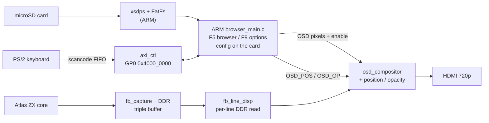

# Шаг 11 — Просмотр содержимого SD-карты: файловый браузер

Languages: [English](README.md) · **Русский**


*Браузер F5, отображающий содержимое SD-карты. Стрелками вверх/вниз можно прокручивать список, клавиша Enter открывает папку, `..` возвращает на предыдущий уровень; длинные имена прокручиваются, папки выделяются, а полоска справа показывает, где ты находишься в длинном списке.*

Цель этого шага — то, что нужно каждому загрузчику в первую очередь: смонтировать настоящую файловую систему с SD-карты и вывести её файлы на экран. На 10-м шаге мы дали ARM «голос» (OSD поверх живого изображения) и «руку» на клавиатуре, но нечего было читать. На этом этапе мы даём ему карту: **файловый браузер F5**, который монтирует карту FAT и просматривает её папки; **меню настроек F9**, изменения в котором применяются в режиме реального времени и сохраняются обратно в файл конфигурации на карте; а также панель OSD, которую теперь можно **перемещать и затухать** прямо из этого меню.

Это по-прежнему браузер, а не загрузчик. Ты можешь перемещаться по карте и читать её содержимое; фактическая загрузка файла, на котором ты остановился (`.z80` / `.sna` через контрольную плоскость AXI), — это следующий шаг. Суть этой версии — в обвязке под капотом: стек SD, переиспользуемое меню и файл конфигурации, который будет расти вместе с проектом.

## Браузер файлов

Нажми **F5**, и на экране появится корневой каталог карты. ARM считывает файловую систему FAT через библиотеку FatFs от ChaN, работающую поверх драйвера SD `xsdps` от Xilinx, и перемещается по ней с помощью `f_opendir` / `f_readdir`:

- **Навигация.** Клавиши «Вверх»/«Вниз» перемещают курсор, «Enter» открывает папку, `..` возвращает на уровень выше. (Исправлена ошибка, из-за которой
  не удавалось выйти из папки — раньше при переходе на уровень выше в конце пути оставалась косая черта, и
  следующее чтение застревало на ней.)
- **Сортировка** с помощью **F3**: по имени, дате, размеру или расширению. Папки всегда сортируются в начало списка, `..`
  закреплён первым, а порядок сортировки логичен для каждой клавиши — от A до Z для имён и расширений, сначала самые новые
  по дате, самые большие — по размеру. Текущий режим отображается в заголовке.
- **Длинные имена** прокручиваются (в виде бегущей строки), как только курсор наводится на них, после короткой настраиваемой паузы, чтобы
  список не дергался.
- **Полоса прокрутки** справа показывает твое положение в списке, если он длиннее панели.
- **Папки помечены** так, чтобы их можно было сразу распознать — в стиле Total Commander `[в скобках]`,
  с помощью значка папки или конечного символа `/`, что можно настроить в параметрах.

Браузер работает **только в режиме чтения**: он отображает список и обеспечивает навигацию, но никогда не открывает файлы для записи, поэтому физически не может повредить карту, пока ты в ней копаешься. (Единственное, что всё-таки записывает — сохранение настроек — описано ниже.)

## Подключение SD-карты

Браузер считывает карту через **FatFs** от ChaN, работающий на драйвере SD-хоста **`xsdps`** от Xilinx — и то, и другое работает «на голом железе», без ОС. Об этом стеке стоит сказать пару слов: проект впервые сталкивается с хранением данных, и это оказалось не так просто.

**Стек.** `xsdps` управляет SD-контроллером Zynq (слот microSD на EBAZ) и перемещает секторы с помощью DMA по стандарту ADMA2. FatFs работает поверх него и преобразует эти секторы в файловую систему FAT. Приложение монтирует диск `0:` один раз при загрузке (`f_mount`), а затем просматривает каталоги с помощью `f_opendir` / `f_readdir` и читает или записывает файл конфигурации с помощью `f_open` / `f_read` / `f_write` / `f_close`. Ничего сложного.

**D-кеш специально отключён — именно этот нюанс обошёлся дороже всего.** Чтение `xsdps` происходит через ADMA2: SD-контроллер с помощью DMA переносит секторы прямо в буфер ОЗУ, минуя процессор. Когда D-кеш ARM включён, драйверу приходится очищать строки кеша, охватывающие этот буфер, чтобы процессор видел именно те байты, которые были перенесены по DMA, а не устаревшую копию, а стандартная процедура очистки округляет длину таким образом, что повреждает байты в конце буфера. Вместо того чтобы вносить исправления в драйвер, приложение запускается с **отключенным D-кешем** (вызов `Xil_DCacheDisable()` — это самое первое, что делает функция `main`). Это действительно снижает производительность ARM, но делает работу с SD-картами корректной и предсказуемой, а браузер не ограничивается пропускной способностью. (Именно поэтому вопрос «может ли ARM эмулировать целую машину» имеет предварительное условие, связанное с кэшем — это отдельная тема.)

**FAT32 и почему.** BootROM Zynq загружается только с FAT16/FAT32, так что загрузочная карта в любом случае должна быть в формате FAT32. FatFs поддерживает длинные имена файлов и кодовую страницу 437, поэтому настоящие имена файлов игр отображаются читаемо. exFAT встроен для *чтения* больших карт, но политика такова: **читать exFAT, записывать только на FAT32**: exFAT не ведёт зеркальную FAT, поэтому запись, прерванная из-за выдернутого шнура питания, с гораздо большей вероятностью приведёт к повреждению тома, а единственное, что записывает проект, всегда попадает именно на FAT32.

**Только чтение при просмотре.** При просмотре карты файлы никогда не открываются для записи (только `f_opendir` / `f_readdir`), поэтому браузер физически не может повредить карту, что бы ты в нём ни делал. Единственное исключение — пункт **SAVE** в меню настроек: он открывает файл `0:/bulbulator.ini` с параметрами `FA_CREATE_ALWAYS | FA_WRITE`, записывает несколько строк и закрывает его. Это первая и единственная запись на карту в рамках проекта, и именно поэтому FatFs скомпилирован с параметром `FF_FS_READONLY=0`. Если карты нет, она заполнена или защищена от записи, открытие не удаётся, приложение переходит в режим «не подключено», а в меню отображается `FAIL` вместо `SAVED` — оно никогда не зависает.

**Сложность заключается в компиляции.** Стек SD — это первое, что тянет за собой BSP от Xilinx, а команда platform-generate, которая должна архивировать FatFs + `xsdps` в `libxil.a`, не работает в этой цепочке инструментов, поэтому приложение напрямую связывает объекты BSP и поставляется в готовом виде. Следующий шаг — добавить `xsdps` + FatFs в список зависимостей для сборки с чистым клоном `gcc` (см. честное примечание в разделе о сборке).

## Меню настроек


*Меню настроек F9. Ключ сортировки, скорость и задержка выделения, способ выделения папок, а также положение и прозрачность самой панели OSD — все это можно менять в режиме реального времени, а сохранить на карту — с помощью кнопки SAVE.*

Нажми **F9** — откроется меню настроек. В его основе лежит небольшой **механизм меню на основе данных**: меню представляет собой таблицу элементов `menu_item` с типом (выбор из нескольких вариантов, действие, числовой диапазон), а один фрагмент кода отвечает за отображение и навигацию по этой таблице. Он предназначен для поддержки всех будущих страниц настроек без написания нового кода для рисования. (Обзор файлов — это отдельный, написанный вручную список; он лишь заимствует ту же идею прокрутки и курсора.)

На данный момент есть следующие пункты:

- **SORT** — ключ сортировки в браузере (тот же, что переключается с помощью F3).
- **SCROLL** / **SCRL DLY** — скорость прокрутки длинных имен и время ожидания перед началом прокрутки.
- **FOLDERS** — как помечаются папки (`[скобки]` / глиф / `/`).
- **OSD DIM**, **OSD X**, **OSD Y** — сама панель OSD (см. ниже).
- **SAVE** — запись настроек на карту.

Кнопки «Влево/Вправо» или «Enter» меняют значение, и изменения вступают в силу **в режиме реального времени** — ты видишь их сразу. Ничего не записывается на карту, пока ты не нажмёшь **SAVE**, что записывает файл `bulbulator.ini` в корневую папку карты и отображает сообщение `SAVED` или `FAIL`. Это первый раз, когда проект вообще записывает что-либо на SD-карту: FatFs переходит из режима «только для чтения» в режим «чтение-запись» (`FF_FS_READONLY=0`) именно для этого одного файла. Конфигурация считывается при загрузке, поэтому устройство запускается в том же состоянии, в котором ты его оставил. Файл специально сделан небольшим, чтобы в будущем можно было добавить больше ключей и разделов.

## OSD, которую можно перемещать и затемнять


*Панель появилась поверх запущенного меню загрузки 128. Spectrum продолжает работать под ней — панель представляет собой полупрозрачное темно-синее окно, которое ты можешь перемещать и скрывать из меню, а не экран, для рисования которого компьютер приостановили.*

Три из этих пунктов меню управляют самой панелью OSD в режиме реального времени через новые регистры управляющей плоскости:

- **OSD X** / **OSD Y** перемещают панель в любую точку экрана (`OSD_POS`, регистр `0x70`).
- **OSD DIM** задаёт степень прозрачности (`OSD_OP`, регистр `0x6C`) — от едва заметной дымки, сквозь которую видна
  игра, до полностью непрозрачной панели.

Композитор делает это, смешивая цвет фона с видеосигналом в реальном времени с помощью альфа-коэффициента: `bg·a + video·(255−a)` для каждого пикселя, комбинационно на пути вывода, так что Z80 ни на секунду не останавливается, а синхронизация изображения не меняется. Аппаратный ограничитель удерживает панель в пределах кадра 1280×720 независимо от значения в регистре, поэтому даже неверные координаты не смогут вытолкнуть её за пределы экрана. Координата представляет собой многобитовое значение, переходящее из тактовой частоты ARM в тактовую частоту пикселей, поэтому композитор фиксирует её только после совпадения двух отсчётов. Это не даёт полуобновлённой координате мигать мусорным значением в течение одного цикла.

Это по-прежнему **текстовая панель с разрешением 1 бит на пиксель** (кремовые буквы на полупрозрачном тёмно-синем поле), но она вдвое выше, чем в шаге 10 (256×128 вместо 256×64), так что в неё помещается браузер или меню из 15 строк. Цвет и скины специально оставили на потом; здесь панель учится перемещаться и менять прозрачность, а не рисовать в цвете.

## Освобождаем место: фреймбуфер переместили в линейный буфер

В этом битстриме есть ещё одно, менее заметное изменение, на которое опирается браузер. Начиная с шага 8, весь кадр ZX масштабировался из копии кадра в BRAM. Этой копии больше нет: `fb_line_disp` теперь считывает кадр из PS DDR **по одной исходной строке за раз** в пару крошечных строчных буферов LUTRAM и выводит их с разрешением 720p50. Выход ZX байт за байтом идентичен старому пути, но он освобождает около дюжины тайлов BRAM — это запас, который понадобится позже для цветного OSD.

Он также реализован как **параметрический** скалер — геометрия, масштаб, кадрирование и количество бит на пиксель являются параметрами, а палитра — единственный этап, зависящий от конкретного ядра. Это сделано специально: один и тот же путь вывода должен поддерживать будущие ядра NES или C64, а не только этот Spectrum.

У считывателя DDR построчно установлен жёсткий дедлайн в реальном времени: одна строка каждые 26,7 мкс, в то время как сторона захвата записывает следующий кадр в тот же DDR. Поэтому перед внедрением тракт AXI-HP был протестирован на аппаратном обеспечении в условиях полной нагрузки записью. Задержка чтения в худшем случае не превышала ~770 нс, а выборка целой строки легко укладывается в лимит 26,7 мкс (примерно 10-кратный запас по времени выборки). Именно эти результаты дали зелёный свет на продолжение работы над цветным OSD.

## Согласование рамки с ZEsarUX

Область символов Spectrum составляет 256×192, но картинка, которую все помнят, включает **рамку** вокруг неё — и демо-программы с рамкой полностью разворачиваются именно там. Чтобы вывести полную рамку на HDMI, сопоставив её с ZEsarUX в качестве эталона, потребовалось несколько взаимосвязанных исправлений.

**Сначала исправим прокрутку.** Для передачи кадра в DDR требуется одинаковое количество слов в каждом кадре, в растровом порядке. Строки vblank в ULA не содержат видимых пикселей, поэтому простой упаковщик выдаёт меньше слов на этих строках, и всё изображение медленно **прокручивается**. `fb_capture_rr` исправляет это с помощью буфера строк типа «пинг-понг»: он захватывает реальные пиксели каждой строки, а затем выдает **ровно 360 пикселей на строку** (захваченные пиксели, дополненные чёрным). В результате каждый кадр состоит ровно из `lines × 360` слов с фиксированной геометрией — никакой прокрутки, что бы ни делала демо-программа с краями.

**Измерение реального кадра.** Чтобы обрезать края, нужно знать, где они на самом деле находятся, а это зависит от конкретной машины и синхронизации. Поэтому крошечный **`cap_geom`-зонд** (считывается по AXI `0x64`) в каждом кадре подсчитывает общее количество строк, а также первую и последнюю *видимую* (непустую) строку. При считывании через JTAG в ZEsarUX получился реальный PAL-кадр: 311 строк, причём изображение с рамкой начинается со 8-й строки.

**Обрезка, которая используется в финальной версии.** При захвате первые 8 строк после vsync пропускаются (`SKIP = 8`) — это хвост vsync, и при повторном растрировании там появляется смещённый мусор — после чего захватываются 302 строки (`FB_H = 302`, видеостроки 8…309). Это полная радужная рамка сверху и снизу, центрированная в кадре 720p, без полосы мусора вверху. По горизонтали захват имеет ширину 360, но последний *хороший* столбец — 356: комбинационное гашение ULA на фоне регистрового цвета оставляет пару случайных белых пикселей на крайнем правом крае (столбцы 357–358) плюс чёрный заполнитель на 359-м, поэтому обрезка изображения заканчивается на 356-м столбце, а остальное остаётся в зоне оверскана.

**Кадр, длина которого не является целым числом.** 302 строки × 360 ÷ 16 = **6795 слов**, что не кратно 16-тактному бёрсту AXI. Поэтому `fb_wr_axi` записывает кадр в виде 424 полных 16-тактных бёрста плюс **один заключительный неполный бёрст из 11 тактов** — именно это и позволяет кадру состоять из 302 строк, а не быть принудительно сведённым к кратному числу 32.

## Регистры плоскости управления

Файл регистров AXI (`axi_ctl.v`, на `M_AXI_GP0` по адресу `0x4000_0000`) пополнился четырьмя записями с 10-го этапа, а версия изменилась на `0xB01B0008`:

| Адрес | Название | Ч/З | Значение |
|---|---|---|---|
| `0x64` | `cap_geom` | Ч | зонд геометрии кадра: количество строк в захваченном кадре и первая/последняя видимая строка — используется для настройки кадрирования по эталону |
| `0x68` | `OSD_BG` | Ч/З | Цвет фона панели OSD (RGB). Он используется при наложении; выбор цвета для него — это более поздний шаг, посвящённый цвету |
| `0x6C` | `OSD_OP` | Ч/З | Прозрачность панели OSD, альфа `0..255` (255 = полностью непрозрачно, 0 = полностью прозрачно). Управляется **OSD DIM** |
| `0x70` | `OSD_POS` | Ч/З | Положение панели OSD, `[10:0]` = X0, `[26:16]` = Y0. Управляется **OSD X** / **OSD Y** |

(`0x54`–`0x60` остались без изменений по сравнению с шагом 10: FIFO сканирующих кодов, сигнал «deadman» и `MACHINE_ID`. Регистры OSD по адресам `0x48`–`0x50` остались на прежних адресах, но буфер за ними увеличился: панель удвоилась до 256×128, поэтому буфер пикселей теперь составляет 1024 слова, а `OSD_ADDR` — это 10-битный указатель.)

## Как всё это устроено



## Сборка, прошивка, запуск

Есть три способа, как и в предыдущих шагах: собрать всё с исходников, записать готовый битстрим через JTAG или просто загрузить готовый образ с SD-карты.

**Скомпилируй битстрим.** Сначала загрузи ядра из корня репозитория (`../../get_deps.sh`), а потом запусти `./build.sh`. RTL-изменения для этого шага находятся в `sources/`: `osd_compositor.v` (положение + прозрачность), новый `fb_line_disp.v` (отображение линейного буфера), переработанные `fb_capture_rr.v` / `fb_wr_axi.v`, `axi_ctl.v` с четырьмя новыми регистрами, верхний уровень и ограничения. `sources/assemble.sh` собирает неизменённый связующий код из шага 6 и цепочку DDR из шага 8 вокруг него, а Vivado записывает файл `bulbulator_zx_browser.bit`.

**Прошивка через JTAG и запуск.** `./browser_run.sh` настраивает битстрим через PCAP (это тот самый «бронированный поезд», как в шагах 6–10), а потом загружает и запускает готовое приложение-браузер на Cortex-A9 № 0. Spectrum запускается через HDMI, а клавиши F5, F9 и F1 работают сразу.

**Загрузка с SD-карты (без хоста, без JTAG).** Скопируй `flash/BOOT.BIN` в раздел `boot` файловой системы FAT на карте, переключи плату на загрузку с SD (перемычка R2577 — см. шаг 0) и включи питание. FSBL загрузит битстрим и запустит браузер; нажатие F5 покажет ту же самую карту. Чтобы самостоятельно пересобрать этот образ, скрипт `flash/build_boot.sh` объединяет FSBL, битстрим этого шага и браузерное приложение в новый файл `BOOT.BIN` без виртуальной машины (см. заголовок скрипта для обходного решения bootgen-on-modern-glibc).

**Приложение для ARM — честное замечание по поводу его сборки.** До шага 10 приложение для ARM было написано на «голом» C и скомпилировано с помощью простого `arm-none-eabi-gcc` без каких-либо дополнительных инструментов, полностью из чистого клона. Шаг 11 — первый, для которого нужна SD-карта, поэтому приложение подключает драйвер SD от Xilinx `xsdps` и FatFs от ChaN. Сейчас оно собирается под Vitis BSP (скрипт `build_browser.sh` напрямую связывает объекты FatFs и `xsdps`, так как неработающий `platform-generate` не архивирует их в `libxil.a`), поэтому сборки приложения с помощью `gcc` из чистого клона пока нет — для этого нужно, чтобы `xsdps` и FatFs были добавлены в репозиторий в качестве внешних библиотек, что и станет следующим шагом (работа над файловой системой SD). Поэтому на этом этапе поставляются **исходный код** приложения (`arm/browser_main.c`), его **скрипт сборки** и **готовый файл `arm/browser.elf`**; файл `BOOT.BIN` для SD-карты и битстрим собираются и запускаются так же, как описано выше.

## Файлы

```
sources/osd_compositor.v          1-bpp OSD panel + live position/opacity blend (CHANGED)
sources/fb_line_disp.v            per-line DDR display, replaces the whole-frame BRAM (NEW)
sources/fb_capture_rr.v           frame capture, crop tuned vs ZEsarUX (CHANGED)
sources/fb_wr_axi.v               DDR frame writer, partial final burst for the new crop height (CHANGED)
sources/axi_ctl.v                 control plane + OSD position/opacity/bg + cap_geom (VERSION 0xB01B0008)
sources/bulbulator_zx_ddr_top.v   full top: the Step 10 design with fb_line_disp + the new registers
sources/bulbulator_ddr.xdc        constraints (CDC false-paths for the new line-disp need_row crossing)
sources/assemble.sh + build.tcl   gather the delta + the Step 6/8 sources into build/, then synth
arm/browser_main.c                the ARM app: F5 browser + F9 options + config (FatFs/xsdps)
arm/build_browser.sh              builds browser.elf against the Vitis BSP (see the honest note above)
arm/browser.elf                   prebuilt ARM app
build.sh                          build the bitstream
browser_run.sh                    PCAP-flash the bitstream + load/run the browser app over JTAG
flash/BOOT.BIN                    ready SD image (FSBL + this step's bitstream + the browser app)
flash/build_boot.sh + bif + fsbl.bin + browser.bin   rebuild BOOT.BIN yourself
flash/pcap_load.tcl + ps7_init_fclk.tcl              PCAP loader + PS7/FCLK/level-shifter init (reused since Step 8)
bulbulator_zx_browser.bit         prebuilt bitstream — flash over JTAG
```

## Что ещё не сделано

Это же записная книжка, так что незавершённые моменты — часть записи:

- **Следующий шаг — загрузка файла.** Браузер переходит по ссылке, но пока не вставляет файл `.z80` /
  `.sna`, на который ты попадаешь. Путь по плоскости управления для этого уже проложен (шаг 7), так что осталось только соединить.
- **На клавиатуре по-прежнему иногда пропадают нажатия** — иногда нажатие не регистрируется с первого
  раза, как в меню, так и в играх, что указывает на общий PS/2-приёмник, а не на ARM. Встроен
  страж синхронизации, но основной причиной, скорее всего, является пропущенный кадр make/break; эту проблему всё ещё
  ищут.
- **Цвет и скины пока отложены.** OSD может перемещаться и менять прозрачность, но пока это однобитовый кремовый текст на тёмно-синем фоне. Указанное
  выше изменение линейного буфера — это основа, которая освобождает BRAM, необходимую для цветовой панели.

Стек SD — это [FatFs](http://elm-chan.org/fsw/ff/) от ChaN на `xsdps` от Xilinx; ядро ZX — это ядро [Atlas `zx`](https://github.com/AtlasFPGA/zx), а композитор OSD, шлюз клавиатуры и цепочка отображения DDR — это работа Step 8/10, на которой всё это основано.
