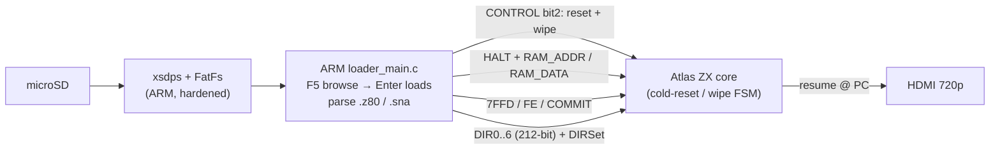

# Step 12 — Loading a snapshot: `.z80` / `.sna` over the control plane

Languages: **English** · [Русский](README.ru.md)


*A snapshot picked in the F5 browser and injected: the machine is cold-reset, the RAM and registers are
written in over the AXI back door, and the core resumes at the snapshot's PC.*

Step 11 gave the browser — mount the card, walk it, read it. It stopped one step short of the thing a
loader exists for: actually running the file you land on. This step is that join. Press **Enter** on a
`.z80` or `.sna` and the ARM parses it, cold-resets and wipes the machine, streams the RAM image into
the core's memory over the Step-7 AXI back door, injects the whole Z80 register set straight into the
T80, and lets it run from the snapshot's PC. The browser is now a real loader.

Two things made this more than "write the bytes and go": every load first does a full hardware
reset+wipe so nothing leaks from the previous program, and the SD path is hardened for a board whose
microSD slot has no card-detect line.

## What it loads

`.z80` (v1/v2/v3, 48K and 128K) and `.sna` (48K and 128K). The detection and the byte-level parsing are
involved enough to have their own document: **[`docs/LOADER_SPEC.md`](../../docs/LOADER_SPEC.md)** is the
exhaustive reference — every header field of both formats, the RLE scheme, the full hardware-mode table,
the page→bank mapping, the `.sna` stack trick, and exactly what BulbuLator does versus what the format
allows. The short version:

- **`.z80`** — the version comes from the PC word at offset 6: non-zero means a v1 (48K) file with memory
  right after the 30-byte header; zero means a v2/v3 file whose real PC is at offset 32 and whose
  extended-header length (23/54/55) tells v2 from v3. 48K-vs-128K is the hardware byte at offset 34, read
  **version-dependently** — `(extlen==23) ? (hw≥3) : (hw≥4)` — because the meaning of codes 3–6 shifts
  between v2 and v3. Memory is a sequence of per-page blocks, each RLE-compressed in `ED ED count value`
  runs (or raw when the length word is `0xFFFF`).
- **`.sna`** — the fixed size is the tell: 49179 → 48K, 131103/147487 → 128K. The 48K variant has no PC
  field; it's recovered by popping it off the saved stack (and SP nudged back by two). The 128K variant
  stores an explicit PC and the `0x7FFD` paging byte in a four-byte trailer, then the remaining RAM banks.

Each 16 KiB page is written to the right one of the core's eight physical RAM banks. The page→bank map is
**different for 48K and 128K** — that's the subtle part, and the spec spells it out with the
collision-resolution warning.

## Reset before every load

A snapshot is a whole-machine state, and the cleanest way to apply it is onto a blank machine. So a
reset runs *first*, before any RAM is written. A new control bit — `CONTROL` bit 2 — is pulsed by the
ARM, crossed into the Spectrum clock domain, and drives the **same cold-reset + RAM-wipe FSM the F11 hard
reset already used**: it sweeps all 128 KiB to zero and resets the Z80, the AY, the ULA and the paging
latch. Only then does the ARM assert HALT and wait for `HALT_ACK` to take the memory bus.

Without it, the previous program leaks into the new load — stale bytes in the pages the snapshot doesn't
write, and, most audibly, an AY-3-8912 still playing whatever note it was last handed, so a fresh load
could start with a continuous squeal. The reset gives every load a clean slate. (The "old demo bleeding
through a new one" artefact and the carried-over AY squeal both came from skipping this.)

One subtlety the CDC review caught: the ARM waits for the reset-busy status to go **0 → 1 → 0**, and
never treats the initial 0 as "done" — the wipe must not race the inject. On an older bitstream that
lacks the bit, this degrades to a brief delay plus HALT, with no wipe.

## Injecting the registers

With the RAM in, the loader sets the paging latch (`0x7FFD`) and the border, commits them, then injects
the **whole Z80 register file in one shot**. The T80 core has a "DIRSet" facility: a 212-bit
register-state vector written across `DIR0..DIR6` and latched by a COMMIT pulse, so PC, SP, AF, the main
and shadow register sets, IX/IY, I, R, the interrupt mode and both interrupt flip-flops all land
atomically. Releasing HALT is the resume — the core runs on from the injected PC. (The exact word-by-word
packing of the vector is in the spec, §6.)

## Hardening the SD path


*The EBAZ has no card-detect line, so the loader is built never to trust the card: a yanked card gives a
status, not a freeze.*

The EBAZ4205 doesn't route the microSD card-detect signal, so the loader can't cheaply ask "is a card
in?". A loader that blocked on a vanished card would wedge the whole non-blocking OSD loop. So the SD
path is built to never trust the card:

- **One strike, then drop.** Any FatFs error unmounts the volume and the loop carries on; the next F5
  remounts. A card pulled mid-read can't hang anything.
- **EJECT** (in the F9 menu) unmounts cleanly so you can pull the card without risking the filesystem.
- **Render-first status.** "MOUNT" / "READ" paint instantly, because a mount on a flaky or absent card
  can take about a second and you want to see *something*.
- **Trimmed `xsdps` timeouts.** The stock driver busy-spins on absurdly long timeouts (tens of seconds)
  on a bad card, which on a bare-metal loop is a freeze; they're cut to about a second so a bad card
  fails fast instead of hanging.
- **Forced re-init.** The diskio layer's "already initialised, skip" early return is removed, so a
  hot-swapped card actually re-mounts instead of silently reusing the dead one.

When nothing mounts you get a plain `SD: NO CARD / NOT FAT`, never a hang.

These `xsdps` / FatFs changes are BSP-side patches baked into the prebuilt `arm/loader.elf`; vendoring
the patched stack into the repo for a clean-clone build is still the SD-file-service step (see the build
note).

## The version on screen


*The build tag sits in the F1 help's title bar, right-aligned, with `HELP` on the left — the same
title-bar idiom as the browser and options views.*

The F12 splash and the F1 help now show the firmware tag and the live core version from a **single
source**: a small `version_str()` helper reads the PL `VERSION` register and formats
`v0.12 core 0xB01B0009`, and both screens call it, so the two can't drift apart. On the F1 help the build
sits in the title bar, right-aligned, with `HELP` on the left like the other OSD views.

## The control-plane registers

The only fabric change from Step 11 is the AXI-RESET path, and the version bumps to `0xB01B0009`:

| Addr | Name | R/W | Meaning |
|---|---|---|---|
| `0x00` | `VERSION` | R | `0xB01B0009` |
| `0x04` | `CONTROL` | W | bit 0 = HALT (Step 7); **bit 2 = RESET+wipe** — new; pulses the cold-reset/wipe FSM |
| `0x08` | `STATUS` | R | bit 0 = HALT_ACK, bit 1 = RAM_BUSY (Step 7); **bit 2 = reset_busy** — new; wipe/reset in progress |

Everything else is unchanged from Steps 7/10/11: `RAM_ADDR` / `RAM_DATA`, the `DIR0..DIR6` inject vector,
`PORT_7FFD` / `PORT_FE`, `COMMIT`, the scancode FIFO and deadman, the OSD registers, and `MACHINE_ID`.

## How it fits together



## Build, flash, run

Same three ways in as the earlier steps.

**Build the bitstream.** `../../get_deps.sh` once, then `./build.sh` → `bulbulator_zx_loader.bit`. This
step's RTL delta is just the AXI-RESET path: `sources/axi_ctl.v` (the `CONTROL` / `STATUS` bit 2),
`sources/inject_cdc.v` (crosses the reset request and the busy flag back between the clock domains),
`sources/bulbulator_zx_ddr_top.v` (ORs the request into the F11 wipe FSM), and `sources/bulbulator_ddr.xdc`
(the CDC false-paths). `sources/assemble.sh` pulls in the unchanged Step 11 display chain and OSD, the
Step 8 DDR chain and the Step 6 glue around it, and `sources/build.tcl` writes the bit.

**Flash over JTAG and run.** `./loader_run.sh` PCAP-configures the bitstream (the "armoured train", as in
Steps 6–11), then loads and runs `arm/loader.elf` on Cortex-A9 #0. The Spectrum comes up on HDMI; F5
browses, Enter loads, F1/F9/F12 work straight away.

**Boot from SD (no host, no JTAG).** Copy `flash/BOOT.BIN` onto the card's FAT `boot` partition, set the
board to SD boot (the R2577 strap — Step 0), and power on. `flash/build_boot.sh` rebuilds that image
VM-free (see the script header for the bootgen-on-modern-glibc workaround).

**The ARM app — the same honest note as Step 11.** The loader is the Step-11 browser app grown a snapshot
loader, the reset-on-load sequence and the SD hardening — all ARM-side, in `arm/loader_main.c`. It still
builds against a Vitis BSP (the patched `xsdps` + FatFs objects linked directly, since the broken
platform-generate won't archive them into `libxil.a`), so a clean-clone `gcc` build of the *app* isn't
there yet — that wants the patched SD stack vendored into the repo, which is the SD-file-service step.
This step ships the app **source** (`arm/loader_main.c`), its **build script**, and the **prebuilt
`arm/loader.elf`**; the bitstream and `BOOT.BIN` both build and run from a clean clone as above.

## Files

```
docs/LOADER_SPEC.md  (repo root)   exhaustive .z80 / .sna format + loader reference (EN; .ru.md alongside)
sources/axi_ctl.v                  control plane + CONTROL bit2 / STATUS bit2 reset path (VERSION 0xB01B0009)
sources/inject_cdc.v               aclk↔spclk CDC, now also crosses the reset request + busy back (CHANGED vs Step 8)
sources/bulbulator_zx_ddr_top.v    full top: the Step 11 design with the reset request OR'd into the F11 wipe FSM
sources/bulbulator_ddr.xdc         constraints + the AXI-RESET CDC false-paths
sources/assemble.sh + build.tcl    gather the delta + the unchanged Step 6/8/11 sources into build/, then synth
arm/loader_main.c                  the ARM app: F5 browser + F9 options + .z80/.sna loader + reset-on-load + SD hardening
arm/build_loader.sh                builds loader.elf against the Vitis BSP (see the honest note above)
arm/loader.elf                     prebuilt ARM app (firmware tag v0.12)
build.sh                           build the bitstream
loader_run.sh                      PCAP-flash the bit + load/run the loader app over JTAG
flash/BOOT.BIN                     ready SD image (FSBL + this step's bitstream + the loader app)
flash/build_boot.sh + bif + fsbl.bin + loader.bin   rebuild BOOT.BIN yourself
flash/pcap_load.tcl + ps7_init_fclk.tcl              PCAP loader + PS7/FCLK/level-shifter init (reused since Step 8)
bulbulator_zx_loader.bit           prebuilt bitstream — flash over JTAG
```

The Step 11 display chain (`fb_line_disp.v`, `fb_capture_rr.v`, `fb_wr_axi.v`, `osd_compositor.v`) and the
Step 8 DDR chain are **not** re-shipped here — `assemble.sh` fetches them from the earlier steps. Clean
delta: this folder carries only what Step 12 actually changed.

## What's not done yet

- **AY / TurboSound state isn't restored.** The reset blanks the AY and the loader re-applies RAM and the
  CPU but not the AY registers, so a 128K snapshot that had music playing comes up silent until the
  program re-inits the AY (most do, every interrupt frame). The `.z80` header carries the AY dump; wiring
  it back in is a small follow-up. (Spec §8.4.)
- **Only the standard 48K and 128K bank maps.** Scorpion 256K (16 pages), the +3/+2A disk paging port
  (`0x1FFD`) and Timex aren't special-cased — they fall onto the 128K map. Pentagon-128 works because its
  paging is standard 128K. (Spec §8.5.)
- **No cycle-exact resume.** PC is injected and the core released; there's no T-state alignment. This is
  invisible for the vast majority of content, but a raster-exact effect that depends on the sub-frame
  position at save time may differ on its first frame.
- **The keyboard still drops a key now and then** — the shared PS/2 receiver, same as Step 11.
- **A flag-/timing-exact 48K-classic core** is a planned variant (for the instruction and timing test
  suites, and later for real ZX-bus peripherals). The Atlas T80 (Sorgelig v350) already passes ZEXALL
  except the SCF/CCF X/Y-flag case, and the core already carries a 48K `model` input, so that's a future
  step rather than a rewrite.

The ZX core is the [Atlas `zx`](https://github.com/AtlasFPGA/zx) core (with the Sorgelig T80); the SD
stack is ChaN's [FatFs](http://elm-chan.org/fsw/ff/) on Xilinx's `xsdps`; the loader, reset-on-load and
the DDR / OSD / keyboard plumbing build on Steps 7–11. The full format and loader detail lives in
[`docs/LOADER_SPEC.md`](../../docs/LOADER_SPEC.md).
