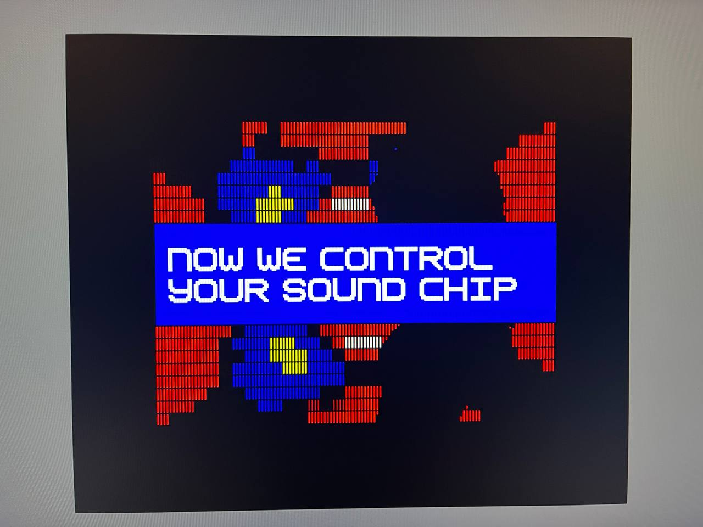
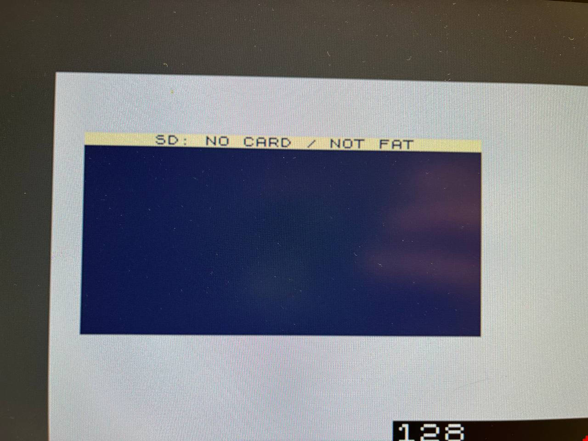
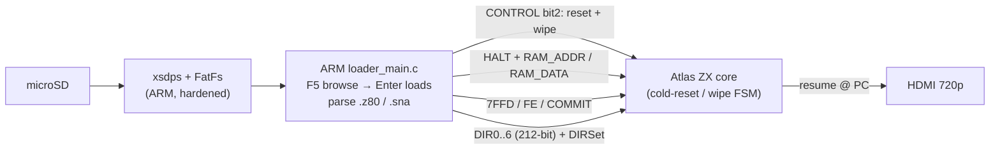

# Шаг 12 — Загрузка снэпшота: `.z80` / `.sna` через плоскость управления

Languages: [English](README.md) · **Русский**



*Снэпшот, выбранный в браузере F5 и вставленный в систему: компьютер проходит холодный сброс, ОЗУ и регистры записываются через «заднюю дверь» AXI, а ядро возобновляет работу с точки выполнения (PC) снэпшота.*

В шаге 11 мы рассмотрели браузер — подключить карту, пройти по ней, прочитать её. Но остановились на один шаг до того, для чего и нужен загрузчик: фактического запуска файла, на который ты попал. Этот шаг и является тем самым связующим звеном. Нажми **Enter** на файле `.z80` или `.sna`, и ARM проанализирует его, выполняет «холодный» сброс и очищает систему, передаёт образ ОЗУ в память ядра через «заднюю дверь» Step-7 AXI, вставляет весь набор регистров Z80 прямо в T80 и запускает его с адреса PC снэпшота. Теперь браузер — настоящий загрузчик.

Две вещи сделали этот процесс чем-то большим, чем просто «записал байты и готово»: при каждой загрузке сначала выполняется полный аппаратный сброс и очистка, чтобы ничего не просочилось из предыдущей программы, а также путь к SD-карте упрочнён для платы, у которой в слоте microSD нет линии обнаружения карты.

## Что он загружает

`.z80` (v1/v2/v3, 48K и 128K) и `.sna` (48K и 128K). Обнаружение и разбор на уровне байтов настолько сложны, что им посвящён отдельный документ: **[`docs/LOADER_SPEC.md`](../../docs/LOADER_SPEC.md)** — это исчерпывающее руководство: там описаны все поля заголовков обоих форматов, схема RLE, полная таблица аппаратных режимов, сопоставление страниц и банков, фишка со стеком в `.sna`, а также точно объяснено, что делает BulbuLator и что допускает сам формат. Вкратце:

- **`.z80`** — версия определяется словом PC со смещением 6: значение, отличное от нуля, означает файл v1 (48K), у которого память
  сразу за 30-байтовым заголовком; ноль означает файл версии v2/v3, у которого реальный PC находится по смещению 32, а
  длина расширенного заголовка (23/54/55) позволяет отличить v2 от v3. Различие между 48K и 128K определяется аппаратным байтом со смещением 34, который считывается
  **в зависимости от версии** — `(extlen==23) ? (hw≥3) : (hw≥4)` — потому что значение кодов 3–6 меняется
  между версиями v2 и v3. Память представляет собой последовательность блоков по страницам, каждый из которых сжат с помощью RLE в виде последовательностей `ED ED count value`
  (или в исходном виде, если слово длины равно `0xFFFF`).
- **`.sna`** — фиксированный размер — это ключ к разгадке: 49179 → 48K, 131103/147487 → 128K. В варианте на 48K нет поля PC;
его восстанавливают, снимая с сохраненного стека (а SP сдвигают назад на две позиции). В варианте на 128K
явно сохраняют PC и байт страничной адресации `0x7FFD` в четырёхбайтовом трейлере, а затем — остальные банки ОЗУ.

Каждая страница размером 16 КиБ записывается в нужный из восьми физических банков ОЗУ процессора. Сопоставление «страница→банк» **различается для версий 48K и 128K** — это и есть тонкость, и в спецификации это четко указано с предупреждением о разрешении коллизий.

## Сброс перед каждой загрузкой

Снэпшотовое состояние — это состояние всей машины, и самый чистый способ его применить — на пустую машину. Поэтому сброс выполняется *первым*, до записи в ОЗУ. ARM генерирует импульс нового управляющего бита — бита 2 `CONTROL` — который переходит в тактовую область Spectrum и запускает **тот же автомат холодного сброса + очистки ОЗУ, что и при аппаратном сбросе F11**: он обнуляет все 128 КиБ и сбрасывает Z80, AY, ULA и защелку страничной памяти. Только после этого ARM подаёт сигнал HALT и ждёт `HALT_ACK`, чтобы получить доступ к шине памяти.

Без этого предыдущая программа просачивается в новую загрузку — устаревшие байты в страницах, которые снэпшот не записывает, и, что слышно сильнее всего, AY-3-8912, который продолжает играть ту ноту, которую ему передали в последний раз, так что новая загрузка может начаться с непрерывного визга. Сброс даёт каждой загрузке чистый лист. (Артефакт «старая демо-версия просачивается в новую» и перенесённый визг AY — всё это произошло из-за пропуска этого шага.)

Одна тонкость, которую заметили в обзоре CDC: ARM ждёт, пока статус «reset-busy» пройдёт по последовательности **0 → 1 → 0**, и никогда не рассматривает начальное 0 как «готово» — очистка не должна опережать запись. В старых битстримах, где этого бита нет, это приводит к небольшой задержке плюс HALT, без очистки.

## Запись регистров

После установки ОЗУ загрузчик устанавливает защелку страничной организации (`0x7FFD`) и бордюр, фиксирует их, а затем **записывает весь регистровый файл Z80 за один раз**. Ядро T80 имеет механизм «DIRSet»: 212-битный вектор состояния регистров, записываемый в `DIR0..DIR6` и фиксируемый импульсом COMMIT, благодаря чему PC, SP, AF, основной и теневой наборы регистров, IX/IY, I, R, режим прерываний и оба триггера прерываний — все это записывается атомарно. Отключение HALT означает возобновление работы — ядро продолжает работу с введенного PC. (Точная упаковка вектора слово за словом приведена в спецификации, §6.)

## Укрепление пути SD



*У EBAZ нет линии обнаружения карты, поэтому загрузчик построен так, чтобы никогда не полагаться на карту: извлечённая карта выдает статус, а не приводит к зависанию.*

EBAZ4205 не пропускает сигнал обнаружения карты microSD, поэтому загрузчик не может просто так спросить: «Карта есть?». Загрузчик, застрявший из-за исчезнувшей карты, заблокировал бы весь неблокирующий цикл OSD. Поэтому тракт SD построен так, чтобы никогда не доверять карте:

- **Один сбой — и отключение.** Любая ошибка FatFs размонтирует том, а цикл продолжится; следующее нажатие F5
  снова монтирует его. Карта, вытащенная во время чтения, ничто не заблокирует.
- **EJECT** (в меню F9) корректно размонтирует карту, так что ты можешь вытащить её, не рискуя повредить файловую систему.
- **Приоритет отображения.** Статусы «MOUNT» / «READ» отображаются мгновенно, потому что монтирование на нестабильной или отсутствующей карте
  может занять около секунды, а тебе хочется увидеть *что-нибудь*.
- **Сокращённые таймауты `xsdps`.** Стандартный драйвер бесконечно крутится при абсурдно длинных таймаутах (десятки секунд)
  на неисправной карте, что на «голом» цикле приводит к зависанию; теперь они сокращены примерно до секунды, так что неисправная карта
  быстро выдает ошибку, а не зависает.
- **Принудительная переинициализация.** Убрано раннее возвращение уровня diskio с сообщением «уже инициализировано, пропустить», так что
  карта, подключённая в режиме «горячей замены», действительно монтируется заново, а не тихо использует неработающую.

Если ничего не монтируется, ты получишь простое сообщение `SD: NO CARD / NOT FAT`, а не зависание.

Эти изменения в `xsdps` / FatFs — это патчи со стороны BSP, встроенные в готовый файл `arm/loader.elf`; добавление исправленного стека в репозиторий для сборки с чистым клоном по-прежнему осуществляется на этапе SD-file-service (см. примечание по сборке).

## Версия на экране


*Тег сборки находится в строке заголовка справки F1, выровненный по правому краю, а слева — `HELP` — такая же схема оформления строки заголовка, как в браузере и окнах настроек.*

Заставка F12 и справка F1 теперь показывают тег прошивки и текущую версию ядра из **одного источника**: небольшая вспомогательная функция `version_str()` считывает регистр PL `VERSION` и форматирует значение в виде `v0.12 core 0xB01B0009`, а оба экрана используют это значение, поэтому их значения не могут расходиться. В справке F1 информация о сборке располагается в строке заголовка, выровненная по правому краю, а `HELP` — слева, как и в других окнах OSD.

## Регистры плоскости управления

Единственное изменение в фабрике по сравнению с шагом 11 — это тракт AXI-RESET, а версия обновляется до `0xB01B0009`:

| Адрес | Название | Ч/З | Значение |
|---|---|---|---|
| `0x00` | `VERSION` | Ч | `0xB01B0009` |
| `0x04` | `CONTROL` | З | бит 0 = HALT (шаг 7); **бит 2 = RESET+wipe** — новое; запускает автомат состояний холодного сброса/очистки |
| `0x08` | `STATUS` | Ч | бит 0 = HALT_ACK, бит 1 = RAM_BUSY (шаг 7); **бит 2 = reset_busy** — ново; очистка/сброс в процессе |

Всё остальное остаётся без изменений по сравнению с шагами 7/10/11: `RAM_ADDR` / `RAM_DATA`, вектор ввода `DIR0..DIR6`, `PORT_7FFD` / `PORT_FE`, `COMMIT`, FIFO сканирующих кодов и «дедмен», регистры OSD и `MACHINE_ID`.

## Как всё это устроено



## Сборка, запись в ПЗУ, запуск

Те же три этапа, что и в предыдущих шагах.

**Скомпилируй битстрим.** Один раз запусти `../../get_deps.sh`, затем `./build.sh` → получится файл `bulbulator_zx_loader.bit`. Дельта RTL на этом этапе — это только тракт AXI-RESET: `sources/axi_ctl.v` (бит 2 сигналов `CONTROL` / `STATUS`), `sources/inject_cdc.v` (передаёт запрос на сброс и флаг занятости между тактовыми доменами), `sources/bulbulator_zx_ddr_top.v` (соединяет запрос с FSM очистки F11 с помощью оператора OR) и `sources/bulbulator_ddr.xdc` (ложные пути CDC). `sources/assemble.sh` подтягивает неизменённую цепочку отображения из шага 11 и OSD, цепочку DDR из шага 8 и связующие элементы из шага 6, а `sources/build.tcl` записывает битстрим.

**Запиши в флешку через JTAG и запусти.** `./loader_run.sh` настраивает битстрим по PCAP (это тот самый «бронированный поезд», как в шагах 6–11), а потом загружает и запускает `arm/loader.elf` на Cortex-A9 № 0. Spectrum запускается через HDMI; F5 — просмотр, Enter — загрузка, F1/F9/F12 работают сразу.

**Загрузка с SD-карты (без хоста, без JTAG).** Скопируй `flash/BOOT.BIN` в раздел `boot` файловой системы FAT на карте, переключи плату на загрузку с SD (ремешок R2577 — шаг 0) и включи питание. `flash/build_boot.sh` пересобирает этот образ без использования виртуальной машины (см. заголовок скрипта для обходного решения bootgen-on-modern-glibc).

**Приложение для ARM — то же предупреждение, что и в шаге 11.** Загрузчик — это браузерное приложение из шага 11, дополненное загрузчиком снэпшотов, последовательностью сброса при загрузке и защитой SD-карты — всё это на стороне ARM, в файле `arm/loader_main.c`. Оно по-прежнему собирается под Vitis BSP (исправленные объекты `xsdps` + FatFs подключаются напрямую, так как неработающий `platform-generate` не архивирует их в `libxil.a`), поэтому чистой сборки *приложения* с помощью `gcc` пока нет — для этого нужно, чтобы исправленный стек SD был добавлен в репозиторий в качестве внешнего модуля, что и является шагом «SD-file-service». На этом этапе поставляются **исходный код** приложения (`arm/loader_main.c`), его **скрипт сборки** и **готовый файл `arm/loader.elf`**; битстрим и `BOOT.BIN` собираются и запускаются из чистого клона, как описано выше.

## Файлы

```
docs/LOADER_SPEC.md  (repo root)   exhaustive .z80 / .sna format + loader reference (EN; .ru.md alongside)
sources/axi_ctl.v                  control plane + CONTROL bit2 / STATUS bit2 reset path (VERSION 0xB01B0009)
sources/inject_cdc.v               aclk↔spclk CDC, now also crosses the reset request + busy back (CHANGED vs Step 8)
sources/bulbulator_zx_ddr_top.v    full top: the Step 11 design with the reset request OR'd into the F11 wipe FSM
sources/bulbulator_ddr.xdc         constraints + the AXI-RESET CDC false-paths
sources/assemble.sh + build.tcl    gather the delta + the unchanged Step 6/8/11 sources into build/, then synth
arm/loader_main.c                  the ARM app: F5 browser + F9 options + .z80/.sna loader + reset-on-load + SD hardening
arm/build_loader.sh                builds loader.elf against the Vitis BSP (see the honest note above)
arm/loader.elf                     prebuilt ARM app (firmware tag v0.12)
build.sh                           build the bitstream
loader_run.sh                      PCAP-flash the bit + load/run the loader app over JTAG
flash/BOOT.BIN                     ready SD image (FSBL + this step's bitstream + the loader app)
flash/build_boot.sh + bif + fsbl.bin + loader.bin   rebuild BOOT.BIN yourself
flash/pcap_load.tcl + ps7_init_fclk.tcl              PCAP loader + PS7/FCLK/level-shifter init (reused since Step 8)
bulbulator_zx_loader.bit           prebuilt bitstream — flash over JTAG
```

Цепочка отображения шага 11 (`fb_line_disp.v`, `fb_capture_rr.v`, `fb_wr_axi.v`, `osd_compositor.v`) и цепочка DDR из шага 8 **не** поставляются заново — скрипт `assemble.sh` загружает их из предыдущих шагов. Чистая дельта: в этой папке только то, что действительно изменилось на этапе 12.

## Что ещё не сделано

- **Состояние AY / TurboSound не восстанавливается.** При сбросе AY обнуляется, а загрузчик заново инициализирует ОЗУ и
  CPU, но не регистры AY, поэтому 128K-снэпшот, на котором играла музыка, запускается без звука, пока
  программа не инициализирует AY заново (большинство программ это делают при каждом прерывании). Заголовок `.z80` содержит дамп AY; подключение
  его обратно — небольшая последующая задача. (Спецификация, §8.4.)
- **Только стандартные карты банков 48K и 128K.** Scorpion 256K (16 страниц), порт страничной организации диска +3/+2A
  (`0x1FFD`) и Timex не рассматриваются отдельно — они подпадают под карту 128K. Pentagon-128 работает, потому что его
  страничная организация памяти соответствует стандартной 128K. (Спецификация §8.5.)
- **Нет возобновления с точностью до цикла.** PC вводится, а ядро освобождается; выравнивания по T-состоянию нет. Для
  подавляющего большинства контента это незаметно, но эффект с точностью до растра, зависящий от
  положение в субкадре на момент сохранения, может отличаться в первом кадре.
- **Клавиатура по-прежнему время от времени пропускает нажатия клавиш** — из-за общего PS/2-приёмника, как и в шаге 11.
- **Ядро 48K-classic с точным флагом и синхронизацией** — это запланированный вариант (для наборов тестов инструкций и синхронизации,
  а позже — для реальных периферийных устройств ZX-bus). Atlas T80 (Sorgelig v350) уже проходит ZEXALL,
  за исключением случая с флагами X/Y в SCF/CCF, а ядро уже поддерживает входную «модель» 48K, так что это скорее будущий
  шаг, чем полная переработка.

Ядро ZX — это ядро [Atlas `zx`](https://github.com/AtlasFPGA/zx) (с Sorgelig T80); стек SD — это [FatFs](http://elm-chan.org/fsw/ff/) от ChaN на `xsdps` от Xilinx; загрузчик, сброс при загрузке и инфраструктура DDR / OSD / клавиатуры построены на основе шагов 7–11. Полная спецификация формата и загрузчика находится в файле [`docs/LOADER_SPEC.md`](../../docs/LOADER_SPEC.md).
