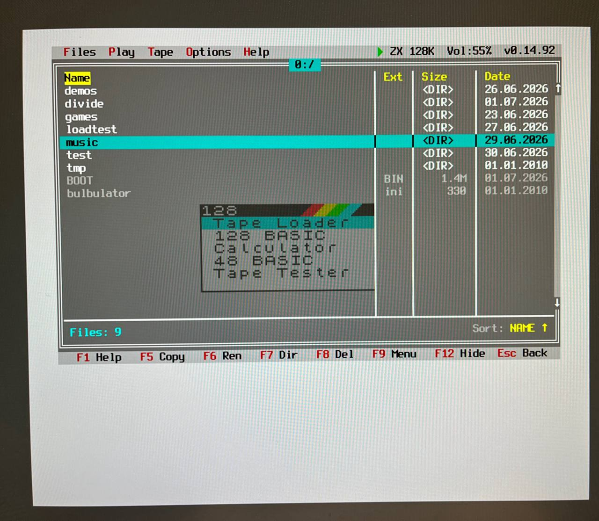
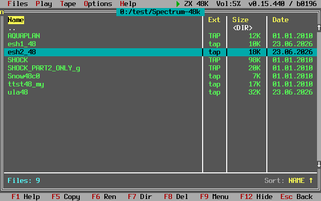
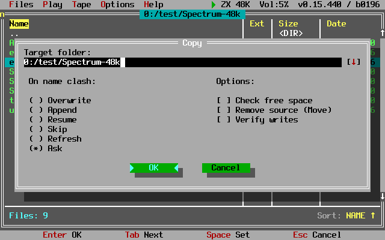
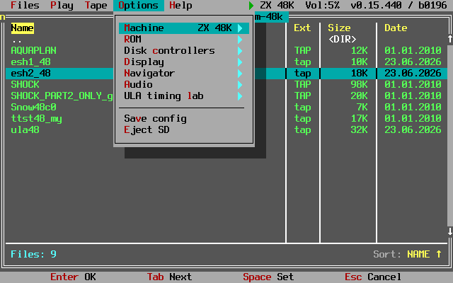
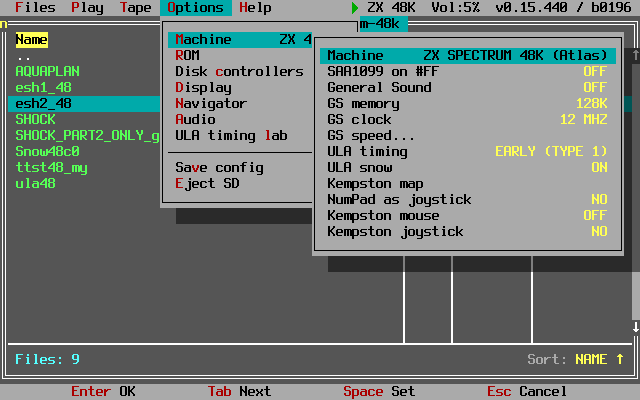
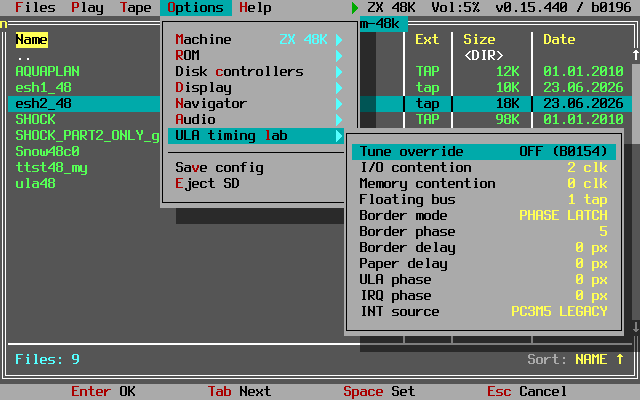
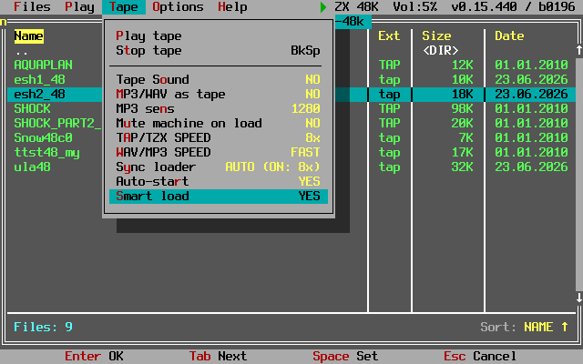
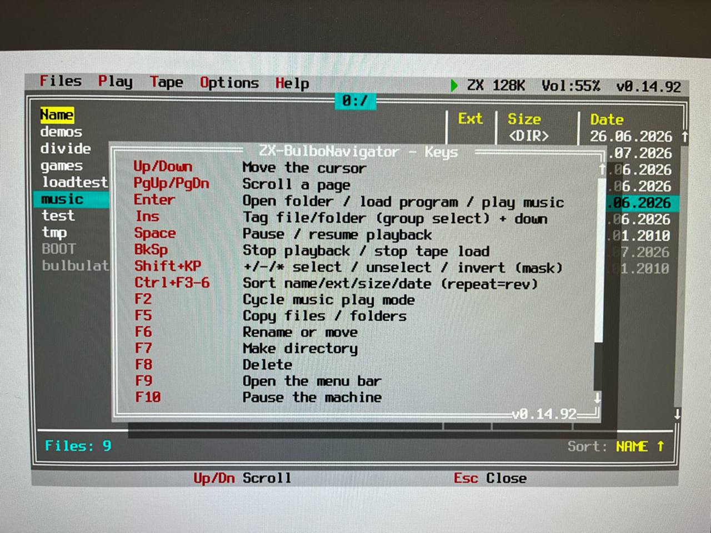

# Step 15 — the Spectrum machine family, measured against the real thing

Languages: **English** · [Русский](README.ru.md)

Production state: core **B0196**, firmware **v0.15.444**. Everything below was checked on real hardware.



*The ZX-BulboNavigator over a running ZX Spectrum 128K core. A true-colour 80×25 text OSD, drawn entirely by the idle ARM core, hosts a DOS Navigator-style file manager, a universal tape station, and a music player. The Spectrum's own 128 menu is visible behind the overlay — the core keeps running; the OSD does not halt it.*

Step 15 is the move from "one machine works" to "there are several machines, and each behaves like the
real one". A single core carries three Spectrums — **48K, 128K and Pentagon 1024** — with MiSTer-48 and
NES/Dendy as separate cores. The shell above them is machine-agnostic: the browser, the tape station and
the player know nothing about the Spectrum and talk to the machine over a stable AXI contract.

What sets this step apart is that **acceptance is by numbers, not by impression**. Nearly every item
below is closed by a measurement: a timing test suite, a byte-for-byte comparison against a reference, a
counter in a register, or a simulator run. Where the references disagree with each other, the decision
becomes a switch in the machine settings rather than a choice made on the owner's behalf.

## What it looks like

Every shot below comes from the live board: the shell canvas is read straight out of memory over JTAG,
so this is exactly what is on screen — no photographs of a monitor.



*The file manager over a running machine. The menu bar and status line at the top carry the machine,
the volume and the core version; the key hints sit at the bottom. The Spectrum underneath keeps
executing.*



*The copy dialog: six ways to resolve a name clash, a free-space check, move mode and write
verification. Every window saves its background on a stack — without that, artefacts stay behind it,
which is what three separate complaints turned out to share as a single cause.*



*Settings are described by data rather than code, and grouped: machine, ROM, disk controllers, display,
navigator, audio, and the ULA timing lab.*



*Machine settings. Anything the references disagree about becomes a switch: the SAA1099 gate on port
`#FF`, the General Sound card's memory and clock, the ULA timing phase, snow, the Kempston interface.
Each option explains when you would touch it — an option without that is worse than no option.*



*The ULA timing lab: eleven knobs right in the menu — the memory and I/O contention windows, floating
bus, border mode, phase and delay, paper delay, ULA and IRQ phase, interrupt source. These are what the
numbers were found with before being fixed in the core.*



*The tape station: the three loading mechanisms are separated and exposed as individual switches —
smart load, warp and the sync loader — plus MP3 and WAV treated as tape.*

## What was done

### The machines and their accuracy

- **Timing Tests 48K pass in full**, port tests 35/36/37 included: "All Tests Complete 100% Pass".
- **Timing Tests 128K — all 34 tests.** The suite ends at 34: line 1350 holds a `STOP`, and the
  "choose test 1-35" prompt is inherited from the 48K version and lies.
- **The interrupt position differs per machine** — 4 on the 48K, 6 on the 128K. A fix measured on the
  48K instrument travelled with the shared core and broke test 4 on the 128K.
- **Contention matches the real machine:** the memory table is the canonical `6,5,4,3,2,1,0,0` anchored
  at 14336, the port contention window is back at zero, and the older phase survives as a switch.
- **A border write lands after contention, not before** — that is what the real machine does, and it
  removes an 8×1 pixel dash left of the paper on the first line that a live 48K does not have.
- **The CPU now matches a real Z80:** the Q flag and the flags of an interrupted block instruction. On
  hardware: `z80full` 152/152, `z80ccf` 152/152, `z80full 1.2a` 160/160, `z80memptr` all passed.
- **Pentagon 1024** has real megabyte paging: banks 0..7 in fabric memory, 8..63 in DDR. RAM size is a
  machine option — 128, 256, 512 or 1024 KB.
- **Stock Pentagon ROM sets work:** the ROM page is addressed by a pair of signals, so factory sets
  reach their own file manager. The magic button inserts the service page on NMI and drops it on `RETN`,
  the way a Multiface does.

### The frame

- **Native capture geometry:** 384 real pixels, borders 64 and 64, by one formula on both 48K and 128K.
  Capture used to take 336 pixels and pad the line by **replicating the edge pixel** 24 times per side.
- **The right edge of the paper matches the reference pixel for pixel.**
- **Pentagon's fine border:** a 2-pixel edge step instead of 8. Two references disagree (2 and 1), but
  what you can observe is the same: the colour is changed by `OUT (#FE),A`, and that only lands on a CPU
  clock boundary.
- **The top edge of the frame is closed.** Two earlier fixes each removed exactly half the artefact
  because they treated the symptom. The cause was one clock cycle at the frame swap: the line-address
  snapshot was computed from the old frame base but tagged with the new epoch. The tag was honest; the
  address lied.

### Storage

- **TR-DOS / Beta Disk:** reading and **writing**, `FORMAT` included. Six defects closed; the seventh
  turned out to be a rotten ROM dump rather than our code. The drive is faster: 200 → 10 ms per
  revolution, 32 → 4.6 µs per byte.
- **NEMO-IDE:** the machine reads `.hdf` **byte for byte**.
- **DivMMC / esxDOS:** images and folder mode; `.mkdir` went from 35 s to 2-3 s.
- **Z-Controller:** five programs accepted, with working software collected on the card.
- Disk images can be browsed from the navigator: catalogue view, blank disk creation, card info.

### Sound

Six sources: beeper, AY/YM, TurboSound, SAA1099, SpecDrum and **General Sound, which plays music**. The
SAA1099 turned out to be a **stub in the bitstream** — two files declared the same module name and the
one read later won. The chip also got exactly 8 MHz instead of 8.0952.

### Tape

`.tap`, `.tzx`, `.wav`, `.mp3`; instant loading through a ROM trap, warp up to 8× with automatic
engagement, pilot-tone detection inside MP3 and WAV. **Permission to play the tape is now separate from
permission to accelerate the CPU** — while they were one signal, part two of the SHOCK demo measured the
wrong frame length between blocks and took the wrong branch.

### The shell

An ARGB8888 canvas, 640×400 as 80×25 cells, CP866 font. A DOS Navigator-style file manager, a tape
station, a player (PSG, WAV, MP3 through one resampler to 47996 Hz) and data-driven settings. A window
framework where **every window saves its background on a stack** — three separate complaints turned out
to be one cause. Crop and pan are now separate: crop trims its own edge, pan moves the output window.

### Instruments

The work that made the rest possible: an honest single-frame grab over JTAG, a per-source audio peak
meter, line-reader counters, a host-side remote for the board, simulator benches and an independent
oracle. Plus a rule paid for twice: **an instrument that changes the behaviour of what it measures must
be switchable off** — the sound card's diagnostic trace was itself breaking the music.

## What is in this directory

| Directory | Contents |
|---|---|
| [`bitstreams/`](bitstreams/) | **prebuilt cores and the boot image** — nothing to build, the files go on the card |
| [`roms/`](roms/) | the **ROM sets** the machine was tested against, and [where each file came from](roms/PROVENANCE.md): author, origin, and what we changed |
| [`docs/`](docs/) | write-ups (Russian): the shell, every machine fix with its evidence, what the emulation can do, the SD card layout, and the tracker audit |
| `sources/` | RTL: machine cores, control plane, video path, devices |
| `arm/` | the shell firmware |
| `tools/` | instruments: frame grab, screen decode, host-side remote, card upload |
| `sim/` | simulator benches and Z80 measurement programs |
| `flash/` | boot image assembly and JTAG upload |

The per-build log with the reasoning behind each change is [`BUILD_HISTORY.md`](BUILD_HISTORY.md);
current state and instrument rules live in [`HANDOVER_CURRENT.md`](HANDOVER_CURRENT.md).

## Running it

Put the files from [`bitstreams/`](bitstreams/) and a ROM set from [`roms/`](roms/) on the card. Where
exactly is in [`docs/SDCARD.ru.md`](docs/SDCARD.ru.md), together with the main trap: **when you update
the ZX core you must replace both files** — `0:/CORES/ATLAS.BIT.BIN` and `0:/BOOT.BIN` — because all
three Spectrums share one core name and a cold start brings the bitstream up from the boot image.

## Still open

- **Pentagon** timing acceptance has not been run; it is the only machine without a completed suite.
- 128K demos have not been run.
- The **MiSTer-48** core on the card has fallen behind the shared top module.
- Pentagon's port `#FF`: we return `0xFF`, one live reference returns the attribute. The clones disagree
  among themselves, so this belongs in machine options rather than being decided for the owner.
- Networking is not blocked by firmware: **this board's Ethernet hangs off FPGA pins**, so it needs a
  bitstream that routes the controller out to the PHY.

The full breakdown is in the tracker audit, `docs/ISSUES_AUDIT.ru.md`.

---

## The true-colour OSD canvas

The old 1-bpp panel is replaced by an **ARGB8888 canvas, 640×400 pixels, arranged as 80×25 character cells** with an 8×16 VGA font. The font is CP866 (Terminus, OFL): ASCII, the full DOS box-drawing set, and Cyrillic, so the navigator can draw authentic double-line frames and Russian text.

- The canvas lives in a **1 MB-aligned, non-cacheable DDR window** at `0x0F800000` (inside the `NC_BASE` region reserved by `lscript.ld`). Because the window is marked non-cacheable at boot, ARM writes are coherent with the fabric with no per-frame cache flush.
- A new fabric reader, **`osd_ddr_rd`**, streams the canvas over **AXI-HP1** and hands pixels to **`osd_compositor`**, which alpha-blends them over the live HDMI scanout per pixel. Window shadows are translucent (`0x80` alpha), dialog bodies are opaque, and the whole layer's dim/opacity and position are adjustable from the Options menu.
- **`OSD_CTRL` bit 1** enables the colour layer; **F8** toggles it and **F12** shows/hides the navigator.
- The golden rule of the whole OSD: **incremental redraw only.** A full-screen repaint flickers, so only the rows that change are redrawn (`dn_draw_file_row`); a full render happens only when a modal dialog closes.

## The BulboNavigator file browser

The browser follows DOS Navigator closely. Columns are **Name / Ext / Size / Date**; the header highlights the active sort field and shows an up/down direction arrow. A Turbo Vision-style scrollbar (arrows + proportional thumb) rides the right frame column. Folders can be styled with brackets, an icon, or a trailing slash, and the cursor row marquees any name too long to fit.

- **Sort** (DOS Navigator hotkeys): `Ctrl+F3` name, `Ctrl+F4` extension, `Ctrl+F5` size, `Ctrl+F6` date. Pressing the same field again reverses the order. A `Files → Sort` dialog offers the same field + a Descending checkbox.
- **Navigation**: arrows, `PgUp`/`PgDn`, `Home`/`End` (jump to the first/last entry), the `..` row goes up. `Enter` opens a folder or launches a file, dispatched by extension — a `.z80`/`.sna` snapshot (the Step 12 loader), a `.tap`/`.tzx`/`.wav`/`.mp3` tape, or a `.psg`/`.mp3`/`.wav` tune.
- **Group tagging**: `Insert` tags an entry (yellow) and steps the cursor down. `Space` is reserved for player pause, so it no longer tags.
- **Group selection by mask** (DOS Navigator's Gray `+`/`-`/`*`, here on `Shift`+numpad so the bare numpad keys stay free for volume): `Shift+KP +` tags every match of a mask, `Shift+KP -` untags, `Shift+KP *` inverts the selection. The mask engine is a practical DN subset — `*` and `?`, case-insensitive, comma/semicolon lists (`*.tap,*.tzx`), a leading `-` to negate (`*.* -*.tmp`), and `*.*` also matches extensionless names.

Keys are dependable now: the main loop and every dialog read through one shared key-state table, and the PS/2 line has a watchdog that resyncs on a mid-byte timeout. The old "fuzzy keys, a hotkey needs three tries" behaviour is gone.

## File operations and the Copy/Move dialog

The panel does real work on the SD card (FatFs, long file names up to 255 characters, D-cache on):

- **`F5` Copy**, **`F6` Rename/Move** (Total Commander style — the field is pre-filled with the selected entry's full path; edit the name to rename, edit the folder to move), **`F7` MkDir** (creates a whole chain of directories), **`F8` / `Delete`** (recursive, with a double confirmation for a non-empty folder).
- The full DOS Navigator **Copy/Move dialog** (78×15) replaces the old one-line prompt: a target-path field, a conflict-resolution radio group with six modes (**Overwrite / Append / Resume / Skip / Refresh / Ask**), and option checkboxes (check free space, remove source = turn Copy into Move, verify writes). One linear Tab ring, `Space` sets a radio or toggles a checkbox, `Enter` = OK, `Esc` = Cancel. `Ask` opens a per-file sub-dialog.
- Both `F5` and `F6` feed a shared `cp`-style path resolver: `0:/dir/file` is absolute, `/dir` is relative to the drive root, a bare name lands in the current folder; a trailing `/`, an existing directory, or a multi-file group means "directory, keep the source names", otherwise the last component is a new name.

Every dialog obeys the DOS Navigator look 1:1 — grey body, white double frame, black input fields, green buttons, red hotkey letters, and a fully opaque cursor (no game screen bleeding through a modal, and nothing from the panel underneath — like a scrolling long name — leaks through either). Input fields use a standard US keyboard layout, so you can type paths, names, and masks straight in (`Shift`+`8` gives `*`, and so on).

## The menu bar and the options system

Pressing `F9` (or clicking the green title) drops the DOS Navigator **menu bar**: **Files · Play · Tape · Options · Help**. Left/Right move between the top menus; `Enter`/Right opens a dropdown; Options has a nested **Settings** submenu. Live "value items" (a setting with its value shown inline) sit right in the menus, and the interaction is deliberate:

- **Left/Right adjust a numeric (range) parameter in place** — volume, OSD dim, window position, MP3 sensitivity — with a fine step, and never leave the menu.
- **A choice (NO/YES, play mode, …) is cycled only by `Space` or `Enter`**; Left/Right on a choice move between the top menus instead, so you can always navigate away.
- **MP3 sens** is a wide range (0–4096), so instead of clicking through it, `Space`/`Enter` opens a dedicated **numeric-entry dialog with an inline explanation** of what the parameter does.

All settings persist to **`0:/bulbulator.ini`**, written on `Options → Save`. Among them: scroll speed/delay, folder style, show-hidden, play mode, pause-on-music, on-launch behaviour, boot-navigator, volume, OSD dim, and window X/Y.

## The tape station — a machine-agnostic PULSE loader

Step 14 adds a real cassette station. It loads **`.tap` / `.tzx`** (standard ROM blocks and turbo/custom loaders), and also **digitised cassette recordings as `.wav` and `.mp3`** — the part that took the most work to get right.

The design is the machine-agnostic **PULSE class** of the loader contract. The ARM owns all format knowledge and pushes a stream of `{level, duration-in-T-states}` pulses into an async FIFO; the fabric module **`tape_player.v`** replays them, clocked by the CPU's own T-state enable (`pe3M5_core`). Tape and CPU therefore advance in **exact lock-step** — a pause (HALT) freezes both, so a ROM, turbo, or custom loader's timing loops measure the pulses exactly as they would from a real tape. The fabric just times edges; it has no idea what a "pilot" is.

- **The reader is a faithful model of the physical tape head**, not an equaliser: an AC-coupling capacitor (a gentle high-pass that strips any DC bias but keeps every fast edge), a Schmitt comparator with hysteresis, and sub-sample zero-cross interpolation for turbo timing. This is what lets a phone's MP3 of a cassette load at all.
- **Pilot auto-detect** decides cassette-vs-music by scanning the start for a pilot tone. **`MP3/WAV as tape`** forces the tape path for turbo or clipped-pilot dumps the detector would miss.
- On an MP3 load the station first **primes out the decoder's warm-up frame and settles the reader's DC** before the first pulse, so the pilot starts clean (no start-of-pilot click).
- **`Tape Sound`** toggles the loading-tone monitor. **`Mute machine on load`** is a separate option that silences the *machine's own* audio during a load (the ZX ULA reproduces the ear signal on its beeper; authentic behaviour, but you can now switch it off) by routing the audio mux to the player. **`MP3 sens`** tunes the edge-detector hysteresis.
- A **`T`** marker appears in the status row (where the music play-mode glyph sits) as soon as the audio is recognised as a cassette.
- A quick stop (`Backspace`) **drains the pulse FIFO**, so an immediate restart always begins at the start of the file, never on a leftover pulse.

## The music player

The player from Step 13 is folded in and extended. It plays **`.psg`** (AYUMI soft-synthesised AY-3-8910), **`.mp3`** (minimp3), and **`.wav`** (PCM), resampling to the 47996 Hz HDMI audio rate (speexdsp), and streams PCM to the audio FIFO through the player mux (`AUDIO_CTRL`).

- A **non-blocking ring buffer** keeps music playing straight through long file copies and deletes.
- **Play modes** (`F2`, or `Play → Mode`): FOLDER, FILE, FOLDER LOOP, FILE LOOP, RANDOM.
- **Non-blocking pause/resume** is bit-exact (AY registers, envelope, and noise LFSR survive the freeze — no click). A **launch-suspend** releases the mux back to the machine while keeping the track position.
- **MP3 preload** (in the Play menu) loads the whole file into DDR so playback survives SD card garbage-collection stalls.
- **Volume** is live on the numpad `+`/`-` (and in the Options menu): a 0..255 gain on the HDMI output, shown as `Vol:NN%` in the top bar.
- A **status line** (row 22) shows the playing track with a play/pause glyph and the current play-mode; the top bar always carries the machine type and a green/red run/pause indicator.

## Machine control and audio coordination

- **Pause** (`F10` / PS/2 Pause) freezes the Spectrum without taking over the screen. A halt bitmask (manual pause / music-halt / SD-op freeze) owns the machine's clock and is cleared only manually.
- **Pause on music** halts the machine while music plays; **On launch (music)** chooses MACHINE (suspend the music, machine is audible) or MUSIC (keep the music, machine muted) when a program is launched over playing music; **Boot nav** chooses whether the navigator appears at power-on or the machine boots straight through (with `F12` to enter later).
- A large, transparent **PAUSE** sign (a bar symbol and the word at the same height, top-right, on a transparent background with no rectangle behind it) shows whenever the machine is frozen, on its own banner overlay.
- **`F11`** is a hard reset of the machine; the video path is decoupled from the core reset.

## In the OSD



*Press F1 for the built-in hotkey reference.*

| Key | Action |
|---|---|
| `↑ ↓ ← →`, `PgUp`/`PgDn` | Move in the list / adjust a numeric setting in a menu |
| `Home` / `End` | Jump to the first / last entry |
| `Enter` | Open a folder, run a file, or confirm a dialog |
| `Space` | Pause/resume the player (freeze/thaw a tape load); cycle a value in a menu |
| `Insert` | Tag an entry (and step down) |
| `Shift`+numpad `+` / `-` / `*` | Select / unselect by mask / invert selection |
| `Backspace` | Stop the player / tape |
| `F1` | Help (scrollable hotkey list) |
| `F2` | Play-mode dialog |
| `Ctrl`+`F3…F6` | Sort by name / ext / size / date (repeat reverses) |
| `F5` | Copy |
| `F6` | Rename / Move |
| `F7` | Make directory |
| `F8` / `Delete` | Delete (recursive) |
| `F9` | Menu bar |
| `F10` / Pause | Pause the machine |
| `F11` | Hard reset the machine |
| `F12` | Show / hide the navigator |
| `Esc` | Back / close a dialog |
| numpad `+` / `-` | Volume |

## The control-plane registers

The AXI control plane grows the true-colour OSD and tape-station registers; the fabric version bumps to **`0xB01B0017`**:

| Addr | Name | R/W | Meaning |
|---|---|---|---|
| `0x00` | `VERSION` | R | `0xB01B0017` |
| `0x04` | `IJ_CTRL` | W | bit 0 = HALT (freeze the machine's clock) |
| `0x08` | `IJ_STAT` | R | bit 0 = HALT_ACK, bit 1 = RAM_BUSY |
| `0x48` | `OSD_CTRL` | W | bit 0 = 1-bpp OSD enable, bit 1 = colour DDR OSD enable |
| `0x54` | `KBD_DATA` | R | `{break[9], empty[8], code[7:0]}`; read pops the PS/2 FIFO |
| `0x5C` | `KBD_HB` | W | deadman heartbeat (any write); the gate re-routes keys to the Z80 if the ARM stops kicking |
| `0x60` | `MACHINE_ID` | R | loaded-core identity |
| `0x6C` / `0x70` | `OSD_OP` / `OSD_POS` | W | 1-bpp OSD opacity / position |
| `0x74` | `VOL` | W | HDMI output volume gain 0..255 |
| `0x78` | `AUDIO_CTRL` | W | bit 0 = 1 mux the ARM player PCM to HDMI, 0 = fabric/machine audio |
| `0x7C` / `0x80` | `AUDIO_FIFO` / `AUDIO_STAT` | W/R | push a `{R,L}` PCM sample / empty+full flags |
| `0x84`–`0x90` | `BANNER_*` | W | independent status/PAUSE banner overlay (enable / addr / data / pos) |
| `0x94` | `OSD_DDR_BASE` | W | DDR byte address of the ARGB8888 colour canvas |
| `0x98` | `DDR_OSD_POS` | W | colour-OSD canvas position (independent of `OSD_POS`) |
| `0x9C` | `TAPE_CTRL` | W | bit 0 run, bit 1 ear_mux, bit 2 mute |
| `0xA0` | `TAPE_FIFO` | W | push `{level[31], duration[23:0] in T-states}` |
| `0xA4` | `TAPE_STATUS` | R | bit 0 = FIFO full, bit 1 = playing |

## Build, flash, run

**Build the bitstream.** `./build.sh` → `sources/build/bulbulator_zx_loader.bit`. This step adds the DDR colour-OSD reader (`osd_ddr_rd`), the compositor changes, and the tape station (`tape_player.v`) to the fabric. `assemble.sh` also overlays our PS/2 watchdog-resync patch (`third_party/atlas-zx-ps2-watchdog/ps2.v`) onto the fetched Atlas core, so a clean clone rebuilds the exact bitstream that runs on the board.

**Build the ARM app.** `cd arm && ./build_loader.sh` → `loader.elf`. It builds against a Vitis BSP workspace, links FatFs (xilffs), the SD driver (`xsdps`), AYUMI, minimp3, and the speexdsp resampler, and uses the custom `lscript.ld` that enables D-cache and reserves the non-cacheable DDR window for the canvas.

**Flash over JTAG and run.** The flash script PCAP-configures the bitstream (converting it to a `.bit.bin` via `bootgen`, as in Steps 6–13), then loads and runs `arm/loader.elf` on Cortex-A9 #0. The fabric version at register `0x00` should read `0xB01B0017`.

**Boot from SD (no host, no JTAG).** Package the FSBL, the bitstream, and the loader app into `BOOT.BIN` with `flash/build_boot.sh`, copy it to the card's FAT boot partition, strap for SD boot, and power on.

## Files

```
sources/osd_ddr_rd.v               DDR->HDMI true-colour OSD reader (AXI-HP1)
sources/osd_compositor.v           per-pixel alpha compositor + independent banner (transparent PAUSE)
sources/tape_player.v              machine-agnostic PULSE tape replay (T-state lock-step, FIFO drain-on-stop)
sources/bulbulator_zx_ddr_top.v    top level: colour OSD + tape station wired in (VERSION 0xB01B0195)
sources/axi_ctl.v                  control plane: DDR-OSD, tape, machine and video registers
arm/loader_main.c                  the ZX-BulboNavigator (browser, dialogs, menus, tape station, options)
arm/player.c                       universal music player (AY/PCM, mux, non-blocking ring)
arm/mp3dec.c                       shared MP3 source (music + tape), with whole-file RAM preload
arm/vga866.h                       CP866 VGA 8x16 font (ASCII + box-drawing + Cyrillic)
arm/lscript.ld                     linker script: D-cache + non-cacheable DDR canvas window
arm/loader.elf                     prebuilt ARM app (firmware tag v0.15.444)
bulbulator_zx_loader.bit           prebuilt bitstream (0xB01B0195)
arm/tv_ui.c                        declarative Turbo Vision / DOS Navigator window framework
arm/gs_arm.c                       General Sound: secondary Z80 card service
arm/divmmc_card.c                  DivMMC / esxDOS card and folder mode
arm/nes_rom.c                      NES cartridge parser
arm/rom_ident.c                    ROM set identification by page content
arm/net_kvm.c                      web remote panel (blocked on Ethernet pinout)
sources/atlas_core/video.v         machine video: frame geometry, blanking, border latch, INT position
sources/fb_line_disp.v             HDMI line reader with the frame tag (top-edge fix)
docs/NAVIGATOR.ru.md               shell: full feature description
docs/MACHINES.ru.md                machines: every fix with its evidence
docs/EMULATION.ru.md               what the emulation can do today
docs/ISSUES_AUDIT.ru.md            tracker vs. code
flash/BOOT.BIN                     ready SD image (FSBL + bitstream + loader app)
```

## Credits

- **AYUMI** — accurate AY-3-8910 / YM2149 emulation by **Peter Sovietov** ([true-grue/ayumi](https://github.com/true-grue/ayumi), MIT).
- **minimp3** — public-domain MP3 decoder by **lieff** ([lieff/minimp3](https://github.com/lieff/minimp3), CC0).
- **speexdsp** resampler — Xiph.Org / Jean-Marc Valin (BSD).
- The OSD's look, dialogs, and keyboard follow **DOS Navigator** (RIT Research Labs) as the visual reference; the CP866 cell font is **Terminus** (OFL).
